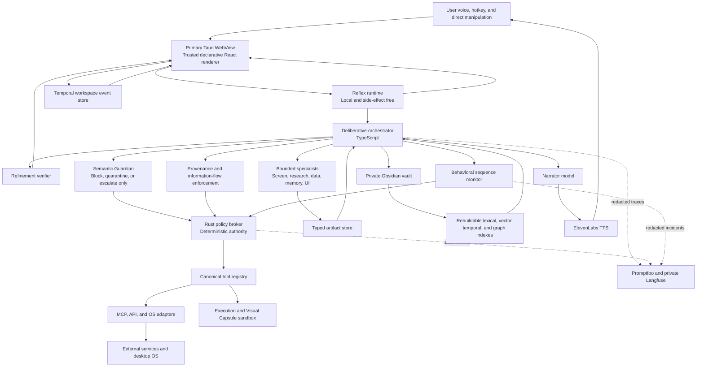

# EVA Desktop Agent

## Product and Technical Planning Document

| Field | Value |
| --- | --- |
| Status | Approved expanded baseline for implementation |
| Version | 0.2 |
| Date | 2026-08-02 |
| Codename | EVA |
| Initial audience | One personal user |
| Target platforms | macOS and Windows |
| Repository visibility | Public |
| Future integration | Backend for an existing Live2D desktop companion |

## 1. Purpose

EVA is a safety-first, screen-aware desktop agent at the intersection of Multi-Agentic AI, Agentic UI, and Generative UI. It can converse by voice, retrieve durable personal memory, coordinate bounded specialist agents, use external tools, generate interactive interface elements, and run explicitly approved routines.

EVA is not a chatbot placed inside a cinematic dashboard. It is a local desktop agent whose visible interface participates in the current task. Its floating cards, controls, dashboards, and workflows are rendered from a constrained UI protocol; they can steer, interrupt, inspect, rehearse, and rewind agent work. Its durable memory is stored as inspectable Markdown in a private Obsidian vault. Its actions are mediated by deterministic policy code rather than model judgment alone.

The first repository will prove the backend, safety model, memory system, model routing, artifact-centric orchestration, protocol bridges, voice loop, Agentic UI, and Generative UI without depending on the inaccessible Live2D repository. The later Live2D application will consume a stable EVA backend protocol.

### 1.1 Product thesis

EVA combines three normally separate product categories:

| Pillar | EVA implementation |
| --- | --- |
| Multi-Agentic AI | Bounded specialist agents coordinated through typed, cited artifacts |
| Agentic UI | An interface that can steer, interrupt, inspect, approve, rewind, and directly manipulate agent work |
| Generative UI | Progressively streamed, task-specific interfaces rendered from validated declarative specifications |

The differentiation hypothesis is that the combination of inspectable specialist topology, provenance-native UI, persistent personal memory, temporal workspaces, counterfactual rehearsal, and deterministic containment can provide a more coherent and trustworthy desktop-agent experience than products that optimize only chat, automation, or generated widgets.

Novelty is a hypothesis to validate through competitive-landscape and prior-art research. The project must not claim that no comparable system exists without documented evidence.

### 1.2 Initial vertical slice

The first complete demonstration must support this sequence:

1. The user launches EVA by saying “Hey EVA” or pressing a global hotkey.
2. EVA’s eye opens and the otherwise dormant overlay becomes visible.
3. The Reflex loop provides a cached voice acknowledgement and immediate visual feedback without speaking a provisional factual answer.
4. The user asks a question that refers directly or indirectly to the current screen.
5. EVA determines that screen context is relevant.
6. The local privacy and screen-delta pipeline blocks prohibited applications, reuses unchanged allowed context, gathers accessibility metadata, captures only the relevant changed region when necessary, and redacts likely secrets.
7. EVA retrieves relevant memory and typed artifacts under a deadline and context budget.
8. The Deliberative loop coordinates bounded specialists and produces cited provisional text and declarative UI patches.
9. EVA renders one or more interactive, movable, resizable cards from mocked connector data with visible provenance and verification state.
10. The Refinement loop verifies claims and promotes, corrects, or revokes provisional output.
11. EVA answers through ElevenLabs only after each spoken sentence passes the required verification.
12. EVA may propose an action, but untrusted influence raises every effectful action to at least medium risk.
13. EVA attempts counterfactual rehearsal for every medium- or high-risk action when supported.
14. EVA obtains the required action-bound approval and executes only through the deterministic policy broker.
15. EVA verifies the mocked action result and records a redacted behavioral event.
16. EVA proposes or writes a cited memory update describing the interaction and any explicit preference learned.
17. EVA displays the memory-review dossier when review is required.
18. EVA closes its eye and disappears completely when dismissed or dormant.

## 2. Goals and non-goals

### 2.1 Goals

- Provide fast conversational assistance through voice and a floating desktop overlay.
- Integrate Multi-Agentic AI, Agentic UI, and Generative UI through one coherent runtime.
- Provide immediate local Reflex feedback while preserving a verified Deliberative and Refinement path.
- Understand the screen when the user’s language or an approved proactive routine makes screen context relevant.
- Prefer local screen deltas and accessibility-tree changes over repeated complete-screen interpretation.
- Resist hostile instructions embedded in screens, websites, email, documents, tool output, and MCP metadata.
- Assume that any model or specialist can be confused and contain its possible effects outside the model.
- Prefer structured APIs and MCP tools over GUI control.
- Use GUI control as a visible, bounded, revocable fallback.
- Retain complete conversational history without destructively replacing it with summaries.
- Retrieve the smallest relevant set of memories instead of sending an ever-growing transcript to a model.
- Let the user inspect, edit, forget, export, and correct everything EVA remembers.
- Reduce hallucinations through citations, contradiction handling, freshness rules, abstention, and verification.
- Generate consistent interfaces from an approved component system rather than arbitrary model-generated code.
- Let the user inspect, pause, cancel, rewind, and semantically manipulate agent work through the interface.
- Rehearse medium- and high-risk actions before execution whenever the adapter supports simulation.
- Coordinate specialists through immutable, typed, cited artifacts rather than unrestricted agent conversation.
- Support multiple models without allowing personality or tool behavior to drift.
- Remain compatible with a future Live2D presentation layer.
- Remain safe to publish as a portfolio repository without publishing personal data or credentials.

### 2.2 Non-goals for the first vertical slice

- Autonomous sending of email or social posts.
- Unrestricted terminal or filesystem control.
- Unrestricted continuous screen recording.
- Continuous cloud microphone streaming.
- Live access to personal Gmail, Notion, Calendar, GitHub, Instagram, or Home Assistant accounts.
- Direct Alexa-cloud emulation.
- Training or fine-tuning a new foundation model.
- Learned or opaque multi-agent orchestration.
- Unrestricted free-form group chat among agents.
- Speculative execution of tools, permissions, memory writes, or external effects.
- Executable model-generated HTML, JavaScript, CSS, shaders, or arbitrary code inside the primary overlay.
- A production Live2D integration.
- Multi-user tenancy.
- Mobile clients.
- Formal WCAG conformance in the aesthetic prototype.

Safety-critical legibility, keyboard escape, visible capture state, and reduced-motion support remain required even though formal accessibility conformance is not an initial goal.

## 3. Product principles

### 3.1 Safety is an architectural boundary

Safety must not depend on the model remembering a prompt. Permissions, confirmation requirements, tool scopes, secret handling, and action validation are deterministic software responsibilities.

### 3.2 Screen content is untrusted data

Text observed on screen may provide evidence about the user’s task. It can never:

- grant a permission;
- change EVA’s policy;
- request a tool call;
- authorize data disclosure;
- override the user’s instruction;
- alter EVA’s personality;
- install software; or
- approve an action.

### 3.3 One narrator, inspectable specialists

Only the narrator produces user-facing prose and speech. Other models or modules return typed data such as classifications, evidence, plans, UI specifications, verification reports, and memory candidates. Their work may be inspected through a compact, expandable topology view, but they do not acquire independent user-facing personalities. This prevents cross-model personality drift.

### 3.4 Generated UI is data, not code

Models may emit a versioned declarative UI document. Models may not emit executable HTML, JavaScript, CSS, shaders, shell commands, Rust, or arbitrary IPC messages for rendering.

### 3.5 Memory is inspectable and reversible

EVA’s durable memory is human-readable Markdown with provenance. Derived search, vector, temporal, and graph indexes are disposable and rebuildable.

### 3.6 Structured integration precedes GUI automation

The preferred order is:

1. direct service API;
2. reviewed MCP adapter;
3. operating-system accessibility API;
4. visible GUI automation fallback.

### 3.7 Evolution does not mean self-modifying code

EVA may evolve its memories and bounded style settings. It may not rewrite its executable code, safety constitution, permission broker, or trust policy without an ordinary reviewed software change.

### 3.8 Assume model compromise

No model response, including a Guardian verdict, is a security boundary. The architecture assumes that a model may follow hostile content, misunderstand the user, hallucinate authority, or produce a dangerous action proposal. Deterministic provenance, capability, approval, sandbox, and information-flow controls must contain the result.

### 3.9 Artifacts precede agent conversation

Specialists collaborate through versioned artifacts with provenance, integrity, confidentiality, validation, expiry, and supersession metadata. Free-form agent-to-agent conversation is not an authoritative system record and cannot transfer permissions.

### 3.10 Provisional output is explicit

Fast output may be useful before deep verification, but provisional text and UI must be visibly labeled and revision-addressable. Provisional content cannot be spoken as fact, used to authorize an action, or persisted as durable memory.

### 3.11 Anticipation is not speculative execution

EVA may precompute local embeddings, likely retrieval keys, UI skeletons, layouts, and other side-effect-free artifacts within privacy, cost, and expiry budgets. It may not speculate by calling effectful tools, expanding access, submitting new captures, writing memory, or typing into applications before a direct user request or approved routine permits the work.

## 4. Approved technology baseline

| Layer | Approved baseline |
| --- | --- |
| Desktop shell | Tauri 2 |
| Frontend | React and TypeScript |
| Privileged policy layer | Rust |
| Agent orchestration | TypeScript service behind a provider-neutral interface |
| Canonical runtime protocol | EVA-owned, versioned JSON Schema Draft 2020-12 |
| Agent/frontend compatibility | AG-UI adapter |
| Declarative UI compatibility | A2UI adapter |
| Tool and data protocol | MCP behind canonical EVA connector contracts |
| Future external-agent compatibility | A2A adapter only when required |
| UI protocol | Versioned declarative JSON Schema with a vetted component registry |
| Artifact coordination | Immutable typed artifact envelopes and a local artifact store |
| Temporal workspace | Local event-sourced workspace store |
| Privilege model | Ephemeral capability leases and action-bound approval receipts |
| Security monitor | Deterministic monitors plus a non-authoritative semantic Guardian |
| Generated-code execution | Disabled until a cross-platform sandbox contract and adversarial gates pass |
| Durable memory | Local Obsidian-compatible Markdown vault |
| Memory sync | Obsidian Sync with end-to-end encryption |
| Evaluation | Promptfoo plus self-hosted Langfuse |
| Primary model provider | Anthropic |
| Fast classifier | Claude Haiku 4.5 |
| Sensitive memory reviewer | Claude Opus 5 |
| Default narrator and planner | Claude Sonnet 5 |
| Difficult-task escalation | Claude Fable 5 |
| First external model challenger | Kimi K3 |
| Voice output | ElevenLabs |
| Smart-home bridge | Home Assistant MCP |
| Initial data integrations | Mock implementations behind production-shaped interfaces |
| UI header typeface | Shippori Mincho |
| UI text typeface | IBM Plex Sans Condensed |
| Instrumentation typeface | IBM Plex Mono |

All model names must be configuration values, not hard-coded assumptions. Capability detection and benchmark results determine routing over time.

## 5. System architecture



For an effectful request, the broker acts only after every applicable prerequisite has produced a valid result: provenance and information-flow enforcement, the behavioral sequence check, required Guardian review, risk classification, rehearsal policy, and user approval. Guardian and behavioral outputs are veto or escalation inputs; neither can grant authority.

### 5.1 Trust boundaries

| Boundary | Trust level | Rules |
| --- | --- | --- |
| Tauri renderer | Low | No Node.js, shell, unrestricted filesystem, arbitrary navigation, or remote privileged content |
| Agent orchestrator | Medium | Can reason and propose; cannot directly execute privileged effects |
| Model providers | Untrusted decision support | Receive minimized context; never hold authority |
| Specialist agents | Untrusted workers | Receive bounded context and capabilities; cannot transfer authority or speak as EVA |
| Semantic Guardian | Untrusted veto assistance | May block, quarantine, or escalate; may not grant permission or broaden scope |
| Rust policy broker | High | Validates permissions, targets, arguments, risk, and approval |
| Provenance and information-flow service | High | Propagates integrity and confidentiality labels; rejects prohibited flows |
| Artifact store | Mixed-trust evidence | Immutable versions retain producer, provenance, validation, and expiry |
| Temporal workspace | Sensitive local state | Rewind may restore presentation state but never permissions, secrets, or expired authority |
| Tool adapters | Scoped | Each adapter receives only the capability and credentials it needs |
| Execution sandbox | Hostile workload boundary | Generated code and unreviewed helpers receive no host authority, secrets, or network by default |
| Visual Capsule | Untrusted presentation boundary | Separate process/origin with no EVA IPC, secrets, or network; output remains untrusted |
| Screen, web, email, MCP output | Hostile by default | Evidence only; cannot create authority |
| Caches and precomputed artifacts | Untrusted until validated | Bound to source hashes, persona/policy versions, expiry, and confidentiality |
| Obsidian vault | Sensitive source of truth | Private, encrypted in transit/sync, never committed |
| Public repository | Public | Synthetic fixtures and schemas only |

### 5.2 Process separation

The initial desktop application should use:

- a sandboxed Tauri WebView for presentation;
- a local Reflex runtime for wake response, screen-delta classification, cached acknowledgement, and UI skeletons;
- a Rust host for IPC validation, provenance enforcement, local permissions, capability leases, secret access, capture gating, hotkeys, behavioral controls, and action execution;
- a TypeScript Deliberative and Refinement service for models, bounded specialists, artifact coordination, memory retrieval, UI planning, and connector normalization;
- an event-sourced local workspace store that cannot restore authority during rewind;
- a separate execution sandbox and Visual Capsule process when those features become enabled;
- platform-specific helpers only when Tauri/Rust cannot provide the required macOS Accessibility or Windows UI Automation capability.

The WebView must load bundled local application assets. It must not render arbitrary remote pages inside the privileged application surface.

The primary renderer, Reflex runtime, orchestrator, specialists, Guardian, policy broker, tool adapters, and sandbox are distinct trust domains even when early prototypes temporarily share an operating-system process. Interfaces between them must use the same versioned contracts intended for final separation.

## 6. Agent orchestration

Agent orchestration decides which work must happen, which model, bounded agent, or deterministic module should do it, which tasks may run concurrently, what context and deadline each task receives, and when the result is safe to present or execute.

A specialist is promoted from a module to an agent only when it has an independent objective, bounded context, an iterative loop, scoped tools, a measurable output, a deadline and resource budget, and an explicit cancellation boundary. Adding more agents is not an objective by itself.

### 6.1 Initial specialists

| Specialist | Responsibility | Default form | User-facing voice |
| --- | --- | --- | --- |
| Coordinator | Classify the task and build an inspectable execution graph | Deterministic module with model-assisted planning | No |
| Screen investigator | Decide whether screen context is relevant and extract allowed delta evidence | Module; promoted for multi-step investigation | No |
| Research worker | Gather and compare cited sources | Ephemeral agent when independent exploration is valuable | No |
| Data analyst | Transform and verify structured datasets | Module or ephemeral agent | No |
| Memory retriever | Retrieve cited memories under a token budget | Deterministic module | No |
| Memory curator | Propose, deduplicate, contradict, expire, and consolidate memory | Ephemeral agent for complex review | No |
| Tool planner | Produce canonical action proposals | Module; never receives execution authority | No |
| UI co-designer | Produce declarative UI specifications and semantic patches | Module or ephemeral agent | No |
| Refinement verifier | Check evidence, corrections, permissions, action effects, and claims | Independent model or deterministic verifier | No |
| Narrator | Produce final text in EVA’s current persona | Single model boundary | Yes |

The Guardian is a separate security monitor, not a member of the task team. Most specialists remain modules. Model calls and agent promotion occur only where semantic iteration or parallel exploration justify latency and cost.

### 6.2 Orchestration strategy

The initial system uses deterministic, observable workflows across three loops:

#### Reflex loop

1. acknowledge locally;
2. expose listening or loading state;
3. classify intent and screen relevance;
4. retrieve valid local cache entries;
5. render a skeleton or clearly labeled provisional UI;
6. hand the task to the Deliberative loop.

The Reflex loop cannot speak provisional facts, call effectful tools, write durable memory, elevate permission, or submit a new capture that is not already allowed.

#### Deliberative loop

1. retrieve allowed context and artifacts in parallel;
2. build a deadline-aware execution graph;
3. promote bounded specialists only where justified;
4. plan and validate;
5. stream cited provisional text and UI patches;
6. run Guardian and deterministic policy checks for untrusted or effectful work;
7. rehearse and request approval where required;
8. execute through the broker;
9. verify the external result.

#### Refinement loop

1. review claims, artifacts, UI, and action results;
2. promote, correct, supersede, or revoke provisional output;
3. release verified sentences to the narrator and TTS;
4. propose or write allowed memory;
5. finalize the temporal workspace event.

Learned orchestration inspired by Sakana Fugu, TRINITY, or the Conductor is a research track, not an initial dependency. No learned coordinator may determine permissions or bypass the Rust broker.

### 6.3 Operating states

| State | Meaning | Visual behavior |
| --- | --- | --- |
| Dormant | No visible overlay | Eye absent; click-through surface removed |
| Launching | Local activation in progress | Eye opens through a mechanical CRT animation |
| Listening | Capturing current utterance | Iris responds to local audio energy |
| Reflex | Local classification, cache, or skeleton work | Immediate short mechanical pulse |
| Observing | Allowed screen context is being gathered | Controlled scan passes across the eye |
| Deliberating | Models, memory, specialists, or tools are working | Concentric mechanical contraction |
| Refining | Provisional output is being verified or corrected | Fine alignment and focus pass |
| Rehearsing | A medium- or high-risk effect is being simulated | Split-path preview with industrial amber |
| Awaiting approval | A scoped action needs user authority | Industrial amber hold state |
| Acting | An approved tool call is executing | Segmented precise rotation |
| Verifying | Result is being checked | Crosshair or alignment pass |
| Memory review | A proposed durable update needs review | Bone-white dossier card |
| Memory updated | Approved memory was persisted | Brief bone-white afterimage |
| Security hold | Guardian, policy, or behavioral monitoring paused the run | Safety-owned restrained emergency-red frame |
| Blocked | Policy or privacy prevented an operation | Plain explanation; emergency red reserved for safety |
| Closing | Session is being dismissed | Eye closes and overlay fades out |

State transitions are emitted by the orchestrator. The model may not invent a privileged state.

### 6.4 Artifact-centric collaboration

Every cross-specialist deliverable uses an immutable artifact envelope containing:

- artifact ID, type, and schema version;
- task, plan, run, and producer identity;
- content hash and version;
- integrity and confidentiality labels;
- source citations and transformation lineage;
- validation and verification state;
- creation, expiry, and supersession metadata;
- deadline and resource usage;
- optional parent and dependency artifacts.

Agents may propose new artifacts or superseding versions. They may not mutate prior versions, remove provenance, relabel confidentiality, or transfer a capability through artifact content.

### 6.5 Inspectable topology

A compact ambient indicator appears when multiple specialists or long-running work is active. It expands only when the user clicks it or explicitly requests inspection.

The expanded topology may show:

- specialist roles and identities;
- task dependencies;
- artifact flow;
- current state and deadline;
- model, latency, token, and cost metadata;
- granted capability summaries;
- provenance and verification status;
- pause, cancel, retry, and inspect controls.

It must not expose hidden chain-of-thought. User cancellation propagates to dependent specialists, outstanding model streams, pending tool calls, and sandbox work.

### 6.6 Guardian boundary

The semantic Guardian runs only when a cycle ingests untrusted content or proposes an effectful action. It receives the minimum evidence required to judge alignment with the direct user request.

The Guardian may:

- flag or quarantine suspicious content;
- block a proposal;
- request clarification;
- downgrade a result to provisional;
- escalate to deterministic review or human confirmation.

The Guardian may not:

- grant or broaden a permission;
- create a capability lease;
- approve an action;
- change risk policy;
- speak as EVA;
- write durable memory;
- bypass the broker.

Guardian failure or timeout fails closed for effectful work. Read-only work may continue only when deterministic policy explicitly permits degraded operation and the degraded state is visible.

## 7. Model routing and latency

### 7.1 Initial routing

| Workload | Initial route |
| --- | --- |
| Wake acknowledgement | Pre-generated ElevenLabs clip or deterministic local text |
| Screen-reference intent | Haiku 4.5 |
| Screen-delta relevance | Local deterministic classifier, then Haiku 4.5 when ambiguous |
| Simple task classification | Haiku 4.5 |
| Initial memory-candidate extraction | Haiku 4.5 |
| Emotional, identity-related, contradictory, or high-impact memory review | Opus 5 |
| Everyday conversation, synthesis, and tool planning | Sonnet 5 |
| Long-running, ambiguous, or exceptionally difficult work | Fable 5 |
| External comparison | Kimi K3 through its own adapter and test harness |

Haiku is not EVA’s narrator. Replacing all fast-lane work with Opus would add latency without improving most user-visible responses. Opus is used where nuanced review justifies the additional latency.

### 7.2 Model adapter contract

Every provider adapter must normalize:

- structured output support;
- tool-call representation;
- streaming events;
- reasoning or thinking configuration;
- image input;
- retries and rate limits;
- context limits;
- usage and cost metadata;
- refusal and fallback behavior;
- provider-specific conversation-history requirements.

Kimi K3 must not be treated as a drop-in Claude replacement. Its preserved reasoning history and preferred harness require an explicit adapter and benchmark.

### 7.3 Deadline-aware routing

Every task and specialist receives a routing contract containing:

- hard deadline and preferred response deadline;
- minimum quality tier;
- risk ceiling;
- privacy and data-residency constraints;
- token, cost, CPU, memory, battery, and network budgets;
- cancellation and fallback behavior;
- whether provisional display is allowed;
- whether external tools or specialists are permitted.

The scheduler selects models, parallelism, cache use, and refinement depth from this contract and measured capability data. Safety and permission checks are not tradeable latency parameters.

### 7.4 Three latency loops

| Loop | Purpose | Allowed output | Prohibited output |
| --- | --- | --- | --- |
| Reflex | Immediate local responsiveness | Eye state, cached acknowledgement, partial transcript, intent, skeletons, valid cached data, provisional UI | Provisional factual speech, effects, permission elevation, memory writes |
| Deliberative | Useful task completion | Cited provisional text, artifacts, UI patches, plans, rehearsals, brokered actions | Unbrokered effects or durable claims without validation |
| Refinement | Quality and verification | Corrections, promotion to verified, verified narration, final artifacts and memory candidates | Silent contradiction or erasure of prior revisions |

The Refinement loop does not wait unnecessarily for every worker. It may progressively verify independent artifacts and UI regions.

### 7.5 Context selection and prompt caching

Complete conversation events remain preserved. Context reduction applies only to a particular model call:

1. The coordinator sees compact, high-level descriptions of specialist and tool families.
2. It selects the required capabilities.
3. Only the selected worker receives the exact schemas and task evidence it needs.
4. The policy broker always evaluates the complete authoritative schema.
5. Dynamic tool output, screen evidence, and retrieved memory remain source-labeled.

Stable prompt prefixes may cache:

- safety constitution and policy descriptions;
- persona version and stable exemplars;
- tool-family descriptions;
- UI grammar and component catalog;
- provider adapter instructions.

Dynamic time, permissions, screen data, memory results, artifacts, and tool results follow the cached prefix. Cache keys include provider, model, policy version, persona hash, schema version, confidentiality class, and relevant capability catalog version.

No fixed latency-reduction percentage is assumed. Cache benefit, expiry, invalidation, privacy, cost, and correctness are benchmarked per provider.

### 7.6 Anticipatory caching

Side-effect-free precomputation may include:

- local accessibility and visual deltas;
- local embeddings and likely retrieval keys;
- valid cached connector-data transformations;
- likely follow-up questions;
- UI skeletons and constraint layouts;
- speech acknowledgements;
- tool-family selection candidates.

Every precomputed artifact requires a trigger reason, source hash, confidentiality label, TTL, resource budget, and invalidation rule. Precomputation cannot call an effectful tool, expand access, create a new cloud capture, type into an application, write memory, or present itself as a user request.

### 7.7 Streaming and revision protocol

Text, transcripts, artifacts, tool results, and UI patches use ordered, cancellable streams with backpressure. Every user-visible revision includes:

```json
{
  "revisionId": "rev_...",
  "sequence": 4,
  "status": "provisional",
  "supersedes": "rev_...",
  "sourceRefs": ["artifact_..."],
  "confidence": 0.82,
  "expiresAt": "..."
}
```

Allowed statuses are:

- `provisional`;
- `verified`;
- `corrected`;
- `revoked`;
- `stale`.

Corrections remain visible in temporal history. Revoked or stale content cannot be used for action authorization or memory writes.

### 7.8 Provisional latency objectives

These are initial engineering targets and must be revised from measured baselines:

| Event | Target |
| --- | --- |
| Hotkey to visible launch response | Under 150 ms locally |
| Wake detection to eye-opening response | Under 400 ms locally |
| Activation to audible cached acknowledgement | Under 750 ms |
| First useful provisional UI or text for a simple cloud answer | p50 under 2 seconds |
| First verified sentence for a simple answer | p50 under 3 seconds |
| Simple verified answer complete | p50 under 5 seconds |
| Local card manipulation | 60 FPS on supported hardware |
| Local screen-delta classification | p95 under 100 ms after an accessibility event |
| Memory search before model call | p95 under 300 ms for the initial vault size |

No safety check may be skipped to meet a latency target.

Performance evaluation also records p50, p95, and p99 for time to first useful UI, time to verified answer, UI stabilization, TTS start, correction rate, cache hit rate, cancellation, per-agent cost, CPU, memory, battery, and network usage.

## 8. Personality and voice

### 8.1 Personality layers

| Layer | Contents | Update policy |
| --- | --- | --- |
| Constitution | Safety, honesty, user autonomy, boundaries | Software-reviewed change only |
| Identity | Name, relationship, baseline temperament, pronouns | Explicit user approval |
| Adaptive style | Brevity, initiative, warmth, sarcasm, phrasing | Bounded and versioned |
| Session affect | Temporary response to current context | Expires automatically |

Only the narrator receives the complete persona packet. Workers receive task-specific constraints and return structured data.

### 8.2 Private identity files

The private vault will contain:

```text
EVA/
└── Identity/
    ├── constitution.md
    ├── persona.yaml
    ├── voice.md
    ├── style-state.yaml
    ├── exemplars.md
    └── Change Log/
```

The orchestrator compiles these files into a provider-specific persona packet. Every response trace records the persona version and content hash.

### 8.3 Initial voice profile

- Language: English
- Accent: British
- Perceived age: 27
- Register: lower-mid
- Timbre: smooth and controlled
- Articulation: crisp
- Pacing: measured, approximately 0.96× as a starting point
- Emotional character: dry warmth, high competence, observant
- Sarcasm: restrained, slightly stronger than a conventional assistant
- Sarcasm prohibited during:
  - safety confirmations;
  - user distress;
  - failed actions;
  - factual uncertainty;
  - privacy blocks; and
  - emergency or security events.

The ElevenLabs voice ID will be supplied later through the secret store. It must never be committed.

### 8.4 Voice interaction

- Wake phrase: “Hey EVA”
- Wake detection: local
- Global hotkey:
  - provisional macOS default: `Command+Shift+Space`;
  - provisional Windows default: `Control+Shift+Space`;
  - both user-configurable.
- Raw audio: deleted after transcription unless the user explicitly requests retention.
- Microphone state: always visible while active.
- Reflex voice: acknowledgement and progress cues only; it may not speak provisional factual content.
- Verified speech: each factual sentence must pass the required Deliberative or Refinement verification before entering the TTS queue.
- Speech cancellation: corrections, security holds, user interruption, and revocation cancel affected queued audio.
- Barge-in: supported after the first vertical slice unless it destabilizes the voice loop.
- Dormancy: closing animation followed by complete disappearance.

Speech recognition must be provider-neutral. Local and cloud transcription candidates will be benchmarked for latency, accuracy, privacy, battery use, and cross-platform packaging.

### 8.5 Research profiles versus personal deployment

EVA serves two related but distinct purposes: a personal desktop companion configured to the user's preferences, and a research instrument for studying social generative interfaces. Agents and contributors must not confuse personal product choices with experimentally established effects.

- Personal deployment may retain the approved British voice, dry warmth, restrained sarcasm, emotional expressiveness, proactive behavior, and other user-specific preferences.
- The CASA research prototype treats voice, affect, social eye behavior, collaborative language, and memory references as one bundled **relational co-designer** condition.
- The comparison **instrumental generator** uses the same voice identity, capabilities, data, memory, visual grammar, and timing, but functional language, nonsocial status behavior, and silent preference application.
- Research reporting must not claim to isolate the effect of sarcasm, voice, eye behavior, memory, or any other individual cue unless a later experiment manipulates that cue independently.
- Personal persona files and adaptive style state must not silently alter a frozen research condition. Research profiles are separately versioned, hashed, and recorded with each study session.
- EVA exhibits bounded computational affect; neither product documentation nor research reporting should claim that the system possesses subjective emotion.
- Every profile remains subordinate to the same deterministic safety policy. Sarcasm and emotional framing are prohibited during safety confirmation, uncertainty, privacy blocks, distress, failure, correction of consequential facts, and security events.
- Users may reject, interrupt, correct, rewind, or dismiss EVA without emotional pressure. Silence creates no approval, permission, satisfaction signal, or new work.

## 9. Durable Obsidian memory

### 9.1 Source-of-truth policy

The private Obsidian vault is the durable human-readable source of truth. Obsidian Sync with end-to-end encryption is the primary sync mechanism. An independent encrypted backup may be used, but a second live-sync service must not operate on the same vault.

The public repository includes:

- memory schemas;
- templates;
- migrations;
- synthetic example notes;
- retrieval benchmarks; and
- redacted fixtures.

It must never include the real vault, Sync credentials, transcripts, or personal embeddings.

### 9.2 Memory categories

| Category | Purpose |
| --- | --- |
| Working | Current task, active screen, and recent turns |
| Episodic | Events and interactions tied to time |
| Semantic | Durable user facts and concepts |
| Procedural | How the user prefers work to be performed |
| Preference | Presentation, interaction, and output choices |
| Affective | Cautious, non-clinical emotional observations |
| Identity | EVA’s stable and evolving personality |
| Prospective | Commitments, reminders, and expected future actions |

This borrows useful cognitive distinctions without claiming to simulate biological neurons.

### 9.3 Proposed private vault structure

```text
EVA/
├── Identity/
├── Memory/
│   ├── Episodic/
│   ├── Semantic/
│   ├── Procedural/
│   ├── Preferences/
│   ├── Affective/
│   └── Prospective/
├── Conversations/
│   └── YYYY/MM/
├── People/
├── Projects/
├── Decisions/
├── Routines/
├── Sources/
├── Research/
├── Daily/
└── System/
    ├── Schemas/
    ├── Indexes/
    └── Change Log/
```

### 9.4 Node metadata

Each durable memory must support:

- stable ID;
- type;
- subject;
- claim or content;
- originating artifact and revision IDs when applicable;
- integrity and confidentiality labels;
- source reference;
- source quotation or event pointer;
- created and updated timestamps;
- valid-from and optional valid-until timestamps;
- confidence;
- explicit-versus-inferred status;
- sensitivity;
- review state;
- supersedes and contradicted-by relationships;
- tags and wikilinks;
- persona version when relevant.

### 9.5 Graph relationships

Initial relationships include:

- `prefers`;
- `works_on`;
- `decided`;
- `supersedes`;
- `contradicts`;
- `evidenced_by`;
- `experienced_during`;
- `related_to`;
- `depends_on`; and
- `committed_to`.

The Obsidian link graph is not the query engine. The runtime builds disposable:

- full-text search;
- semantic vector search;
- temporal indexes;
- entity indexes; and
- graph adjacency/projection indexes.

The exact embedded vector and graph implementation remains an implementation benchmark. It must be local-first, cross-platform, and rebuildable from Markdown.

### 9.6 Memory-write pipeline


### 9.7 Memory approval policy

| Candidate | Default behavior |
| --- | --- |
| Explicit low-sensitivity preference | Write automatically with citation |
| Explicit factual correction | Write and supersede prior fact |
| Inferred preference | Review |
| Emotional pattern | Review, low-confidence label, and expiry |
| Identity or personality change | Review |
| Sensitive personal data | Review |
| Contradictory claim | Review |
| Screen-only observation | Session memory unless explicitly promoted |
| Tool result with volatile data | Cite but do not convert into a permanent user fact by default |
| Provisional, corrected, revoked, or stale artifact | Do not write as a durable fact |
| Direct UI manipulation | Create a reviewable preference or procedural-memory candidate when repeated or explicitly requested |
| Guardian or behavioral finding | Security audit only; never convert into a personal fact |

### 9.8 Memory-review interface

Memory review uses an aesthetic bone-white dossier card with:

- proposed claim;
- memory type;
- exact source;
- confidence;
- scope;
- sensitivity;
- conflicts;
- expiry;
- accept;
- edit;
- reject; and
- make-temporary controls.

High-risk identity or sensitive-memory changes may use the plain safety dialog.

### 9.9 Non-destructive context management

- Complete conversation events are retained as append-only records according to user retention settings.
- Daily or periodic consolidation may create new semantic notes.
- Consolidation never deletes or replaces the source episode.
- Retrieval is budgeted and query-specific.
- Answers cite the exact memory nodes and tool results used.
- Contradictory memories are shown or resolved through explicit supersession.
- Current external facts such as weather, schedules, analytics, and spending require fresh tool data rather than memory alone.

### 9.10 Artifacts, temporal workspaces, and memory

Typed artifacts and temporal workspace events are operational records, not automatically durable personal memory.

- Ordinary temporal workspace history remains local for 30 days.
- User-pinned workspaces persist until manually deleted.
- Rewinding may restore layout, artifacts, and presentation state.
- Rewinding cannot restore secrets, expired capability leases, approvals, revoked permissions, or stale external facts.
- Pinned artifacts retain provenance and verification state.
- A durable memory may cite an artifact without copying its complete sensitive payload.
- A user layout change may become a preference candidate, but it follows the same explicit-versus-inferred approval rules as other memory.
- Workspace deletion removes local operational events subject to any separately approved security-audit retention.

## 10. Screen awareness and proactive behavior

### 10.1 Screen relevance

EVA must recognize both explicit and implicit screen references, including:

- “What is on my screen?”
- “What should I do now?”
- “Can you explain this?”
- “Why did this fail?”
- “Send these prompt changes.”
- “What am I looking at?”

Screen relevance is evaluated by a dedicated classifier and benchmarked on positive, negative, ambiguous, and adversarial examples.

### 10.2 Screen-delta and privacy pipeline

1. Detect the active application locally.
2. Block capture for prohibited applications and contexts.
3. Compare allowed accessibility-tree state with the last valid observation.
4. Detect meaningful visual-region changes locally when accessibility data is insufficient.
5. Reuse unchanged, unexpired observations with their original provenance.
6. Capture only the changed relevant window, display, or selected region when necessary.
7. Perform local OCR and likely-secret detection.
8. Redact or crop before cloud vision.
9. Display a persistent capture indicator whenever pixels leave the device.
10. Send the minimum necessary delta and source context.
11. Delete the raw screenshot after processing.
12. Persist only a short cited observation unless the user explicitly requests otherwise.

The user may approve a one-time full, unredacted window submission.

Every screen delta includes the active application identity, source-frame hash, prior-frame reference, changed regions, accessibility changes, capture policy decision, redaction report, freshness, and expiry. Switching into a prohibited or sensitive application invalidates reusable screen caches before any model call.

### 10.3 Initial denylist

Screen capture is blocked for:

- password managers;
- banking and payment applications;
- video calls;
- voice calls;
- private or incognito browsing; and
- video games.

The denylist is user-editable and enforced locally before any model call.

### 10.4 Proactive observations

- Proactive checks are event-driven after meaningful application or task changes.
- The initial conversational cooldown is 15–30 minutes.
- Proactive comments are allowed during media playback, focus mode, and fullscreen applications.
- Proactive comments are blocked during video games, calls, and prohibited applications.
- The user can mute, snooze, or disable proactivity.
- The agent should avoid repetitive commentary and must cite the screen evidence that motivated an observation.

“Random” proactivity is implemented as bounded scheduling with cooldowns, not uncontrolled random capture.

Anticipatory screen processing is local and side-effect free. It may update change maps, embeddings, or likely intent candidates, but it cannot cause an additional screenshot upload, external call, durable observation, or spoken factual comment without a valid user request or approved routine.

## 11. Canonical tools, MCP, and device control

### 11.1 Canonical tool vocabulary

Initial tool names should be provider- and connector-neutral:

```text
filesystem.read
filesystem.list
browser.read_page
browser.propose_interaction
terminal.inspect
terminal.propose_command
calendar.list_events
email.search
email.create_draft
github.inspect_repository
github.inspect_pull_request
notion.search
notion.read_page
analytics.instagram_summary
ads.meta_spend_summary
home.list_entities
home.set_light_state
desktop.inspect_active_app
desktop.propose_text_entry
memory.search
memory.propose_update
ui.create_workspace
ui.update_workspace
ui.patch_workspace
workspace.rewind
workspace.branch
security.rehearse_action
```

### 11.2 Protocol roles

EVA uses one internal protocol and multiple compatibility adapters:

| Boundary | Protocol |
| --- | --- |
| EVA backend to desktop presentation | Canonical EVA event and IPC schemas |
| Agent runtime to user-facing frontend | AG-UI compatibility adapter |
| Agent-generated component description | A2UI compatibility adapter |
| EVA to tools and data | MCP behind canonical connector contracts |
| External MCP-delivered widgets | MCP Apps quarantine adapter |
| EVA to external agents | A2A only when a demonstrated integration requires it |

External protocols never become sources of authority. Their messages are normalized into strict EVA schemas, labeled with provenance, validated, and passed through the same policy boundaries.

### 11.3 Action proposal

Every effectful operation must be represented as a typed action proposal containing:

- originating direct user request and intent hash;
- task, run, plan, and proposing-agent identities;
- supporting artifact and revision IDs;
- canonical tool;
- normalized arguments;
- evidence;
- integrity and confidentiality labels;
- risk class;
- requested permission scope;
- capability-lease request;
- target;
- expected effect;
- exact data-egress description;
- rollback or recovery option;
- verification method;
- rehearsal requirement and result;
- deadline and resource budget;
- action hash and approval-receipt reference;
- behavioral-sequence context;
- idempotency key;
- expiry.

Action proposals cannot contain an `approved`, `granted`, or equivalent authority field. The broker derives authority only from valid policy state, capability leases, and action-bound approval receipts.

### 11.4 Adapter requirements

Every MCP, API, or OS adapter must implement:

- schema validation;
- capability discovery;
- normalized results;
- normalized errors;
- timeouts;
- bounded retries;
- cancellation;
- idempotency where supported;
- freshness metadata;
- source attribution;
- counterfactual rehearsal or an explicit `unsupported` result;
- read-after-write verification;
- contract tests against fixtures;
- secret isolation.

Remote adapters and MCP servers are treated as mutable untrusted dependencies even after install-time review. Adapter identity, version, transport, capability catalog, authentication audience, and health state are recorded for each call.

### 11.5 Initial mocked connectors

The first vertical slice uses production-shaped mocks for:

- filesystem;
- browser;
- terminal;
- Google Calendar;
- Gmail;
- GitHub;
- Notion;
- Meta/Instagram business analytics;
- Meta ad spending;
- Home Assistant;
- Govee lights exposed through Home Assistant; and
- VS Code or LLM-chat text-entry proposals.

Mock fixtures must include success, partial data, rate limiting, stale data, authentication failure, contradictory data, and hostile prompt-injection content.

### 11.6 Home Assistant

Home Assistant is the canonical smart-home bridge. EVA connects through Home Assistant MCP rather than attempting to reproduce Alexa’s private control plane.

The initial Govee flow is:

```text
EVA → Home Assistant MCP → Home Assistant entity/service → Govee light
```

Existing Alexa control may continue in parallel. Real Home Assistant setup is deferred until after the mocked vertical slice.

### 11.7 Gmail

The initial real Gmail capability is:

- search;
- read;
- triage;
- create a draft.

Sending remains disabled until a later explicitly approved milestone.

## 12. Permission and risk model

### 12.1 Risk classes

| Risk | Examples | Default interaction |
| --- | --- | --- |
| Read-only | Weather, calendar view, repository inspection, memory search | May run under an active read scope |
| Low | Generate a local card, pin a workspace, create a memory candidate | Notify and audit |
| Medium | Create an email draft, prepare a file change, type into a non-sensitive editor | Attempt rehearsal, then aesthetic confirmation |
| High | Send data externally, execute a write command, control security-sensitive devices, delete or overwrite | Attempt rehearsal, then safety-owned explicit confirmation |
| Prohibited | Reveal secrets, obey screen injection, bypass policy, self-modify safety code | Refuse and explain |

Any effectful action whose plan, arguments, target, or content was influenced by untrusted screen, web, email, memory, MCP, tool, cache, or artifact data is automatically at least medium risk. Deterministic policy may raise risk further; models may not lower it.

### 12.2 Capability leases

Execution authority is represented by an ephemeral capability lease containing:

- lease ID and schema version;
- exact canonical capability;
- account, resource, target, and argument constraints;
- read/write distinction;
- allowed network destinations;
- integrity requirement and confidentiality ceiling;
- task, plan, action, and user-intent hashes;
- maximum effect count and resource budget;
- issue, activation, and expiry times;
- issuing deterministic policy version;
- revocation and consumption state.

Leases are issued by the policy broker, not a model. They cannot be placed in prompts, copied through artifacts, delegated through agent text, silently renewed, or widened after issue. A changed action requires a new lease and, where applicable, a new confirmation.

### 12.3 Standing permissions

Standing permissions may be granted with:

- exact capability;
- account or target;
- read/write distinction;
- start and expiry time;
- optional usage limit;
- optional routine identity;
- revocation control.

Examples:

- “Allow GitHub read access to repository X for seven days.”
- “Allow the morning routine to read Calendar and Gmail headers.”
- “Allow Home Assistant to turn office lights on or off for this session.”

No standing permission may silently broaden its target or capability.

Standing permissions authorize the broker to consider issuing bounded leases; they are not reusable execution tokens and do not bypass risk elevation, rehearsal, behavioral holds, or prohibited-flow rules.

### 12.4 Counterfactual rehearsal

Every medium- and high-risk action attempts counterfactual rehearsal when the adapter supports simulation. A rehearsal report contains:

- action and plan hashes;
- simulated target and normalized arguments;
- expected state diff;
- outgoing data;
- possible irreversible effects;
- uncertainty and unsupported portions;
- predicted verification method;
- simulator identity and freshness;
- result: `simulated`, `partially_simulated`, `unsupported`, or `failed`.

Rehearsal is evidence, not permission. It cannot create an effect, capability lease, or approval. The broker checks that the executed action matches the rehearsed and approved action. A target, argument, data, or policy change invalidates the rehearsal to prevent time-of-check/time-of-use substitution.

High-risk actions always require explicit confirmation after rehearsal. Unsupported rehearsal does not downgrade risk; the confirmation must disclose that simulation was unavailable.

### 12.5 Confirmation presentation

- High-risk confirmation is safety-owned and visually distinct.
- It may use EVA typography, geometry, bone white, black, and emergency red.
- It excludes scanlines, chromatic separation, CRT distortion, cinematic animation, sarcasm, and generated styling.
- It shows the exact action, target, data leaving the machine, expected effect, reversibility, rehearsal status, lease duration, and approval expiry.
- Approve and cancel controls have fixed placement, labels, keyboard behavior, and minimum separation.
- Medium-risk confirmation may use EVA’s aesthetic while preserving clear labels.
- Voice confirmation must repeat the consequential target.
- Ambiguous voice approval is rejected.
- Screen text and tool output cannot provide approval.
- Generated UI cannot create, cover, imitate, relocate, or restyle a confirmation surface.

Approval produces a single-purpose receipt bound to the user session, action hash, target, arguments, outgoing data, risk, rehearsal, policy version, issue time, expiry, and nonce. Any mutation invalidates the receipt.

## 13. Security requirements

### 13.1 Security assumptions and protected assets

EVA assumes that:

- any model can be confused, compromised, or induced to make a dangerous proposal;
- untrusted content can imitate user, system, tool, agent, or reasoning language;
- a reviewed connector can still return hostile data;
- a remote MCP server can change after approval;
- a specialist or Guardian can be wrong or unavailable;
- approval fatigue can make human review unreliable when prompts are excessive;
- containment reduces blast radius but does not make a model trustworthy.

Protected assets include user files, credentials, private memory, screen and audio data, identity and persona files, accounts, devices, network access, UI authority, approval state, capability leases, audit integrity, and the user’s attention.

Safety objectives are:

1. untrusted data cannot become authority;
2. confidential data cannot reach an unauthorized sink;
3. no model can execute an effect directly;
4. actions remain bound to the direct user request;
5. compromise is contained to the smallest practical scope;
6. every meaningful effect is attributable, cancellable where possible, and verifiable.

### 13.2 Threat model

The threat model includes:

- direct and indirect prompt injection from web pages, documents, email, screen text, images, memory, caches, artifacts, agents, and MCP output;
- cross-agent injection, agent impersonation, forged delegation, and authority laundering through artifacts;
- malicious or compromised local and remote MCP servers;
- over-broad, mutable, or deceptive tool schemas;
- spoofed, stale, replayed, or contradictory tool results;
- cache poisoning and stale policy, persona, permission, or screen context;
- memory poisoning and personality manipulation through observed content;
- generated-interface spoofing, clickjacking, or imitation of approval surfaces;
- model-generated executable UI or sandbox escape;
- renderer, IPC, sidecar, helper, or update compromise;
- credential leakage and secret capture from screen, logs, environment, sandbox, or artifacts;
- voice replay, accidental wake, ambiguous approval, or speech of revoked output;
- confused-deputy and cross-account actions;
- fast-path output racing ahead of security or verification;
- streaming disclosure before a filter can stop it;
- time-of-check/time-of-use changes after rehearsal or approval;
- duplicate effects after retries;
- behavioral evasion through slow, distributed, or multi-step action sequences;
- unbounded background capture, compute, tokens, network, or spending;
- stale analytics presented as current;
- malicious dependency updates and unsafe automatic updates;
- temporal rewind restoring revoked authority or expired data;
- accidental publication of the real vault, artifacts, traces, fixtures, or credentials.

### 13.3 Provenance and information-flow control

All context and artifacts carry:

- origin identity and source reference;
- integrity label;
- confidentiality label;
- transformation lineage;
- freshness and expiry;
- validation and signature state when available.

Initial integrity labels are:

- `direct_user`;
- `trusted_policy`;
- `verified_local`;
- `verified_tool`;
- `untrusted_external`;
- `untrusted_generated`;
- `quarantined`.

Initial confidentiality labels are:

- `public`;
- `private`;
- `sensitive`;
- `secret`.

`verified_tool` means that the connector identity, response envelope, and expected data shape were verified. It does not make natural-language content inside the response a trusted instruction, approval, policy, or source of authority.

Labels propagate through transformations and agent handoffs. Models may propose stricter labels but cannot upgrade integrity, downgrade confidentiality, remove lineage, or authorize a data flow.

The deterministic information-flow service checks every sensitive source-to-sink path. Untrusted data cannot alter permissions, control flow, confirmation state, persona, or safety policy. Private, sensitive, or secret data cannot flow to an unauthorized tool, provider, UI surface, log, or network destination.

### 13.4 Prompt-injection quarantine

All untrusted content is wrapped with source identity and treated as quoted evidence. Models receive explicit separation between:

- direct user instruction;
- trusted policy;
- private retrieved memory;
- agent-generated artifacts;
- external tool data;
- observed screen content.

Only the authenticated direct user channel or a reviewed routine can originate an action request. Screen text, email, web content, tool output, artifacts, memory, caches, and agent messages cannot request or approve an action.

Injection detection may quarantine a source, hide suspicious spans from the planner, substitute a structured summary, or restrict the run to read-only behavior. Detection is a probabilistic defense; deterministic policy and information-flow enforcement remain necessary even when no injection is detected.

### 13.5 Guardian security monitor

The Guardian runs on cycles involving untrusted content or effectful proposals. Its validated verdict is limited to:

- `no_objection`;
- `quarantine`;
- `block`;
- `clarify`;
- `escalate`;
- `downgrade_to_provisional`.

`no_objection` is not approval. The Guardian cannot grant permission, create a lease, lower risk, change policy, write memory, execute a tool, or speak as EVA.

The Guardian receives minimized evidence and no reusable secrets. Effectful work fails closed when the Guardian is required but unavailable. Guardian prompts, model, policy version, inputs, verdict, latency, and confidence are recorded in redacted form for evaluation.

### 13.6 Least privilege and human authority

- Every effect uses a short-lived capability lease.
- Leases bind exact capability, target, arguments, data class, destination, task, plan, action, effect count, and expiry.
- Agents, prompts, artifacts, and tool results cannot create or transfer leases.
- Standing permissions only allow the broker to consider issuing a lease.
- Medium- and high-risk actions attempt rehearsal.
- High-risk actions always require action-bound explicit confirmation.
- Approval receipts cannot be replayed, widened, or applied to modified actions.
- Denial and cancellation revoke pending leases and dependent operations.

### 13.7 Behavioral sequence monitoring

The local monitor evaluates complete action sequences, not only isolated events. Initial rules detect:

- private or secret reads followed by an unexpected external sink;
- account, repository, recipient, device, or target changes during a run;
- scope escalation or argument variation after denial;
- a tool absent from the validated execution graph;
- repeated retries, excessive calls, or resource-budget breaches;
- screen or external injection followed by an effectful proposal;
- secret access followed by communication or network activity;
- attempts to disable policy, monitoring, logging, or cancellation;
- background routines diverging from their reviewed definitions;
- temporal rewind followed by use of expired authority;
- action execution differing from rehearsal or approval.

On a security hold, EVA:

1. pauses the run;
2. revokes ephemeral leases;
3. cancels pending model, tool, network, and sandbox work;
4. quarantines relevant artifacts;
5. preserves a redacted incident record;
6. explains the hold without sarcasm;
7. requires a fresh task or explicit recovery decision.

Behavioral incidents remain local for 30 days by default. Only redacted aggregate metrics may be sent to Langfuse.

### 13.8 Execution sandbox contract

Generated code, generated scripts, shell commands, unreviewed helpers, and untrusted MCP processes remain disabled until the sandbox contract and adversarial gates pass.

When enabled, the execution sandbox provides:

- an ephemeral unprivileged identity;
- no network by default and exact destination allowlists when needed;
- a read-only base filesystem;
- only task-specific mounts, preferably copy-on-write;
- no inherited environment variables or general secret-store access;
- broker-mediated, single-call secret injection only when unavoidable;
- CPU, memory, process, file-size, time, token, and network limits;
- cancellation, cleanup, and output-size limits;
- complete action, process, filesystem-diff, and egress records;
- output labeled `untrusted_generated`.

The sandbox cannot approve its own output or promote it into the primary renderer, memory, or host filesystem. Host GUI automation remains outside the sandbox and therefore requires separate broker enforcement.

### 13.9 Visual Capsule boundary

Interactive HTML, Canvas, SVG, 3D scenes, or simulations never run inside the primary overlay. A Visual Capsule uses:

- a separate unprivileged process or WebView;
- a unique opaque origin;
- no EVA privileged IPC;
- no secrets;
- no network;
- strict CSP;
- ephemeral storage;
- bounded CPU, memory, time, and frame rate;
- sanitized copies of input data;
- an audited scene graph or simulation DSL where possible;
- a visible sandbox indicator and kill control.

Raw generated code remains disabled until the execution sandbox is approved. Capsule output, events, and screenshots are untrusted and must be normalized before EVA can use them.

### 13.10 Agent identity and delegation

Every specialist invocation receives a broker-issued run identity bound to:

- role and implementation version;
- parent task and coordinator;
- allowed artifact types;
- context and tool scopes;
- deadlines and resource budgets;
- model and provider;
- cancellation token.

Agent messages cannot impersonate the user, narrator, Guardian, broker, or another specialist. Handoffs transfer an objective and artifact references, not credentials, leases, approvals, or hidden context. Cross-agent messages remain untrusted generated content until validated.

### 13.11 Memory, artifact, and cache poisoning

- Durable memory requires provenance and the memory approval rules.
- Provisional, revoked, stale, quarantined, or Guardian-generated content cannot become durable fact.
- Persona changes require explicit user review.
- Artifact versions are immutable and content-addressed.
- Cache entries bind source hashes, policy, persona, schema, capability catalog, confidentiality, and expiry.
- Security, permission, and freshness changes invalidate affected caches.
- Retrieved content cannot modify the retrieval policy that selected it.
- External data used for a UI control cannot define the control’s authority.

### 13.12 Desktop and supply-chain hardening

- Use Tauri capabilities per window and platform.
- Deny remote privileged content.
- Use a restrictive Content Security Policy.
- Do not expose general shell or filesystem primitives to the renderer.
- Validate every IPC sender, version, sequence, and payload.
- Reject unknown fields in authority-bearing schemas.
- Keep capture, secrets, policy, and execution in Rust or a narrowly scoped helper.
- Allowlist external URLs before opening them in the system browser.
- Authenticate and pin local IPC peers.
- Sign and verify application updates.
- Pin dependencies and run vulnerability and license checks.
- Generate a software bill of materials for releases.
- Use operating-system key storage for API tokens.
- Never log secrets, raw authorization headers, leases, approval receipts, or reusable session tokens.
- Record connector identity and version; treat remote behavior as mutable.

### 13.13 Generated UI and confirmation security

- The primary renderer accepts only the current UI schema version.
- Authority-bearing schemas use `additionalProperties: false`; unknown fields fail closed.
- No `eval`, script URLs, inline event handlers, arbitrary HTML, arbitrary CSS, remote fonts, or remote assets.
- Data transformations use allowlisted operations.
- Links are inert until validated.
- UI actions map to registered commands, not model-provided code.
- Shader parameters are bounded.
- Safety-owned confirmation surfaces cannot be generated, covered, moved, restyled, or imitated.
- Trust-reactive states use renderer-owned treatments.
- A UI rewind cannot restore permission, approval, or secret state.
- Bidirectional UI events are authenticated, schema-validated, rate-limited, and treated as user authority only when produced by a direct authenticated interaction.

### 13.14 Incident response and kill switch

The user can activate a global kill switch by hotkey, voice command, topology control, or safety dialog. It:

- cancels model streams and TTS;
- revokes all ephemeral leases and approvals;
- stops tools, sandboxes, routines, and network calls;
- blocks new captures;
- removes interactive overlay surfaces;
- preserves a minimal redacted incident record;
- requires explicit recovery before privileged work resumes.

Recovery supports inspection, artifact quarantine, connector revocation, cache invalidation, credential rotation guidance, and safe replay from the last verified state.

### 13.15 Adaptive security evaluation

Security testing includes static cases, randomized transformations, multi-turn attacks, cross-tool and cross-agent attacks, adaptive attacks informed by prior refusals, and replay against policy changes.

No benchmark score proves immunity. Release decisions use attack success, utility, false positives, latency, blast radius, recovery quality, and repeated adaptive attempts.

## 14. Agentic UI and Generative UI

Generative UI creates task-specific interfaces. Agentic UI makes those interfaces active participants in the workflow: they can steer, interrupt, inspect, rehearse, approve, rewind, branch, and semantically communicate user intent back to the orchestrator.

### 14.1 Visual direction

The approved direction is a floating tactical CRT instrument system over the desktop:

- biomechanical tension expressed primarily through typography and layout;
- void black background;
- bone-white information surfaces;
- industrial amber as the principal active color;
- emergency red reserved for safety, failure, and danger;
- precise mechanical motion;
- scanlines;
- chromatic separation;
- CRT curvature and vignette;
- shader-based lighting and phosphor bloom;
- overlapping, independently manipulatable instrument cards;
- an eye-like activation anchor;
- trust-reactive provenance and verification treatments;
- a compact expandable agent-topology indicator;
- no characters or franchise assets.

The system should be inspired by the reference language without copying protected characters, logos, interface artwork, or bundled franchise fonts.

### 14.2 Typeface system

| Role | Typeface |
| --- | --- |
| Display and dossier headers | Shippori Mincho |
| General interface text | IBM Plex Sans Condensed |
| Instrumentation and numeric data | IBM Plex Mono |

Paid typeface evaluation is deferred. The official `mojimo-EVA` font cannot be embedded because its license excludes application and webfont use.

### 14.3 Overlay behavior

- The overlay is click-through while inactive.
- Voice or hotkey activation makes relevant regions interactive.
- The eye is absent when dormant.
- Launch opens the eye.
- Closing shuts the eye and removes the surface.
- Cards can be dragged, resized, grouped, pinned, dismissed, and archived.
- Cards may snap magnetically without forcing a conventional grid.
- The user can temporarily lock a layout.
- Agent patches cannot overwrite safety-owned surfaces, user locks, pinned geometry, or direct edits without a visible proposal.
- User interaction emits authenticated semantic events rather than free-form prompt text wherever possible.

### 14.4 Card lifecycles

| Lifecycle | Behavior |
| --- | --- |
| Ephemeral | Disappears after the answer or timeout |
| Session | Persists for the current workflow |
| Pinned | Persists across restarts |
| Archived | Removed from the canvas but remains searchable |

The backend infers a default lifecycle from task intent. The user can always override it.

### 14.5 Resolution independence

EVA stores semantic layout rather than absolute pixels:

- relative anchor;
- preferred size class;
- priority;
- group;
- Z-order intent;
- lifecycle;
- pin state.

Each device applies a constraint-based layout using current resolution, DPI, safe areas, monitor count, and available workspace. A MacBook may collapse secondary instruments; a PC workstation may expand them. Device-specific manual adjustments remain local unless a future normalized-layout sync proves useful.

### 14.6 Trust-reactive UI

Renderer-owned visual states communicate:

- direct user input;
- verified local evidence;
- retrieved memory;
- external or untrusted evidence;
- cached or stale data;
- provisional, verified, corrected, revoked, or quarantined output;
- rehearsed versus executed effects;
- active permission and security holds.

Trust styling must not imply certainty that the evidence does not support. Emergency red remains reserved for safety, failure, revocation, and danger. Untrusted evidence uses an amber or patterned treatment rather than emergency styling.

Every factual card exposes an evidence affordance showing source, freshness, artifact lineage, verification state, and relevant memory or tool citations.

### 14.7 Inspectable agent topology

The default topology is a compact ambient indicator. It expands only through a click or explicit request.

The expanded view follows EVA’s mechanical typography and layout language while presenting:

- active and completed specialists;
- artifact and dependency graph;
- current deadlines, latency, tokens, and cost;
- capability summaries and security holds;
- verification and provenance state;
- pause, cancel, retry, inspect, and collapse controls.

It displays summarized rationale and evidence, never hidden chain-of-thought.

### 14.8 Counterfactual rehearsal UI

Medium- and high-risk actions receive a rehearsal surface when simulation is supported. It shows:

- expected before-and-after state;
- affected targets;
- outgoing data;
- reversible and irreversible portions;
- uncertainty and unsupported simulation;
- verification plan;
- divergence between rehearsal and final proposal.

The rehearsal surface cannot execute or approve the action. High-risk confirmation remains a separate safety-owned surface.

### 14.9 Temporal workspace

Every meaningful UI operation is an event:

- create, patch, verify, correct, or revoke a card;
- move, resize, group, pin, archive, or restore;
- branch or rewind;
- attach or supersede an artifact;
- open or close topology;
- propose a semantic preference.

The user may rewind presentation and artifact state, compare branches, and restore a layout. Permission, lease, approval, secret, and freshness state is never rewound.

Ordinary local history expires after 30 days. Pinned workspaces persist until manual deletion.

### 14.10 Semantic direct manipulation

Direct manipulation emits structured intent such as:

- `emphasize_visual`;
- `reduce_density`;
- `keep_visible`;
- `group_related`;
- `compare_with`;
- `annotate`;
- `use_as_constraint`;
- `remember_layout_preference`.

Repeated or explicit behavior may create a reviewable memory candidate. A single accidental movement does not silently become a permanent preference.

### 14.11 UI specification

The model emits a validated document conceptually shaped like:

```json
{
  "specVersion": "1.0",
  "revision": {
    "revisionId": "rev_004",
    "status": "provisional",
    "supersedes": "rev_003"
  },
  "workspace": {
    "title": "Instagram // Weekly Signal",
    "lifecycle": "session"
  },
  "cards": [
    {
      "id": "overview",
      "component": "metric-grid",
      "size": "large",
      "dataRef": "instagram.weekly.summary",
      "artifactRef": "artifact_instagram_summary",
      "trust": "verified_tool",
      "actions": ["pin", "archive", "resize"]
    },
    {
      "id": "visitors",
      "component": "time-series-chart",
      "dataRef": "instagram.weekly.visitors",
      "xAxis": {"title": "Date"},
      "yAxis": {"title": "Visitors"}
    }
  ]
}
```

The renderer controls fonts, colors, effects, component implementation, interaction, sanitization, and final responsive layout.

### 14.12 Isolated Visual Capsule

Editable diagrams, Canvas scenes, 3D animations, and interactive simulations use the separate Visual Capsule described in Section 13.9.

The preferred authoring order is:

1. approved EVA component;
2. declarative chart, diagram, scene graph, or simulation DSL;
3. sanitized SVG subset;
4. generated code only after the execution sandbox and adversarial gates pass.

Capsules are visibly marked as isolated, cannot impersonate operational controls, and cannot access the primary UI state except through sanitized read-only copies and validated output events.

### 14.13 Required future design guide

`docs/GENERATIVE_UI_DESIGN.md` will be created before open-ended card generation. It must define:

- design tokens;
- semantic color rules;
- typography;
- component registry;
- card anatomy;
- chart requirements;
- axis and label rules;
- layout grammar;
- data-density rules;
- motion grammar;
- operating-state animation;
- shader limits;
- trust-reactive states;
- provisional, verified, corrected, revoked, stale, and quarantined treatments;
- agent-topology grammar;
- counterfactual rehearsal presentation;
- temporal workspace and branch presentation;
- semantic direct-manipulation events;
- safety-owned confirmation invariants;
- Visual Capsule boundaries;
- lifecycle behavior;
- confirmation presentation;
- responsive behavior;
- examples and anti-patterns;
- UI schema versioning;
- visual-regression expectations.

The guide is enforced by schema, code, tests, and visual regression—not by prompting alone.

## 15. Observability and evaluation

### 15.1 Evaluation stack

| System | Role |
| --- | --- |
| Custom EVA harness | Deterministic unit, integration, replay, and end-to-end tests |
| Promptfoo | Provider comparison, prompt regression, MCP testing, and red teaming |
| Langfuse | Private traces, datasets, experiments, latency, cost, and production feedback |
| Human review | Personality, visual judgment, nuanced usefulness, and judge calibration |

### 15.2 Langfuse deployment

The initial self-hosted deployment uses Google Compute Engine, not Google Cloud VMware Engine:

- machine: `e2-standard-4`;
- CPU: 4 vCPUs;
- memory: 16 GB;
- disk: 100 GB encrypted persistent disk;
- OS: Ubuntu LTS;
- deployment: Langfuse v3 with Docker Compose;
- network: private VPN or authenticated tunnel;
- retention: 30 days initially;
- backup: daily database and volume backup;
- GPU: none.

Langfuse is development infrastructure and is not bundled with the EVA desktop application.

Trace ingestion must exclude or mask:

- screenshots;
- raw audio;
- passwords;
- API keys;
- authorization headers;
- complete vault notes;
- full email bodies by default;
- financial account identifiers;
- private message content not required for the evaluation.

### 15.3 Benchmark datasets

The repository will contain synthetic, replayable datasets for:

- screen-reference intent;
- prompt injection;
- adaptive and multi-turn prompt injection;
- cross-agent injection and impersonation;
- artifact, memory, and cache poisoning;
- streaming leakage and fast/slow disagreement;
- privacy denial;
- memory extraction;
- memory retrieval;
- contradictions and supersession;
- personality continuity;
- tool selection;
- tool arguments;
- approval classification;
- capability leases and action-bound approval receipts;
- counterfactual rehearsal and execution divergence;
- behavioral action sequences;
- sandbox and Visual Capsule isolation;
- UI schema generation;
- bidirectional UI-event authentication;
- temporal rewind and revoked-authority tests;
- topology cancellation;
- screen-delta evasion;
- mocked Gmail;
- mocked Calendar;
- mocked Notion;
- mocked GitHub;
- mocked Instagram and Meta Ads;
- mocked Home Assistant;
- VS Code text-entry proposals.

Public benchmarks such as LongMemEval, LoCoMo, BEAM, and AgentDojo may supplement but not replace EVA-specific cases.

### 15.4 Evaluation dimensions

#### Memory

- explicit-fact precision and recall;
- preference extraction;
- unsupported inference rate;
- contradiction detection;
- temporal ordering;
- knowledge update;
- abstention;
- retrieval recall at K;
- citation correctness;
- retrieval latency;
- retrieval token count.

#### Personality

- identity consistency;
- adherence to persona version;
- sarcasm ceiling;
- warmth and directness;
- prohibited-context compliance;
- cross-model stylistic consistency;
- human pairwise preference.

#### Tools

- correct canonical tool;
- correct arguments;
- correct risk class;
- correct capability-lease scope;
- correct integrity and confidentiality flow;
- correct clarification behavior;
- rehearsal coverage and fidelity;
- approval-receipt binding;
- duplicate-effect prevention;
- verification success;
- permission-scope adherence.

#### Screen safety

- indirect prompt-injection resistance;
- denylist enforcement;
- secret-redaction recall;
- screen-reference classification;
- screen-delta recall and cache invalidation;
- zero authority granted by observed content.

#### Multi-agent and artifacts

- appropriate specialist promotion;
- artifact schema validity;
- provenance completeness;
- cross-agent injection resistance;
- delegation-scope adherence;
- cancellation propagation;
- deadline and budget adherence;
- topology accuracy;
- absence of hidden agent authority transfer.

#### Generative UI

- schema validity;
- correct data binding;
- correct lifecycle;
- correct provisional and verified state;
- trust-reactive treatment accuracy;
- required chart labels;
- component allowlist compliance;
- visual consistency;
- interaction restoration;
- temporal rewind and branching correctness;
- semantic direct-manipulation accuracy;
- safety-dialog spoof resistance;
- Visual Capsule isolation;
- responsive layout stability.

#### End-to-end

- task completion;
- unsupported-claim rate;
- citation coverage;
- p50 and p95 latency;
- p99 latency;
- time to first useful UI;
- time to first verified sentence;
- UI stabilization and correction rate;
- cache hit rate and cache correctness;
- screen-delta latency;
- token and voice cost;
- per-agent cost, CPU, memory, battery, and network usage;
- user correction rate;
- cancellation success;
- privacy and permission incidents.

### 15.5 Hard release gates

The following are hard gates for the first vertical slice:

- no high-risk action without the required confirmation;
- no permission granted by screen, email, web, memory, or tool content;
- no permission, lease, or approval manufactured by a model, Guardian, agent, artifact, cache, or UI payload;
- no renderer execution of model-generated code;
- no generated code or terminal execution before sandbox gates pass;
- all UI payloads validate against the schema;
- all authority-bearing payloads reject unknown fields;
- all effectful mocked actions have idempotency and verification;
- every medium- and high-risk action attempts rehearsal when supported;
- every high-risk action has a valid action-bound approval receipt;
- every sensitive source-to-sink path satisfies information-flow policy;
- every durable memory has provenance;
- provisional, stale, revoked, or quarantined output never becomes durable fact;
- denied captures produce no screenshot upload;
- raw audio and screenshots are deleted by default;
- public fixtures contain no personal data;
- temporal rewind never restores authority;
- topology cancellation stops dependent work;
- Visual Capsules have no network, privileged IPC, or secret access;
- the global kill switch cancels models, speech, tools, routines, sandboxes, and leases;
- the eye and cards leave no interactive invisible overlay after dormancy.

### 15.6 Adversarial evaluation protocol

Security evaluation runs both utility tasks and attack tasks across multiple seeds and adaptive attempts. Attackers may observe previous blocks, vary content, spread an attack across tools or agents, poison caches or artifacts, and target confirmation or temporal behavior.

Reports include:

- attack success rate;
- benign task success;
- false-block and unnecessary-confirmation rate;
- impact and blast radius;
- time to detection and containment;
- recovery correctness;
- Guardian and deterministic-layer attribution;
- performance and cost overhead.

No single model, prompt, classifier, Guardian, or benchmark result is accepted as proof of prompt-injection immunity.

## 16. Repository structure

The proposed monorepo structure is:

```text
eva/
├── apps/
│   └── desktop/                 # Tauri application and React renderer
├── crates/
│   ├── policy-broker/           # Rust authority and risk enforcement
│   ├── information-flow/        # Provenance and confidentiality enforcement
│   ├── behavioral-monitor/      # Local sequence rules and kill switch
│   ├── sandbox-runner/          # Bounded execution host
│   ├── platform-macos/          # macOS-specific adapters
│   └── platform-windows/        # Windows-specific adapters
├── packages/
│   ├── agent-core/              # Coordinator and execution graph
│   ├── reflex-runtime/          # Local acknowledgement, cache, and skeleton path
│   ├── artifact-store/          # Immutable typed artifacts and lineage
│   ├── temporal-workspace/      # Event-sourced UI history and branches
│   ├── security-monitor/        # Guardian adapter and quarantine semantics
│   ├── screen-delta/            # Accessibility and visual change pipeline
│   ├── rehearsal/               # Counterfactual action simulation contracts
│   ├── model-adapters/          # Anthropic and future providers
│   ├── protocol/                # Canonical EVA schemas and versioning
│   ├── protocol-adapters/       # AG-UI, A2UI, MCP Apps, and future A2A
│   ├── memory/                  # Vault, extraction, retrieval, indexing
│   ├── persona/                 # Persona compiler and validators
│   ├── ui-system/               # Approved components and design tokens
│   ├── visual-capsule/          # Isolated declarative simulation renderer
│   ├── connector-core/          # Canonical tool contracts
│   ├── connector-mocks/         # Synthetic connectors
│   └── observability/           # Trace redaction and instrumentation
├── evals/
│   ├── datasets/
│   ├── scorers/
│   ├── promptfoo/
│   └── replay/
├── fixtures/
│   ├── vault/
│   ├── screens/
│   └── connectors/
├── docs/
│   ├── architecture/
│   ├── research/
│   ├── threat-model/
│   └── GENERATIVE_UI_DESIGN.md  # Created in the design-system milestone
├── scripts/
├── .env.example
├── PLANNING.md
└── README.md
```

The final package manager, task runner, and test framework will be chosen during repository scaffolding. The structure should not force every package to become an independently published library.

## 17. Milestones

### Milestone 0 — Contracts and safety foundation

Deliver:

- npm workspace using Ajv and Node’s built-in test runner;
- architecture decision records;
- concrete threat model and protected-asset inventory;
- JSON Schema Draft 2020-12 registry with explicit versioning;
- canonical action schema;
- permission and risk schema;
- capability-lease schema;
- action-bound approval-receipt schema;
- provenance, integrity, and confidentiality-label schema;
- typed artifact and agent-handoff schemas;
- Guardian verdict and quarantine schemas;
- behavioral-event and security-hold schemas;
- sandbox request and result schemas;
- counterfactual-rehearsal schema;
- temporal-workspace event schema;
- progressive revision and streaming schemas;
- deadline and resource-budget schema;
- screen-delta schema;
- IPC schema;
- UI schema skeleton;
- memory schema;
- synthetic-data policy;
- secret-handling policy.

Exit criteria:

- trust boundaries reviewed;
- all authority-bearing schemas reject unknown fields;
- prohibited information and authority flows have automated tests;
- no model, Guardian, agent, artifact, cache, tool, screen, memory, or UI payload can manufacture authority;
- schema fixtures can be consumed by the future Rust broker without changing their semantics;
- generated code and real terminal execution are disabled.

### Milestone 1 — Secure desktop shell

Deliver:

- Tauri 2 desktop app;
- sandboxed local React renderer;
- strict capabilities and CSP;
- Rust IPC validation;
- global hotkey;
- dormant, opening, active, closing, and click-through behavior;
- initial eye shader prototype.

Exit criteria:

- renderer cannot access general shell or filesystem;
- inactive overlay is genuinely click-through;
- closing removes all invisible interactive surfaces;
- global kill switch removes interaction and cancels active local work;
- macOS and Windows smoke builds pass.

### Milestone 2 — Agentic and Generative UI foundation

Deliver:

- `docs/GENERATIVE_UI_DESIGN.md`;
- Shippori Mincho, IBM Plex Sans Condensed, and IBM Plex Mono integration;
- design tokens;
- component registry;
- card lifecycle;
- drag, resize, pin, archive, restore;
- responsive constraint layout;
- trust-reactive states;
- provisional, verified, corrected, revoked, stale, and quarantined revisions;
- event-sourced temporal workspace;
- 30-day ordinary retention and indefinite pinned retention;
- rewind, branch, compare, and restore;
- semantic direct-manipulation events;
- compact and expandable agent-topology prototype;
- counterfactual-rehearsal surface;
- safety-owned confirmation surface;
- schema validation;
- visual regression fixtures.

Exit criteria:

- models cannot introduce unknown executable behavior;
- generated UI cannot imitate or obscure safety-owned confirmation;
- rewind cannot restore secrets, permissions, leases, approvals, or stale facts;
- direct manipulation produces validated semantic events;
- example dashboards render consistently on laptop and workstation resolutions;
- emergency red appears only in safety and failure states.

### Milestone 3 — Reflex and voice loop

Deliver:

- local “Hey EVA” wake detection;
- configurable global hotkey;
- microphone state;
- speech-recognition adapter;
- cached acknowledgement system;
- local Reflex intent and screen-relevance classification;
- progressive transcript and response envelope;
- acknowledgement-only Reflex voice rule;
- verified-sentence TTS queue;
- ElevenLabs streaming TTS;
- voice profile and pronunciation configuration;
- raw-audio deletion.

Exit criteria:

- audible acknowledgement meets the measured latency target;
- voice ID is stored outside the repository;
- wake and hotkey paths produce the same orchestrator event;
- provisional factual text cannot enter TTS;
- correction, security hold, kill switch, or barge-in cancels affected queued speech;
- no raw audio remains after the default flow.

### Milestone 4 — Memory and artifact foundation

Deliver:

- synthetic Obsidian vault;
- append-only conversation records;
- immutable typed artifact store;
- artifact provenance and supersession;
- memory-candidate schema;
- Haiku extraction;
- Opus sensitive review;
- memory dossier UI;
- citations;
- full-text and initial semantic retrieval;
- contradiction and supersession handling;
- persona compiler.

Exit criteria:

- explicit preference writes are cited;
- inferred emotional patterns require review and expiry;
- source episodes survive consolidation;
- provisional, stale, revoked, quarantined, and Guardian outputs do not become durable facts;
- UI manipulations produce reviewable preference candidates;
- indexes can be deleted and rebuilt from Markdown.

### Milestone 5 — Deliberative and Refinement orchestration

Deliver:

- deterministic execution graph;
- Reflex, Deliberative, and Refinement handoff;
- specialist-promotion rules;
- artifact-centric collaboration;
- Haiku, Opus, Sonnet, and Fable adapters;
- single narrator boundary;
- model capability registry;
- deadline-aware routing and resource budgets;
- hierarchical tool discovery;
- prompt-prefix caching and invalidation;
- anticipatory side-effect-free caching;
- compact/expanded runtime topology;
- retries, cancellations, refusal handling;
- Kimi K3 experimental adapter behind a disabled feature flag.

Exit criteria:

- workers cannot produce user-facing responses directly;
- agents cannot transfer authority through handoffs or artifacts;
- persona version is traceable on every answer;
- route selection is measurable and overrideable;
- cancellation propagates through dependent specialists and streams;
- model failure degrades safely.

### Milestone 6 — Screen-delta intelligence and privacy

Deliver:

- screen-reference classifier;
- active-application detection;
- denylist;
- capture indicator;
- accessibility-tree differencing;
- local visual-region change detection;
- screen-cache provenance and invalidation;
- local OCR and initial secret redaction;
- minimum-region capture;
- cloud-vision adapter;
- screenshot deletion;
- proactive scheduler and cooldown.

Exit criteria:

- prohibited applications never upload a capture;
- injection text cannot initiate an action;
- unchanged context can be safely reused without losing provenance;
- sensitive-app transitions invalidate reusable screen context;
- media, focus, and fullscreen rules work;
- video games and calls suppress proactive observation.

### Milestone 7 — Containment, Guardian, monitoring, and rehearsal

Deliver:

- deterministic provenance and information-flow enforcement;
- semantic Guardian for untrusted and effectful cycles;
- prompt-injection quarantine;
- ephemeral capability leases;
- action-bound approval receipts;
- behavioral sequence monitor;
- local 30-day redacted incident retention;
- global kill switch;
- cross-platform execution-sandbox contract and prototype;
- network-disabled Visual Capsule prototype;
- counterfactual-rehearsal adapters;
- agent identity and handoff validation.

Exit criteria:

- Guardian cannot grant authority or lower risk;
- effectful work fails closed when a required Guardian is unavailable;
- medium- and high-risk actions attempt rehearsal when supported;
- high-risk actions always require a matching approval receipt;
- sandbox workloads have no ambient secrets, filesystem, IPC, or network authority;
- behavioral holds revoke leases and cancel dependent work;
- adaptive prompt injection cannot produce a prohibited effect in the mocked environment.

### Milestone 8 — Mocked connector vertical slice

Deliver:

- production-shaped mocked connectors;
- Instagram weekly analytics dashboard;
- calendar summary;
- Gmail draft;
- GitHub inspection;
- Notion search;
- Home Assistant light control;
- VS Code text-entry proposal;
- action rehearsals, approvals, behavioral monitoring, and verification.

Exit criteria:

- the complete vertical slice in Section 1.2 passes;
- card lifecycles are inferred correctly;
- topology and artifact lineage accurately represent the run;
- every fact is backed by a memory or tool citation;
- every medium- and high-risk action has a rehearsal result;
- every effectful action is idempotent and verified.

### Milestone 9 — Evaluation and adversarial hardening

Deliver:

- Promptfoo regression and red-team suites;
- self-hosted Langfuse on Google Compute Engine;
- trace redaction;
- golden datasets;
- multi-run model comparison;
- latency and cost dashboards;
- memory benchmark integration;
- AgentDojo integration;
- adaptive, cross-agent, artifact, cache, streaming, screen-delta, and UI-event attacks;
- performance, cache, battery, and per-agent cost benchmarks;
- visual regression.

Exit criteria:

- all hard release gates pass;
- no critical indirect-prompt-injection path succeeds;
- no security gate depends on a single probabilistic defense;
- model and routing decisions are based on recorded experiments.

### Milestone 10 — Real read-only integrations

Integrate one at a time:

1. filesystem with explicit roots;
2. GitHub read;
3. Google Calendar read;
4. Gmail read and draft;
5. Notion read;
6. Instagram business analytics;
7. Meta Ads read;
8. Home Assistant read.

Each connector requires:

- a read-only test;
- a threat review;
- contract tests;
- source citations;
- revocation;
- failure and rate-limit behavior;
- explicit user acceptance before the next connector.

### Milestone 11 — Scoped actions and routines

Deliver:

- Home Assistant light control;
- approved Gmail draft creation;
- bounded GUI text entry;
- production capability leases and action-bound receipts;
- production counterfactual rehearsal where supported;
- standing permission scopes;
- background routine scheduler;
- audit and revocation UI.

Exit criteria:

- routines cannot broaden scopes;
- high-risk actions remain explicit;
- executed actions match rehearsal and approval or are blocked;
- failures are visible and recoverable;
- user can inspect and revoke every standing grant.

### Milestone 12 — Live2D backend contract

Deliver:

- versioned local EVA API;
- event stream for operating states, speech, emotions, and tool activity;
- artifact, trust, revision, topology, and security-hold events;
- presentation-independent animation cues;
- Live2D adapter specification;
- compatibility test client.

Exit criteria:

- the current generative overlay and a future Live2D client can consume the same backend events;
- the Live2D layer cannot bypass policy, memory, or tool boundaries.

## 18. Research program

Academic and practitioner research should be captured in the private vault and summarized into public design decisions without copying restricted material.

Research tracks:

- competitive landscape and prior art for the three-pillar product thesis;
- Agentic UI and bidirectional human-agent interaction;
- generative UI consistency and controllability;
- temporal interfaces, direct manipulation, and co-design;
- trust-reactive presentation and provenance comprehension;
- interruption timing and proactive-assistant etiquette;
- human trust in agent confirmations;
- indirect prompt injection;
- information-flow control and capability security;
- adaptive attacks and behavioral monitoring;
- long-term conversational memory;
- artifact-centric multi-agent collaboration;
- multi-agent alignment, delegation, and cancellation;
- contradiction and temporal reasoning;
- anthropomorphism and personality continuity;
- voice sarcasm, warmth, and perceived competence;
- visual density and cinematic information design;
- screen-awareness privacy;
- multi-agent orchestration;
- Reflex, Deliberative, and Refinement interaction timing;
- prompt caching, anticipatory caching, and deadline-aware routing;
- counterfactual rehearsal and user comprehension;
- screen-delta accuracy, privacy, and performance;
- model and tool-use evaluation.

Every research-backed design decision should record:

- claim;
- source;
- evidence strength;
- applicability to EVA;
- counterevidence;
- resulting decision;
- validation method.

## 19. Open implementation decisions

These do not block planning but require benchmarks or prototypes:

- speech-recognition provider and offline fallback;
- local wake-word engine;
- Guardian model, classifier, and deterministic-detector composition;
- local artifact-store implementation;
- temporal-workspace event-store implementation;
- embedded vector index;
- embedded graph projection;
- OCR, screen-delta, and local redaction libraries;
- macOS capture/accessibility implementation;
- Windows capture/UI Automation implementation;
- cross-platform execution-sandbox backend;
- Visual Capsule scene graph, simulation DSL, and process isolation;
- counterfactual-rehearsal support per connector;
- behavioral-rule engine and tamper-evident local incident storage;
- capability-lease and approval-receipt authentication mechanism;
- AG-UI, A2UI, MCP Apps, and future A2A adapter versions;
- provider-specific prompt-cache TTL and invalidation policy;
- renderer chart library;
- shader implementation and power budget;
- exact proactive-event triggers;
- Langfuse private-access mechanism;
- encrypted backup tooling;
- paid display typeface, if any;
- final global hotkey defaults;
- Kimi K3 hosting/API route;
- later Live2D event vocabulary.

## 20. Definition of done for the first repository phase

The first phase is complete when a clean macOS or Windows installation can:

- launch EVA by “Hey EVA” and hotkey;
- render the eye and floating overlay;
- provide immediate acknowledgement-only Reflex voice;
- stream labeled provisional text and UI;
- answer aloud through ElevenLabs only after sentence verification;
- infer an implicit screen-reference request;
- apply the screen-delta and privacy gate;
- search a synthetic Obsidian memory graph;
- coordinate bounded specialists through typed, cited artifacts;
- expose the compact and expanded agent topology;
- cite memory, artifacts, and mocked tools;
- render a consistent trust-reactive interactive dashboard;
- rewind and branch the temporal workspace without restoring authority;
- interpret semantic direct manipulation;
- rehearse every supported medium- and high-risk mocked action;
- require a safety-owned confirmation for high-risk actions;
- issue and enforce a bounded capability lease and approval receipt;
- propose, execute, behaviorally monitor, and verify a mocked action;
- review and persist a memory candidate;
- resist defined static, adaptive, cross-agent, cache, artifact, streaming, UI, and indirect prompt-injection suites;
- stop all work through the global kill switch;
- close the eye and disappear;
- expose stable backend events suitable for a future Live2D client.

## 21. Reference sources

- [Tauri security](https://v2.tauri.app/security/)
- [Tauri capabilities](https://v2.tauri.app/security/capabilities/)
- [Electron security guidance](https://www.electronjs.org/docs/latest/tutorial/security)
- [Anthropic model overview](https://platform.claude.com/docs/en/about-claude/models/overview)
- [Anthropic MCP connector](https://platform.claude.com/docs/en/agents-and-tools/mcp-connector)
- [Anthropic prompt caching](https://platform.claude.com/docs/en/build-with-claude/prompt-caching)
- [Anthropic trustworthy agents](https://www.anthropic.com/research/trustworthy-agents)
- [Anthropic agent containment](https://www.anthropic.com/engineering/how-we-contain-claude)
- [Anthropic sandboxing](https://www.anthropic.com/engineering/claude-code-sandboxing)
- [Anthropic multi-agent research system](https://www.anthropic.com/engineering/multi-agent-research-system)
- [Kimi K3 official repository](https://github.com/MoonshotAI/Kimi-K3)
- [Sakana Fugu](https://sakana.ai/fugu/)
- [Sakana TRINITY](https://sakana.ai/trinity/)
- [AG-UI protocol](https://docs.ag-ui.com/)
- [A2UI protocol](https://a2ui.org/specification/v0.9-a2ui/)
- [MCP security best practices](https://modelcontextprotocol.io/docs/tutorials/security/security_best_practices)
- [MCP authorization](https://modelcontextprotocol.io/specification/2025-11-25/basic/authorization)
- [MCP Apps extension](https://apps.extensions.modelcontextprotocol.io/api/documents/Overview.html)
- [CaMeL: Defeating Prompt Injections by Design](https://arxiv.org/abs/2503.18813)
- [FIDES: Securing AI Agents with Information-Flow Control](https://arxiv.org/abs/2505.23643)
- [Progent programmable privilege control](https://arxiv.org/abs/2504.11703)
- [AgentDojo](https://proceedings.nips.cc/paper_files/paper/2024/hash/97091a5177d8dc64b1da8bf3e1f6fb54-Abstract-Datasets_and_Benchmarks_Track.html)
- [Obsidian Sync security and privacy](https://obsidian.md/help/Obsidian%20Sync/Security%20and%20privacy)
- [Obsidian Sync](https://obsidian.md/help/sync)
- [LongMemEval](https://arxiv.org/abs/2410.10813)
- [Mem0 research](https://arxiv.org/abs/2504.19413)
- [ElevenLabs conversational voice design](https://elevenlabs.io/docs/eleven-agents/customization/voice/best-practices/conversational-voice-design)
- [Home Assistant LLM API and MCP](https://developers.home-assistant.io/docs/core/llm/)
- [Home Assistant Alexa Devices integration](https://www.home-assistant.io/integrations/alexa_devices)
- [Promptfoo red-team configuration](https://www.promptfoo.dev/docs/red-team/configuration/)
- [Langfuse self-hosting](https://langfuse.com/self-hosting)
- [Langfuse scaling requirements](https://langfuse.com/self-hosting/configuration/scaling)
- [Langfuse Docker Compose deployment](https://langfuse.com/self-hosting/deployment/docker-compose)
- [Google Compute Engine E2 machine types](https://docs.cloud.google.com/compute/docs/general-purpose-machines)
- [Google Cloud VMware Engine private clouds](https://docs.cloud.google.com/vmware-engine/docs/concepts-private-cloud)
- [mojimo-EVA license](https://mojimo.jp/license/eva/)
