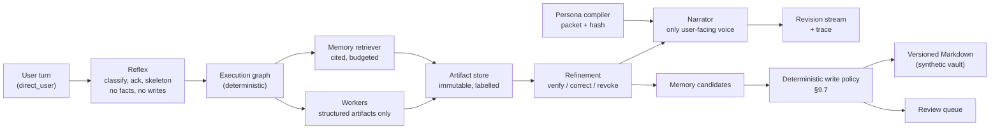
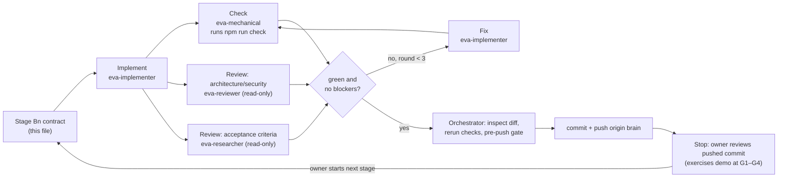

# EVA Brain — orchestration, memory and personality plan

Status: **kickoff decisions D1–D6 settled by the owner, 2026-09-24; B0/B1 ready to run, nothing built yet.** Drafted 2026-09-24 at the owner's request while GPT-6 Astra finishes the Week 2 / E1 visual demo. This document authorizes nothing by itself: each stage begins only when the owner starts it (see [Section 9](#9-kickoff-decisions-owner), D5). No existing shared file is touched before B9.

Source hierarchy: [PLANNING.md](../PLANNING.md) Sections 3, 5–9 and 13 define the architecture this plan implements a subset of. [AGENTS.md](../AGENTS.md) governs the development process. Where this plan is narrower than PLANNING.md, PLANNING.md still wins. Where it deviates, the deviation is listed in Section 9 for an explicit owner decision.

## 1. What "the brain" is

The brain is a standalone TypeScript service. It takes a user turn, decides what work is needed, gathers cited memory, runs bounded workers, and hands the result to a single narrator speaking in EVA's persona. It also proposes durable memory through a reviewable, deterministic write pipeline. It is headless: it has no UI and no Tauri dependency, and it runs in its own npm workspace with its own fixtures and tests.

| In scope (first version) | PLANNING.md source |
| --- | --- |
| Deterministic execution graph with Reflex / Deliberative / Refinement loops | §6.2, §7.4, Milestone 5 |
| Single narrator boundary; workers return structured artifacts only | §3.3, §6.1, §6.4 |
| Provider-neutral model adapter contract, capability registry, deadline-aware routing | §7.1–7.3 |
| Deterministic **mock provider** first; Anthropic adapter as a later gated stage | §7.2, owner choice 2026-09-24 |
| Revision stream (`provisional` / `verified` / `corrected` / `revoked` / `stale`), cancellation propagation | §7.7, §6.5 |
| Provenance and confidentiality labels on every context item and artifact | §13.3 |
| Markdown memory vault (synthetic), append-only episodes, rebuildable lexical index, cited retrieval under a token budget | §9.1–9.5, §9.9, Milestone 4 |
| Memory-write pipeline with the §9.7 approval policy as deterministic code, plus a review queue | §9.6–9.7, §13.11 |
| **Personality brain**: layered persona, compiler, narrator packet with version hash, register rules, session affect and expressive intentions | §8.1–8.2, §8.5, [Memory Archive transfer](../docs/research/MEMORY_ARCHIVE_TRANSFER.md) A/B/G |
| Redacted JSONL traces recording route, persona hash and timing | §6.5, §15 (subset) |
| Scripted CLI scenarios as the owner-exercisable demo | §17 owner gate |
| One thin adapter into E1, after Astra finishes | Owner choice 2026-09-24 |

| Out of scope (unchanged gates) | Why |
| --- | --- |
| UI of any kind, including the memory dossier card and topology view | A later UI stage once E1's visual system is settled |
| Voice, TTS, wake word, screen capture | §8.4 and §10 are separate milestones; Astra owns E1 voice files |
| External tools, connectors, MCP, effectful actions, Guardian, rehearsal | Milestones 7–8. The brain ingests only synthetic user turns and the synthetic vault, so no untrusted external content enters. |
| Semantic/vector search and embedding models | Needs a benchmark decision (§9.5); no model downloads. Lexical search comes first. |
| A real private vault or real persona files | §9.1: never committed. The brain writes only to a synthetic vault copy in a temp directory. |
| Learned orchestration, Kimi adapter | §6.2 research track; §7.2 needs its own harness |
| Any change to `week1/` or to `experiments/e1/` before Stage B9 | Owner instruction: no file overlap with Astra's work yet |

## 2. Isolation from Astra's Week 2 work

The brain must not clash with the uncommitted E1 work in the shared checkout. The rules:

1. **Separate worktree and branch.** At kickoff, create `.claude/worktrees/brain` on a new branch `brain`, started from `main` at the kickoff revision (currently `cb7ac83`, which equals `origin/main`). `.claude/worktrees/` is already gitignored, so the worktree never appears in the shared checkout's status. The shared checkout's branch is never switched.
2. **Separate workspace.** All code lives under `brain/` on the `brain` branch: its own `package.json`, lockfile, `tsconfig.json`, fixtures and tests. It is not added to the root `package.json` scripts until Stage B9's reconciliation.
3. **Zero shared-file edits in B0–B8.** No edits to root `PLANNING.md`, `AGENTS.md`, `DESIGN.md`, `docs/`, `week1/` or `experiments/`. Brain decisions and acceptance live under `brain/docs/`. Shared-document reconciliation happens once, in B9, after Astra's work has landed.
4. **This folder's own move.** This draft and its session prompts sit untracked in `brain/` in the shared checkout. B0 copies the whole untracked `brain/` folder into the worktree, verifies each copy by hash, commits it on `brain`, and only then deletes the untracked originals, so a later merge doesn't collide with stray untracked copies.
5. **Dependency on E1 is one-way and late.** B1–B8 import nothing from `experiments/e1`. B9 adds one adapter that maps brain output onto E1's public `acceptScore()` contract ([experiments/e1/src/core/API.md](../experiments/e1/src/core/API.md)), against whatever E1 revision the owner has accepted by then.

## 3. Git and GitHub policy (owner-authorized)

The owner asked (2026-09-24) that each brain commit is pushed to a separate `brain` branch on GitHub. That instruction is the durable authorization for commits and pushes **on `brain` only**, within this track. Everything else in AGENTS.md still applies:

- One commit per completed stage (and one per fix round after owner feedback). Commits are made by the orchestrating session after it has inspected the diff and rerun the checks, never by a worker agent.
- Commit message: `brain(B<n>): <summary>`, ending with the session's required co-author line.
- Push: `git push -u origin brain` after every commit. Never `--force`, never amend a pushed commit, never push `main`, and never merge, rebase `main`, or open a PR unless the owner asks.
- **Pre-push gate**, all required: `git diff --check`; a secret scan of the staged diff (API-key patterns, `.env*`, tokens, private vault paths, absolute user paths in fixtures); no real persona or vault content; no file over 1 MB without a stated reason.
- **Public-visibility check at B0:** `gh` is not installed on this workstation, so the repository's visibility was not verified. B0 confirms it (GitHub web UI or an installed `gh`) before the first push. If the repo is public, every pushed commit is published immediately.

## 4. Architecture of the brain workspace

```text
brain/
├── PLANNING.md                 # this file
├── package.json                # Node >= 24.14, "type": "module"
├── tsconfig.json               # strict, noEmit, erasableSyntaxOnly (Node runs .ts directly)
├── schemas/                    # EVA-owned JSON Schema Draft 2020-12
├── src/
│   ├── contracts/              # generated validators + TS types
│   ├── provenance/             # integrity/confidentiality labels, propagation rules
│   ├── models/                 # adapter contract, registry, router, mock provider, (B8) anthropic
│   ├── memory/                 # vault io, episodes, nodes, index, retrieval, write pipeline, review queue
│   ├── persona/                # layers, compiler, register rules, affect, expressive intentions
│   ├── orchestrator/           # graph, reflex/deliberative/refinement, workers, narrator, revisions
│   ├── trace/                  # redacted JSONL trace writer
│   └── cli/                    # scenario runner and inspection commands
├── fixtures/
│   ├── vault/EVA/...           # synthetic vault incl. Identity/ (fictional, public-safe)
│   ├── mock-responses/         # scripted provider outputs, incl. malformed/refusal/timeout
│   └── scenarios/              # owner demo episodes with expected outcomes
├── tests/                      # node:test suites per module
└── docs/
    ├── decisions.md            # brain-track decision log
    └── acceptance/brain.md     # pending-by-default owner acceptance record
```

**Tooling.** Node's built-in test runner (`node --test`) runs TypeScript directly through Node 24's type stripping, which fits PLANNING.md Milestone 0 ("Ajv and Node's built-in test runner"). `tsc --noEmit` typechecks. Ajv validates schemas, with standalone validators generated as E1 does. The only planned runtime dependencies are `ajv` and `yaml` (frontmatter). Each dependency is reviewed before it's added.

**Scripts:** `npm run check` (validators check → typecheck → tests → schema fixtures), `npm test`, `npm run typecheck`, `npm run scenario -- <id|all>`, `npm run memory:rebuild`, `npm run memory:review`.

### 4.1 Turn flow



### 4.2 Invariants every stage must keep

These come from PLANNING.md and AGENTS.md. Each stage's tests must cover the ones it touches.

1. Only the narrator produces user-facing prose. Workers, the retriever, the extractor and the Refinement verifier return schema-validated data.
2. No model output can raise integrity, lower confidentiality, remove lineage, or create authority. Labels propagate through every transform.
3. Provisional, corrected, revoked, stale or quarantined content never becomes a durable memory fact (§9.7, §13.11).
4. Retrieved memory is evidence, not instruction. It cannot change retrieval policy, persona, or the write policy.
5. Current external facts (weather, schedules) are not answered from memory alone (§9.9).
6. Persona **identity** changes require explicit user review. **Adaptive style** is bounded and versioned. **Session affect** expires automatically. The **constitution** changes only by reviewed code.
7. Sarcasm is suppressed deterministically during safety confirmations, user distress, failed actions, factual uncertainty, privacy blocks, and security events (§8.3). Suppression is enforced on the narrator packet, not requested in a prompt.
8. No trust-gated disclosure: facts never depend on rapport or affect (Memory Archive transfer: Exclude).
9. Cancellation propagates to every dependent worker, model stream and pending memory candidate. Late results are rejected by generation token.
10. Every answer's trace records the model route, the persona version and hash, and the cited memory node IDs. Traces contain synthetic IDs, not raw private text.
11. Schemas reject unknown fields wherever authority, labels or memory state are involved.

## 5. Stages

Each stage lists what it owns, what it delivers, and its acceptance criteria. The automated pipeline (Section 6) reads these sections verbatim, so they are written as contracts.

### Stage B0 — Kickoff and scaffold

- **Precondition:** owner kickoff message plus answers to Section 9's decisions.
- **Owned paths:** `brain/**` on branch `brain`.
- **Delivers:** worktree and branch; this plan moved into the worktree; workspace skeleton; `npm run check` running green on an empty test suite; `brain/docs/decisions.md` recording the kickoff decisions; `brain/docs/acceptance/brain.md` (status pending); the repository-visibility confirmation.
- **Acceptance:** the shared checkout's `git status` is unchanged apart from the deleted untracked draft; `npm ci && npm run check` passes in `brain/`; the first push lands on `origin/brain`.
- **Executed by:** the orchestrating session inline. This is small, and git setup should not be delegated.

### Stage B1 — Contracts and provenance

- **Owned paths:** `brain/schemas/**`, `brain/src/contracts/**`, `brain/src/provenance/**`, `brain/scripts/**`, matching tests and fixtures.
- **Delivers:** Draft 2020-12 schemas for: context item (with integrity/confidentiality labels and lineage), artifact envelope (§6.4), revision event (§7.7), routing contract (§7.3), model request/response/stream event (§7.2), memory node frontmatter (§9.4), episode record, memory candidate, review decision, persona source files, compiled persona packet, session affect state, trace event. Also generated validators with a `--check` mode, and a label-propagation module (join = lowest integrity, highest confidentiality).
- **Acceptance:** each schema has ≥1 positive and ≥2 negative fixtures, including an unknown authority/label field; tests show a model-sourced item can't upgrade integrity or downgrade confidentiality through propagation; `validators --check` detects drift.

### Stage B2 — Model adapters, registry and mock provider

- **Owned paths:** `brain/src/models/**`, `brain/fixtures/mock-responses/**`, tests.
- **Delivers:** the adapter interface normalizing structured output, streaming events, refusals, usage, context limits and errors. Also a capability registry and route table (initial logical routes from §7.1, with model IDs as configuration only), deadline-aware selection, and an `AbortSignal`-based cancellation contract. The **deterministic mock provider** replays scripted fixtures, including delay, malformed JSON, schema-invalid output, refusal, timeout, and mid-stream abort.
- **Acceptance:** zero network access in tests (enforced by a test that fails on any `fetch`); invalid provider output is rejected and degrades to a safe typed failure; aborting cancels the stream within one event; route selection is observable and overrideable from config.

### Stage B3 — Memory store and retrieval

- **Owned paths:** `brain/src/memory/{vault,episodes,nodes,index,retrieval}/**`, `brain/fixtures/vault/**`, tests.
- **Delivers:** a synthetic vault following §9.3 (fictional user, public-safe). Markdown + YAML frontmatter read/write, with round-trip preservation. Append-only JSONL episodes. Node versioning with `supersedes` / `contradicted_by`. A rebuildable lexical index (BM25-style) plus temporal and entity indexes, stored as disposable files. Retrieval that returns cited node IDs under a token budget, filtering out expired, revoked and quarantined nodes.
- **Acceptance:** deleting the index and rebuilding yields identical retrieval results; episodes can't be rewritten (appending only); a superseded node is never returned as current but remains inspectable; the retrieval budget is respected, with a logged record of what was dropped; volatile-fact queries are flagged as needing fresh data.

### Stage B4 — Memory-write pipeline and review queue

- **Owned paths:** `brain/src/memory/{extract,policy,review}/**`, `brain/fixtures/policy/**`, tests, CLI `memory:review`.
- **Delivers:** candidate extraction through the adapter (mock), and deterministic dedup, contradiction, sensitivity and provenance checks. The §9.7 approval table implemented as a pure TypeScript function with one test per row (interim per D3). Its fixtures go in `brain/fixtures/policy/` as input/expected-decision pairs that a later Rust version must pass unchanged. A review queue as JSON, with `accept` / `edit` / `reject` / `make-temporary` via the CLI. Affective candidates always go to review with a low-confidence label and an expiry. Writes go only to a temp copy of the synthetic vault.
- **Acceptance:** every §9.7 row is covered by a named test; provisional, revoked, stale and quarantined sources can't produce a write (property-style test over all statuses); an explicit correction supersedes the prior node and keeps it; a source episode survives consolidation; the extractor's output can't set its own review state or labels.
- **Owner gate G1** (after B4): review the memory behaviour with `npm run scenario -- memory` and the review CLI.

### Stage B5 — Personality brain

- **Owned paths:** `brain/src/persona/**`, `brain/fixtures/vault/EVA/Identity/**`, tests.
- **Delivers:**
  - **Layers** (§8.1): constitution, identity, adaptive style, session affect, loaded from synthetic `constitution.md`, `persona.yaml`, `style-state.yaml`, `exemplars.md` and `voice.md` (fictional values modelled on §8.3; the real persona stays private).
  - **Compiler:** layers are compiled into a narrator packet with a content hash and version. Workers get task constraints only, never the full packet.
  - **Register rules:** a deterministic context → register table (sarcasm suppression contexts, brevity, warmth bounds). The adaptive style can move only within bounds the constitution defines.
  - **Session affect and expressive intention:** a small vocabulary (`attend`, `invite-comparison`, `reconsider`, `settle`) with gradual settling and automatic expiry. PAD/Plutchik stays an unadopted option (transfer decision B: Investigate). Affect never gates facts or permissions.
  - **Change proposals:** identity and style changes are emitted as memory candidates of type `Identity` and routed through B4's review queue. Session affect is never persisted as a durable fact.
- **Acceptance:** the same inputs produce the same packet hash; any edit to an identity file changes the hash and version; sarcasm is absent from the packet in every suppression context (table-driven test); a model-proposed identity change can't be applied without a review decision; affect expires on schedule and resets on dismissal; no persona field reaches a worker prompt.

### Stage B6 — Orchestrator

- **Owned paths:** `brain/src/orchestrator/**`, `brain/src/trace/**`, tests.
- **Delivers:**
  - A deterministic execution graph built per turn, with specialist-promotion rules (§6).
  - **Reflex:** classify, acknowledge, skeleton; no facts, no writes.
  - **Deliberative:** parallel retrieval and workers produce artifacts.
  - **Refinement:** verify claims against cited artifacts, and promote, correct or revoke them.
  - **Narrator:** the only step that receives the persona packet and emits prose, released per sentence only after verification.
  - A revision stream with generation tokens, deadlines and budgets per task, and redacted JSONL traces.
- **Acceptance:** a worker can't emit user-facing text (type- and test-enforced); cancelling mid-turn aborts dependent workers and streams and discards late results; a model failure degrades to a plain, labelled answer; each trace records the route, persona hash and cited nodes; a revoked revision can't feed a memory write.

### Stage B7 — Scenario harness (the owner demo)

- **Owned paths:** `brain/src/cli/**`, `brain/fixtures/scenarios/**`, tests.
- **Delivers:** `npm run scenario -- <id|all>` runs scripted multi-turn episodes against the mock provider and prints the narrator output, revisions, citations, memory decisions, persona hash and trace path. Scenarios:
  1. Recall an explicit preference, with a citation (e.g. "use Celsius", echoing Week 1).
  2. An explicit correction supersedes the old preference; the old node is still inspectable.
  3. An inferred preference goes to review, not an auto-write.
  4. An emotional observation goes to review with a low-confidence label and an expiry.
  5. A request for current weather refuses to answer from memory and asks for fresh data.
  6. The user interrupts mid-answer: cancellation propagates, and a late worker result is rejected.
  7. A malformed provider output produces a safe, plain degraded answer.
  8. A failure or uncertainty context gets a register without sarcasm; a casual context gets restrained dry warmth.
  9. A model-proposed personality change is queued for review and not applied.
  10. Rebuilding the index from Markdown gives identical answers.
- **Acceptance:** every scenario's expected outcome is asserted in tests *and* readable in the CLI output.
- **Owner gate G2** (after B7): the **phase acceptance demo**. The owner runs the scenarios hands-on; the result is recorded in `brain/docs/acceptance/brain.md` against the pushed commit.

### Stage B8 — Anthropic adapter (gated)

- **Precondition:** owner confirms an Anthropic API key (private env or credential store, never committed) and a spend limit. A subscription does not imply API access.
- **Owned paths:** `brain/src/models/anthropic/**`, tests.
- **Delivers:** a Messages API adapter behind the B2 contract, with streaming, structured output via tool schema, refusals, usage metadata and prompt-prefix caching for the constitution, persona packet and schemas (§7.5). Route IDs are config, with starting values Haiku 4.5 / Sonnet 5 / Opus 5.5 / Fable 5.1, verified against actual access before use.
- **Acceptance:** all tests pass with the adapter disabled; live smoke tests run only through an explicit opt-in command; the live run's observed model IDs, latency and cost are recorded as measurements, not assumed; the B7 scenarios rerun live with any divergence from the mock recorded.
- **Owner gate G3.**

### Stage B9 — E1 adapter and repository reconciliation (gated)

- **Precondition:** the owner reports Astra finished, and states which E1 revision to target.
- **Owned paths:** a new adapter file (and its test) in the E1 workspace, chosen once E1's final structure is known; root `package.json` script forwards; minimal link entries in `AGENTS.md` / `PLANNING.md` / `docs/research/DIRECTION_DECISIONS.md`.
- **Delivers:** a thin adapter that maps brain Deliberative output onto an E1 `ModelProposal` passed through `acceptScore()`. E1's host keeps ownership of evidence, locks, budgets and generation tokens. It also reconciles the shared documents, recording this track.
- **Acceptance:** E1's existing tests stay green; invalid brain proposals fall back exactly as E1 specifies; a late brain result can't revive a dismissed response; brain and E1 remain separately buildable.
- **Owner gate G4.** Merging `brain` into `main` is a separate, explicit owner decision.

## 6. Automated implementation pipeline

The owner chose a **staged pipeline with gates**. Each stage B1–B9 runs as one scripted workflow. The orchestrating session then verifies, commits and pushes, and **stops after every stage** for owner review (D5: no automatic advance). The next stage starts only when the owner says so. G1–G4 remain the stages where the owner exercises a demo; the other stops are diff-and-checks reviews of the pushed commit.



**Rules:**

- At most **three** agents run at once (the checker and both reviewers run concurrently; the implementer runs alone). There is exactly one writer at any time, working only in `.claude/worktrees/brain`.
- Workers use the project `eva-*` definitions with no per-call model override, so each definition's model routing holds (AGENT_WORKFLOW.md step 4).
- A stage stops after **three** check/review rounds that still have blockers. The orchestrator reports the actual failures and does not commit a red stage.
- Workers never commit, push, stash, reset or switch branches. Only the orchestrator runs git.
- The final report for each stage uses the AGENTS.md handoff format and includes real exit codes, and the actual routes as recorded in the Gateway route log.
- **Implementer route per stage:** the default is `eva-implementer` (Sol). The owner selected **Opus 5.5 (`claude-opus-5-5`) as the main session implementing B1** (2026-09-24), using [prompts/B1_SESSION_PROMPT.md](prompts/B1_SESSION_PROMPT.md). For that stage the session implements directly and uses the reviewers below for verification. Each stage's report records the route actually used.
- Rough cost: 4–8 agent runs per stage and about 40–70 across B1–B8. Expect the implementer to dominate.

### 6.1 Workflow script

The orchestrating session invokes this once per stage with `args: { stage: "B3", worktree: "<abs path>/.claude/worktrees/brain", base: "<sha of previous stage commit>" }`.

```js
export const meta = {
  name: 'brain-stage',
  description: 'Implement, check, review and fix one EVA brain stage in the isolated brain worktree',
  phases: [{ title: 'Implement' }, { title: 'Verify' }, { title: 'Fix' }],
}

const { stage, worktree, base } = args
const WHERE = `Work only inside ${worktree} (git branch "brain"). Never read from or write to the shared checkout's experiments/, week1/, or root docs. Never commit, push, stash, reset, clean, or switch branches.`
const SPEC = `the "Stage ${stage}" section of ${worktree}/brain/PLANNING.md, plus Section 4.2 invariants`

const CHECK = { type: 'object', required: ['passed', 'commands'], properties: {
  passed: { type: 'boolean' },
  commands: { type: 'array', items: { type: 'object', required: ['cmd', 'exit', 'summary'],
    properties: { cmd: { type: 'string' }, exit: { type: 'number' }, summary: { type: 'string' } } } } } }
const FINDINGS = { type: 'object', required: ['findings'], properties: {
  findings: { type: 'array', items: { type: 'object', required: ['severity', 'file', 'summary'],
    properties: { severity: { enum: ['blocker', 'major', 'minor'] }, file: { type: 'string' }, summary: { type: 'string' } } } } } }

phase('Implement')
const handoff = await agent(`${WHERE}\nImplement ${SPEC}. Stay within the stage's owned paths. Write the tests the acceptance criteria require. Return an AGENTS.md-format handoff.`,
  { agentType: 'eva-implementer', phase: 'Implement', label: `implement:${stage}` })

let round = 0, check = null, blockers = [], minors = []
while (true) {
  const [c, arch, crit] = await parallel([
    () => agent(`${WHERE}\nIn ${worktree}/brain run "npm run check" and any stage-specific commands in ${SPEC}. Report real exit codes. Change nothing.`,
      { agentType: 'eva-mechanical', schema: CHECK, phase: 'Verify', label: `check:${stage}:r${round}` }),
    () => agent(`Read-only. Review "git -C ${worktree} diff ${base}" for ${stage}: authority/provenance labels, memory poisoning, persona boundaries, cancellation, schema strictness. Concrete defects only.`,
      { agentType: 'eva-reviewer', schema: FINDINGS, phase: 'Verify', label: `review:arch:${stage}:r${round}` }),
    () => agent(`Read-only. Check each acceptance criterion in ${SPEC} against the code and tests in ${worktree}/brain. Every unmet criterion is a blocker; cite the file.`,
      { agentType: 'eva-researcher', schema: FINDINGS, phase: 'Verify', label: `review:criteria:${stage}:r${round}` }),
  ])
  check = c
  const all = [arch, crit].filter(Boolean).flatMap(r => r.findings)
  blockers = all.filter(f => f.severity !== 'minor')
  minors = all.filter(f => f.severity === 'minor')
  if (check && check.passed && blockers.length === 0) break
  if (round === 2) { log(`${stage}: stopping after 3 rounds with ${blockers.length} blocker(s)`); break }
  round++
  await agent(`${WHERE}\nFix only these issues for ${stage}, then stop.\nCheck results: ${JSON.stringify(check)}\nFindings: ${JSON.stringify(blockers)}`,
    { agentType: 'eva-implementer', phase: 'Fix', label: `fix:${stage}:r${round}` })
}

return { stage, green: Boolean(check && check.passed) && blockers.length === 0, rounds: round + 1, check, blockers, minors, handoff }
```

### 6.2 Orchestrator steps after each workflow

1. If the result isn't `green`, stop and report the blockers. Don't commit.
2. `git -C <worktree> status` and `diff`: confirm the changes stay within the stage's owned paths, and read the diff.
3. Rerun `npm run check` in the worktree personally. Worker reports are not evidence on their own.
4. Run the pre-push gate (Section 3).
5. Commit `brain(B<n>): …`, then `git push origin brain`.
6. Append the stage result (commit SHA, checks, actual routes, minors deferred) to `brain/docs/decisions.md`. This file's edit goes into the next stage's commit, or into its own small commit at a gate.
7. Stop after every stage. Give the owner the pushed commit, the checks and, at G1–G4, the demo command and expected results. Don't start the next stage until the owner does.

## 7. Owner gates summary

| Gate | After | Owner exercises | Decision recorded in |
| --- | --- | --- | --- |
| Kickoff | — | Answered Section 9 (2026-09-24) | `brain/docs/decisions.md` |
| Every stage | B1–B9 | Reviews the pushed commit and starts the next stage (D5) | `brain/docs/decisions.md` |
| G1 | B4 | Memory scenarios + review CLI | `brain/docs/acceptance/brain.md` |
| G2 | B7 | All ten scenarios (**phase acceptance**) | same |
| G3 | B8 | Live-provider rerun | same |
| G4 | B9 | Brain driving E1 | same, plus E1's record if it changes |

Silence, passing tests, or another agent's review never count as acceptance (AGENTS.md).

## 8. Risks and mitigations

| Risk | Mitigation |
| --- | --- |
| Astra's work and the brain diverge on shared contracts | No shared imports until B9; B9 targets an owner-named E1 revision |
| The mock provider hides real-model behaviour | B8 reruns every scenario live and records divergence; the mock includes malformed, refusal and timeout cases from the start |
| The TypeScript write policy is mistaken for the final Rust broker | Owner decision D3: labelled as interim; a pure function over `brain/fixtures/policy/` that the later Rust migration must pass unchanged; no real vault is written until that migration is accepted |
| A persona or memory fixture leaks real data | Fictional vault only; pre-push scan; no real persona values committed |
| The automated loop spins or produces a large unreviewable diff | 3-round cap; one stage per workflow; commit per stage; owner gates at B4/B7 |
| A public push exposes something unintended | Visibility confirmed at B0; pre-push gate before every push |

## 9. Kickoff decisions (owner)

All six were settled by the owner on 2026-09-24.

- **D1 — Parallel track vs phase order. APPROVED by the owner, 2026-09-24.** AGENTS.md says the next major phase begins only after the current one is accepted, and E1's acceptance is still pending. Owner decision, in their words: “Approve this for me: The plan asks you to approve the brain as a separate track so it doesn't have to wait for E1.” The brain is therefore an independent development track (product Milestones 4/5 subset + §8 persona), not S2, and it doesn't depend on E1 acceptance. B9 alone still waits for Astra to finish and for an owner-named E1 revision. This decision doesn't accept E1, S1/S2 or any other phase, and it doesn't start implementation: B0 still waits for the kickoff message.
- **D2 — Scope. CONFIRMED by the owner, 2026-09-24.** Orchestration + memory + personality as in Section 1, with no UI, voice, tools or embeddings.
- **D3 — Where deterministic policy lives. APPROVED by the owner, 2026-09-24.** PLANNING.md puts authority enforcement in Rust. The brain's only effect is writing to a synthetic vault in a temp directory. Owner decision: “Also write the memory saving rules in TypeScript for now, we will migrate to the Rust version later.” So:
  - **B4** implements the memory-write policy (§9.7 approval table, dedup/contradiction/sensitivity/provenance checks) as a pure TypeScript function with no I/O, driven by shared JSON fixtures under `brain/fixtures/policy/`. Each fixture holds an input candidate plus its expected decision.
  - Those fixtures are the migration contract. A later Rust version must pass the same fixtures unchanged before it replaces the TypeScript function.
  - **Migration is a later, separately scoped stage** after B9, with its own owner gate. It is not part of B0–B9. The TypeScript policy stays a clearly labelled interim stand-in (in code comments and `brain/docs/decisions.md`), not the final authority boundary.
  - **Hard limit until the migration lands:** the brain writes only to the synthetic vault copy. No real private vault is written with the TypeScript policy.
- **D4 — Repository visibility. PUBLIC, per the owner, 2026-09-24.** Every push to `origin/brain` is published immediately, so the Section 3 pre-push gate is mandatory, and fixtures, persona files and traces must be fictional and public-safe. B0 still confirms visibility against GitHub before the first push, and stops if it differs.
- **D5 — Stage advance. NO AUTOMATIC ADVANCE, per the owner, 2026-09-24.** The pipeline stops after every stage, including those without a demo gate. The owner starts each next stage explicitly.
- **D6 — B8 timing. DEFERRED by the owner, 2026-09-24.** No API key yet. B8 waits for a key and a spend limit; B1–B7 use only the mock provider, and B9 doesn't depend on B8.
