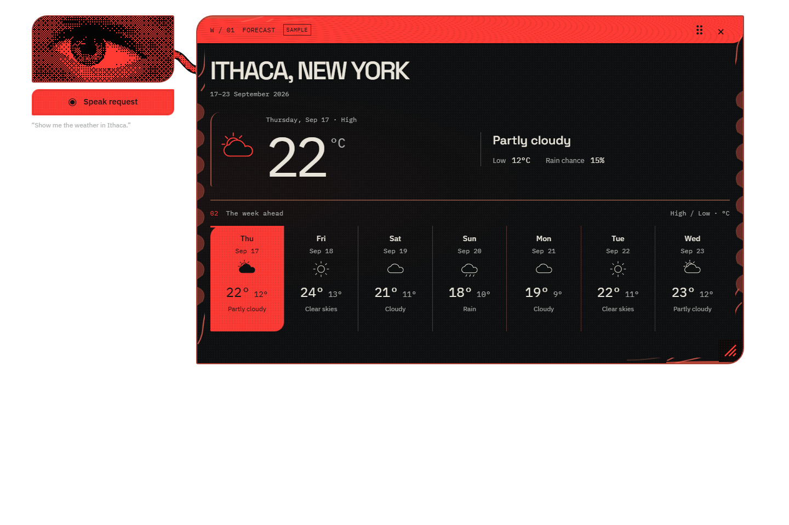
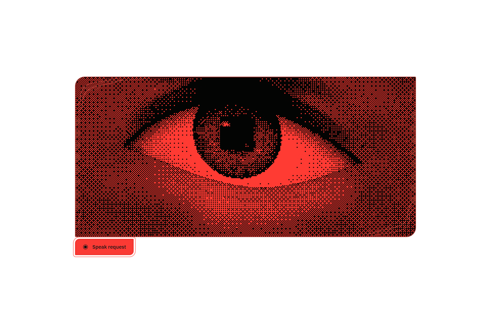
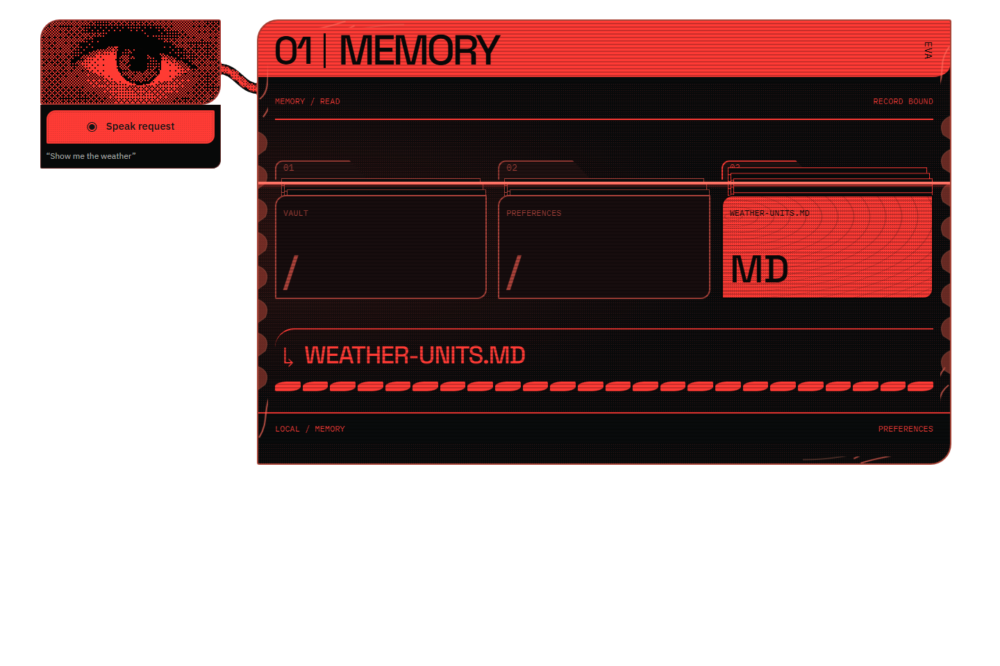
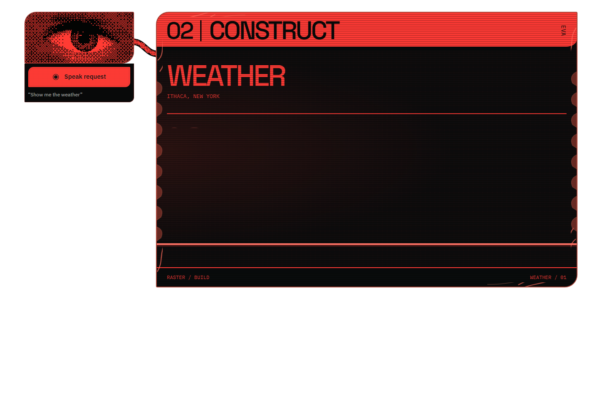
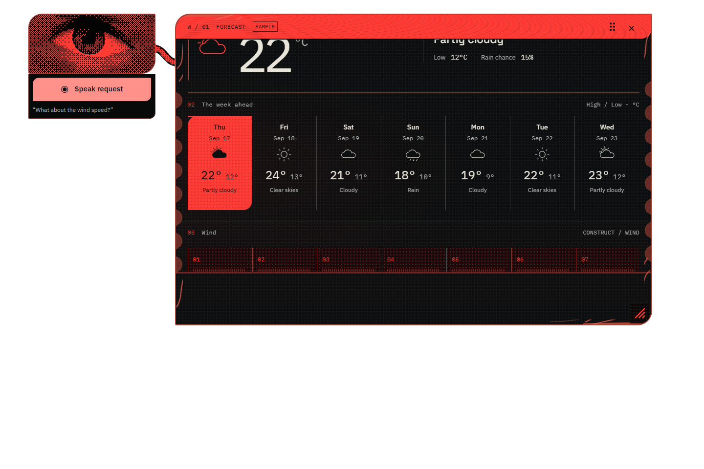
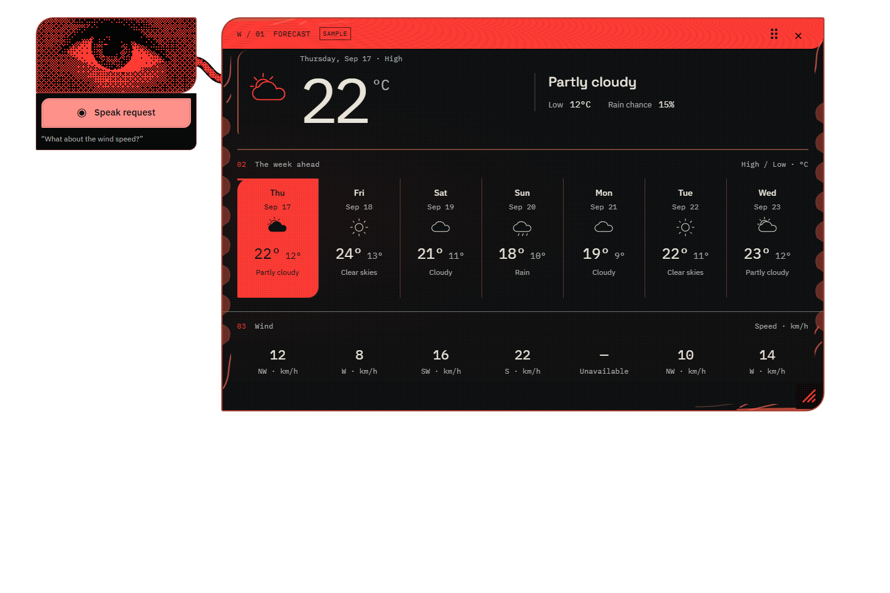
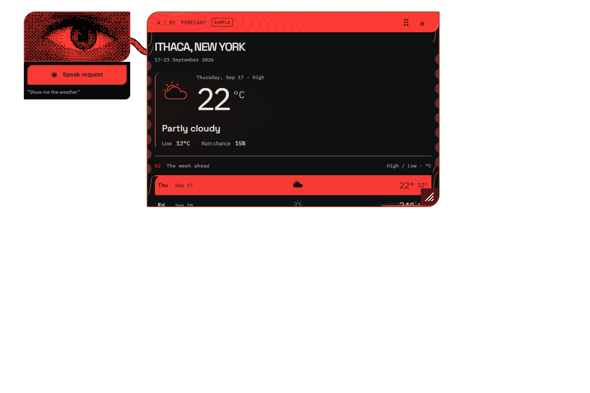
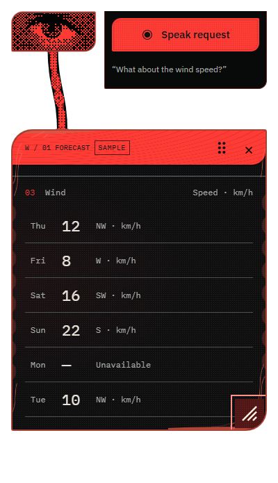
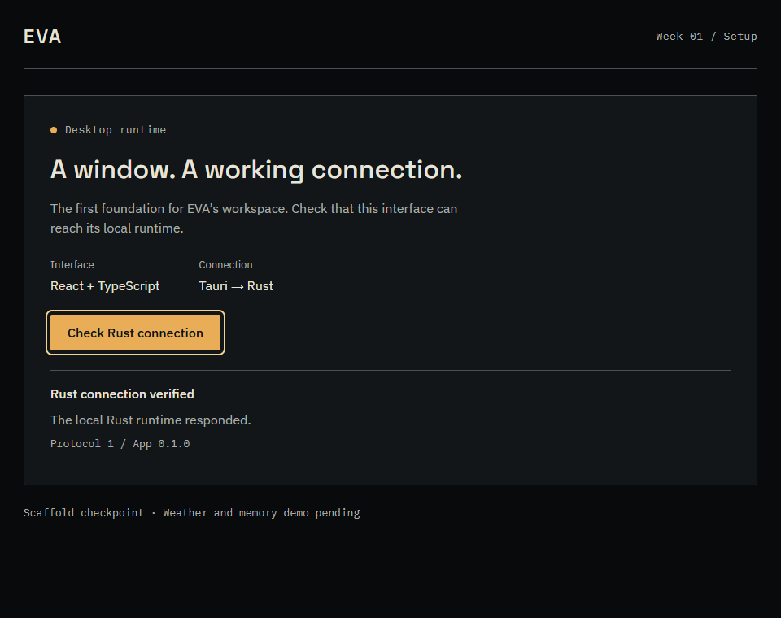

# EVA — Week 1 visual demo

Week 1 was about getting EVA onto the desktop and giving a simple weather request a bit of personality. We built a blinking red eye, a weather panel that draws itself into place, and a spoken follow-up that adds wind without starting over.

**The demo was a success on September 17, 2026.** [Week 1 outcome notes](docs/design/acceptance/week1-outcome.md).



- **This is where we landed:** red, black, warm white text, chunky pixels, and a small eye beside the forecast.
- **One way in:** click **Speak request**, ask for the weather, and send the recording.
- **The numbers are demo data:** seven days of made-up Ithaca weather, clearly marked **Sample**.

All images below are saved screenshots of the Week 1 app. The walkthrough uses browser captures; the early setup image is a native Windows capture. Transparent areas may look black or take on your viewer's background. Earlier captures are labeled because the controls changed along the way.

## Meet the eye



- The eye blinks, follows the pointer inside the app window, and reacts while you're recording.
- The lids, brow, and surrounding shape move along with the pupil. We wanted more than a dot sliding around.
- When the weather opens, this same eye shrinks and moves to the side to make room.
- The dotted texture is **dithering**: tiny squares that create shading. The square pupil stayed part of the look.

## Ask for the weather, then watch it come together

Say **“Show me the weather in Ithaca.”** EVA acknowledges the request, looks up a saved temperature preference, and builds the weather view while speaking.



- **First, the memory moment.** The folder animation points to a small Markdown note that says to use Celsius.
- Rust really reads that bundled demo record. The animated folder search is something we designed; it isn't scanning the computer.
- This capture is from before we removed the box around the microphone controls.



- **Then, the build-up.** Red scan lines and stepped reveals make the panel feel like an old CRT screen drawing itself.
- The full weather reveal takes about **15 seconds**, giving the spoken lines room to play. That's deliberate animation timing, not a measure of how long the data takes to load.
- We also added a reduced-motion path that skips this long reveal.

## “What about the wind speed?”

The follow-up was the other big part of the demo. You ask through the microphone, EVA says **“Give me a second,”** and a new section forms inside the existing panel.



- The wind section builds for **five seconds after the acknowledgement finishes**.
- The weather stays in the same panel, with your selected day, size, and position kept in place.



- The finished section shows wind speed in **km/h** and direction for each day, followed by a spoken reply.
- Missing data stays **Unavailable** instead of quietly becoming zero.
- Asking again doesn't add another copy. Closing the panel cancels an unfinished reveal.
- These two captures come from just before the final microphone-control cleanup.

[Watch the saved wind sequence](docs/design/revisions/week1-wind-dialogue-20260917/dialogue-02/wind-dialogue.webm). This browser recording has no audio track; it shows the visual timing.

## Move it around. Make it smaller.



- Drag the header handle to move the panel, or the bottom-right grip to resize it.
- The layout rearranges itself as space gets tighter. Short panels scroll inside the frame.
- The move and resize handles also work with arrow keys when focused.



- **At 400 pixels wide:** wind values become a vertical list, and the eye sits above the panel.
- This is a narrow browser check of the desktop interface. Both resize images predate the final microphone-control cleanup.

[Watch the saved resize walkthrough](docs/design/revisions/week1-wind-dialogue-20260917/after/resize-voice.webm).

## What we used, in normal words

| Tool | What it did in this demo |
| --- | --- |
| **Tauri 2 + Windows WebView2** | Put our web interface inside a Windows desktop app. We configured a transparent, frameless window without the usual title bar. |
| **React 19 + TypeScript** | Built the eye controls, forecast, day selection, and changing screen states. TypeScript helped catch mismatched data while coding. |
| **CSS + WebGL** | CSS handled layout, textures, and transitions. WebGL drew the animated eye using the graphics hardware, with a simpler fallback if unavailable. |
| **Rust** | Handled the desktop side: reading the allowed demo memory file and making voice-service requests. |
| **OpenAI Whisper** | Turned an explicitly submitted microphone recording into text. A small local matcher recognized the weather and wind requests. |
| **ElevenLabs v3** | Read EVA's approved replies aloud. We worked on delivery cues, pauses, and when each line played. |
| **JSON + Markdown files** | Held the sample forecast and the readable Celsius preference. No database was needed for this demo. |
| **JSON Schema + Ajv** | Checked that weather data and interface updates had the shape we expected before using them. |
| **Vite + npm** | Ran the development preview, managed packages, and built the frontend. |
| **Playwright + Node/Rust tests** | Checked interactions in a browser and tested the data, memory, and voice code. |

The lettering uses **Space Grotesk** for headings, **IBM Plex Sans** for reading and controls, and **IBM Plex Mono** for numbers and small labels.

The voice-to-screen path looked like this:

```text
You record a request
        ↓
Whisper turns it into text
        ↓
Local code recognizes “weather” or “wind”
        ↓
Sample forecast + saved Celsius preference
        ↓
React updates the view  +  ElevenLabs reads the reply
```

- **The voice services were real integrations.** With private keys configured, they made cloud requests. Browser checks also used simulated requests so we could repeat the same scenarios.
- **The weather, memory, and screen-building steps were deliberately small.** We supplied the data and wrote the animation sequence; an LLM wasn't inventing layouts or fetching live forecasts.
- **Speech had its own polish pass:** five reply stages, a forecast summary drawn from the displayed data, cancellation, and a one-second silent tail to keep clip endings from feeling cut off. [Voice notes and scripts](docs/design/VOICE_PROMPTING.md).

## Where we started



- Our first working screen did one thing: confirm that the interface could talk to Rust.
- From there we added sample weather, the memory reader, voice, the eye, and the animated reveal.
- We iterated toward the red, anatomical look, then stripped away extra buttons and explanation text. The final entry point was just **Speak request**.
- The earlier screenshots and recordings are all kept in the [Week 1 design history](docs/design/INDEX.md).

## Try the demo

With dependencies and private voice settings already in place, run this from the repository root:

```powershell
npm.cmd run desktop:dev
```

1. Click **Speak request**, say **“Show me the weather in Ithaca,”** then click **Send recording**.
2. Let the eye dock and the weather finish building.
3. Select another day. Move the panel and try its resize grip.
4. Use **Speak request** again and ask **“What about the wind speed?”**
5. Watch the wind section appear without resetting the panel. Close it with **×** when you're done.

<details>
<summary>First time running it? Setup and checks</summary>

You'll need **Node 24.14+**, Rust's Windows MSVC toolchain, Visual Studio C++ Build Tools/Windows SDK, and WebView2. We installed and checked these during Week 1; the steps are in [Windows prerequisites](docs/setup/WINDOWS_PREREQUISITES.md).

From the repository root:

```powershell
cd week1
npm.cmd ci
# Only create this file if you don't already have one.
if (-not (Test-Path .env.local)) { Copy-Item .env.example .env.local }
```

Add your private settings to `week1/.env.local`:

```dotenv
OPENAI_API_KEY=
ELEVENLABS_API_KEY=
ELEVENLABS_VOICE_ID=
```

Keep these settings private and don't give them a `VITE_` prefix. Restart the app after changing them. Cloud access is needed for the voice services.

Then, from `week1/`:

```powershell
npm.cmd run desktop:dev
```

For a browser preview, use `npm.cmd run dev` and open `http://127.0.0.1:1420`. Use one dev server at a time because both paths use port 1420. The browser uses a demo adapter for memory; it doesn't establish how the native window behaves over the desktop.

The final interface uses microphone entry, so launching a preview without voice configuration doesn't provide a working weather shortcut.

These are the Week 1 check commands, also available from the repository root:

```powershell
npm.cmd run build
npm.cmd test
npm.cmd run memory:check
npm.cmd run rust:test
npm.cmd run rust:fmt
npm.cmd run rust:clippy
```

The final microphone-layout check is `node scripts/speak-only-smoke.mjs <new-output-directory>` against a running dev server. The wind check is `node scripts/wind-dialogue-smoke.mjs <new-output-directory>`. Run these from `week1/`; use a new output folder to preserve old captures. They use simulated microphone/provider inputs. Older button-based scripts describe earlier versions of the UI.

</details>

## What we checked

The saved end-of-week [verification record](docs/archive/verification.md) reports:

| Check | Saved result |
| --- | --- |
| Frontend build | Passed |
| JavaScript tests | 24 passed |
| Rust tests | 17 passed |
| Rust formatting and code checks | Passed |
| Windows desktop debug build | Passed |
| Browser interaction checks | Passed, including wide/narrow layouts and microphone-to-weather flow |

These are historical results, not tests rerun for this README. The owner reported the demo successful; the browser screenshots alone don't prove native desktop transparency or live voice playback.

## Find the bits

| Folder | What's inside |
| --- | --- |
| [apps/desktop/](apps/desktop/) | The interface and Rust desktop code. |
| [packages/](packages/) | Shared UI pieces, data rules, and validators. |
| [fixtures/connectors/](fixtures/connectors/) | The sample Ithaca forecast. |
| [fixtures/vault/preferences/weather-units.md](fixtures/vault/preferences/weather-units.md) | The demo Celsius preference, as a readable note. |
| [fixtures/narration/](fixtures/narration/) | The approved speech lines and voice settings. |
| [docs/design/INDEX.md](docs/design/INDEX.md) | Screenshots, recordings, and notes from each visual iteration. |
| [WEEK1_DEMO_PLANNING.md](WEEK1_DEMO_PLANNING.md) | The original Week 1 build plan. |
