# EVA — Week 2 weather experiment (E1)

Week 2 took the Week 1 eye and asked a harder question: can a weather answer be something you *watch change*, rather than a panel of text? We built a red particle eye that opens into a sun for today's New York weather, breaks apart into rain clouds when you ask about tomorrow, and folds back into the eye when you dismiss it.

**Owner decision: pending.** This is the current candidate, not an accepted result. See the [acceptance record](docs/design/acceptance/e1.md).

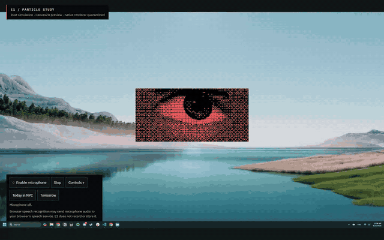

**[Watch the full recording (MP4, 20 s, 1440×900)](docs/design/revisions/e1-20260924-procedural/particles-preview.mp4).** It's a browser recording with no audio, run with the GPU switched off.

- **Everything moving is a real particle.** A small Rust program simulates 8,192 dots, and the browser draws them. We don't play video or cut up images.
- **The weather is made up on purpose.** Scenario W-NYC-02 is invented: 2026-10-14 is sunny and 22 °C, 2026-10-15 is rainy and 16 °C. Every screen labels it **Synthetic**.
- **The desktop is fake too.** The lake scene is a fixed "Mock Desktop" picture, so the preview looks like it's sitting on Windows without touching your real screen.

## Try it

From the repository root:

```powershell
npm.cmd --prefix week2 run dev
# then open http://127.0.0.1:1431
```

1. Click **Today in NYC**. The eye breaks up and gathers into a sun beside **Sunny 22 °C**.
2. Click **Tomorrow**. The sun loosens into two clouds that drip rain and leave ripples, next to **Rainy 16 °C**.
3. Click **Dismiss weather**. The particles pull back into the eye.
4. Anytime: **Stop** freezes the motion, including mid-return. **Controls +** has Pin, Less motion, Plain answer and a typed-command box.

You need Node and Rust, plus Rust's `wasm32-unknown-unknown` target. On a new machine, install it with `rustup target add wasm32-unknown-unknown`.

> **Don't run `desktop:dev` or an old `eva-e1.exe`.** The native Windows version froze the owner's whole system (see step 6 below). It's blocked on purpose.

## How we got here

### 1. Concepts first

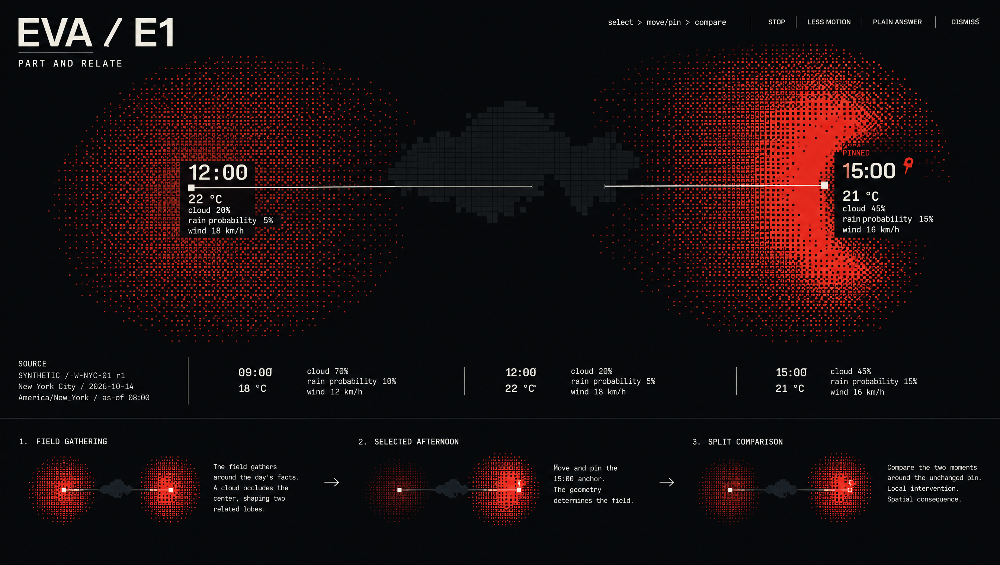

- We started with still concepts in Higgsfield showing weather as fields of red dots, not cards.
- The main idea: you can pick, pin and compare moments, and the picture rearranges around your choice.
- These are pictures, not working software. [Concept brief](docs/design/revisions/e1-20260917-01/authoring/brief.md) · [second concept](docs/design/revisions/e1-20260917-01/authoring/02-withdraw-and-reanchor.png)

### 2. The first build felt like an app in a box

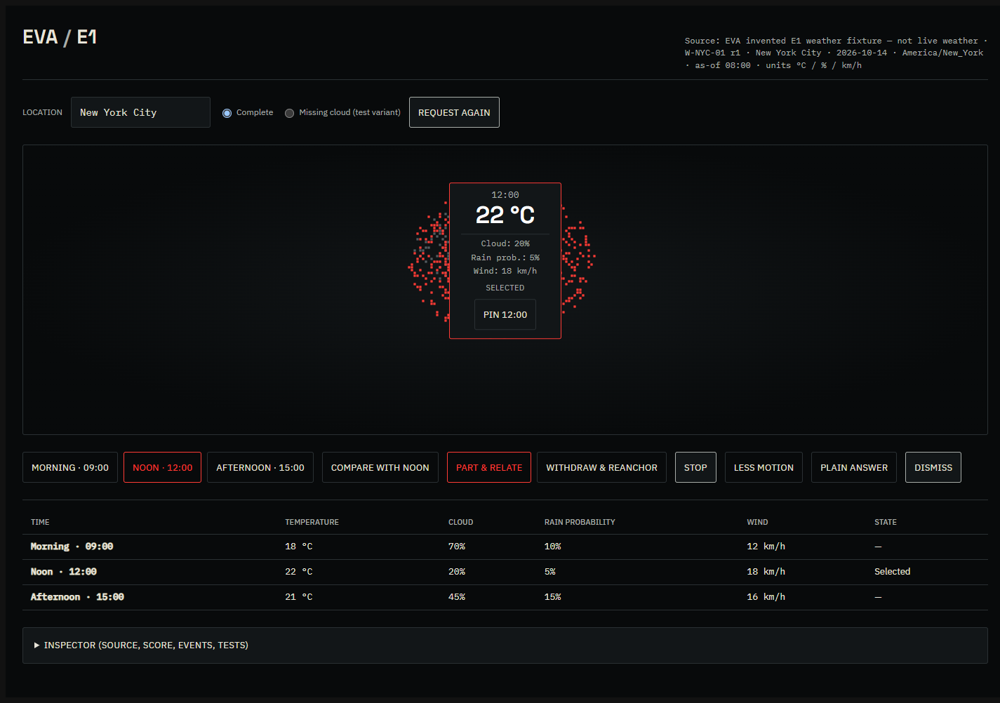

- The first working version had every control and fact on screen: time buttons, a table, and a card in the middle.
- The owner's feedback was that it relied too much on text and looked like an application inside a box.
- That sent us toward something that floats over the desktop with far fewer words. [Notes](docs/design/revisions/e1-20260923-01/README.md) · [the change in direction](docs/design/revisions/e1-20260923-02/REFINEMENT.md)

### 3. Off the box, onto the desktop

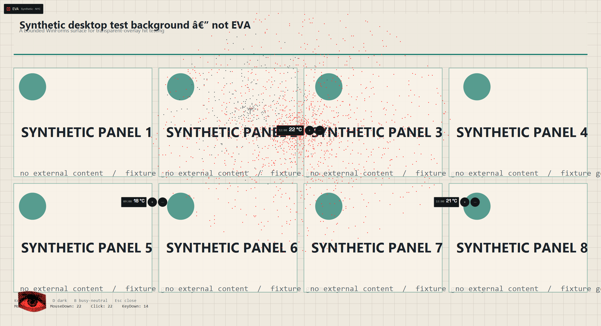

- We built a transparent Windows overlay with Tauri. Clicks pass through to whatever is underneath unless you hit EVA itself.
- We brought back the Week 1 eye.
- Screenshots were taken over a made-up test background, never a real desktop. [Notes](docs/design/revisions/e1-20260924-01/README.md) · [native recording](docs/design/revisions/e1-20260924-01/native/native-demo.mp4)

### 4. A motion reference in Figma Weave


- We captured the Week 1 eye as it followed the cursor ([recording](docs/design/revisions/e1-20260924-week1-eye-reference/week1-cursor-tracking.mp4)) and placed it on the Mock Desktop.
- Figma Weave used that as a starting point to produce keyframes and three short clips: eye → sun, today → tomorrow, and dismiss.
- These set the look we were aiming for. They're a reference, not something the app plays. [All Weave files](weave/README.md) · [the brief we gave it](docs/design/experiments/E1_VOICE_WEAVE_BRIEF.md)

### 5. First try at matching it: too rough

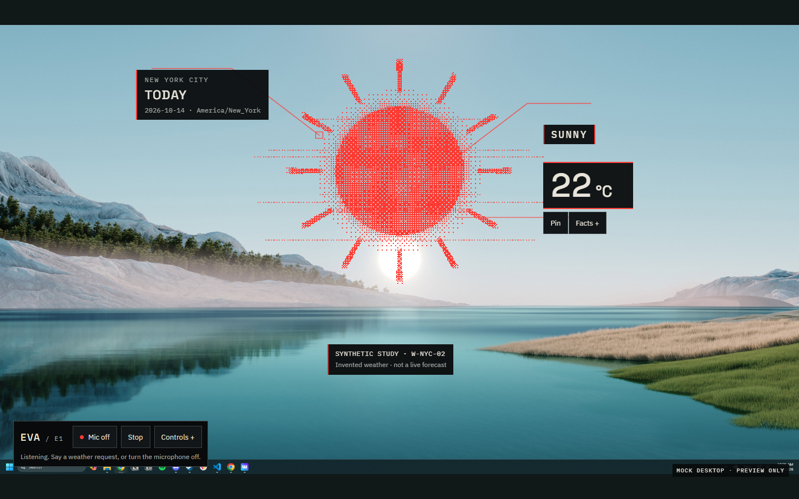

- We redrew the look by hand in code. The shapes and timing weren't close enough, and the owner asked for a faithful recreation. [Notes](docs/design/revisions/e1-20260924-weave/README.md)

### 6. Second try: playing frames, withdrawn

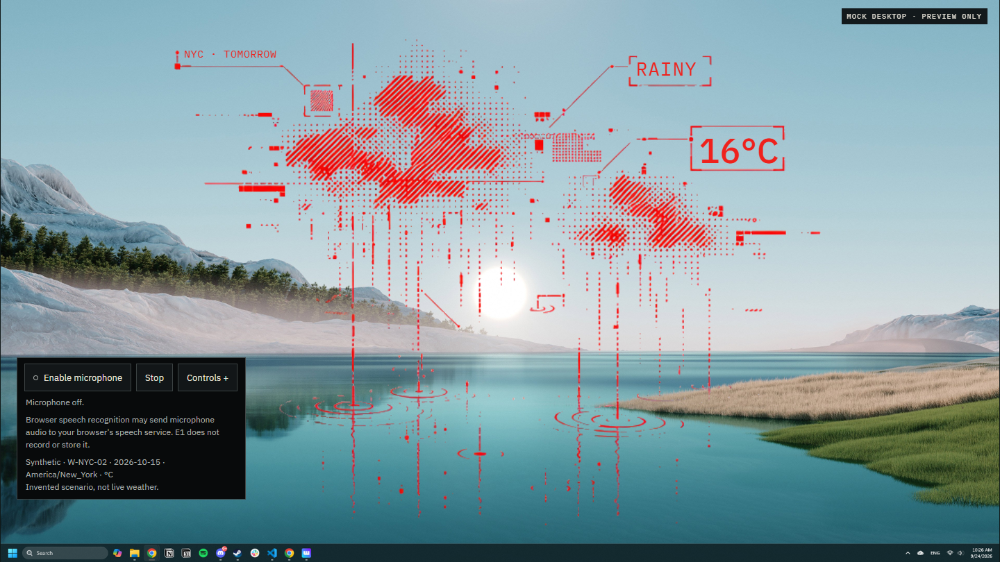

- This version looked closest because it played frames cut out of the Weave clips. That's playback, though, not a recreation, and the owner rejected it for that reason.
- Worse, the native Windows build **froze the whole system and blacked out the screen** during the sunny → rainy change. We never found the cause.
- We disabled the native renderer and removed the frame set. [What happened](docs/design/revisions/e1-20260924-faithful/README.md) · [recording](docs/design/revisions/e1-20260924-faithful/smaller-eye-sequence.mp4)

### 7. Where we landed: real particles

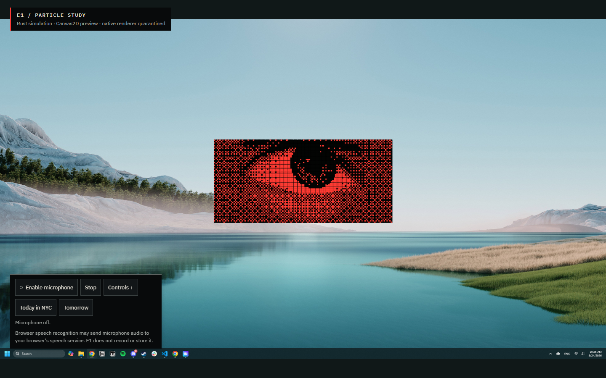 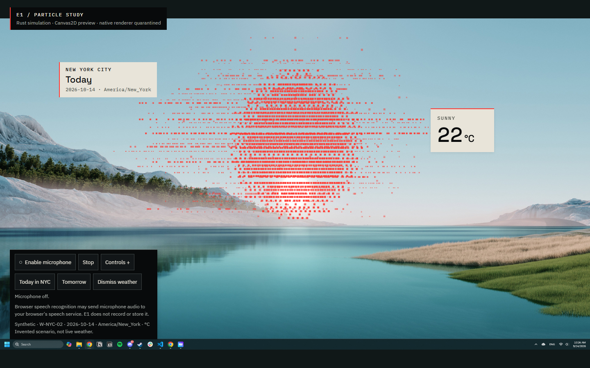

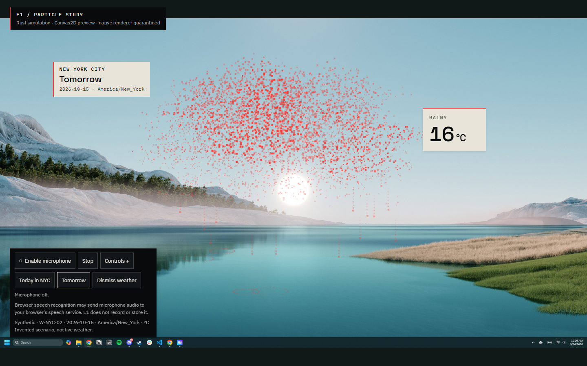 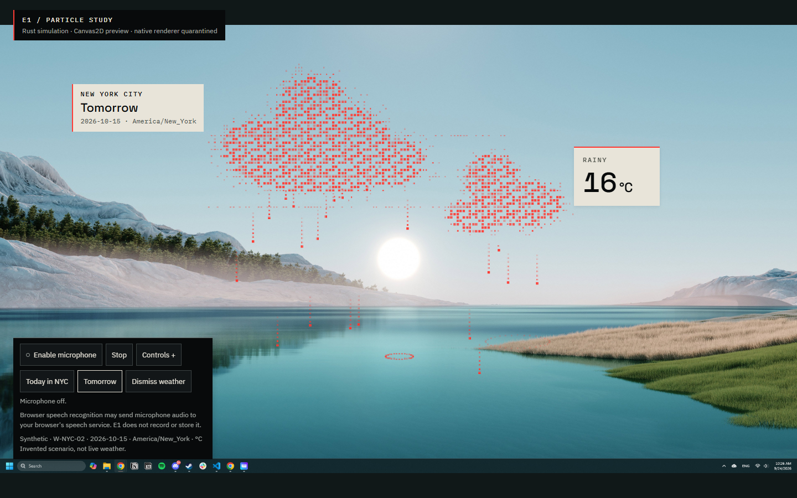

- **Idle → today → changing → tomorrow.** The same 8,192 dots make the eye, the sun and the clouds. Rain drops are recycled, and each ripple starts where a drop lands.
- **Reading surfaces are small, solid cards.** They replace the huge see-through labels from the Weave look, so the facts stay readable over any background.
- The facts show up right away. The animation doesn't make you wait to read the temperature.
- The eye follows your pointer inside the browser. Your pins, focus and settings carry over when you switch days.

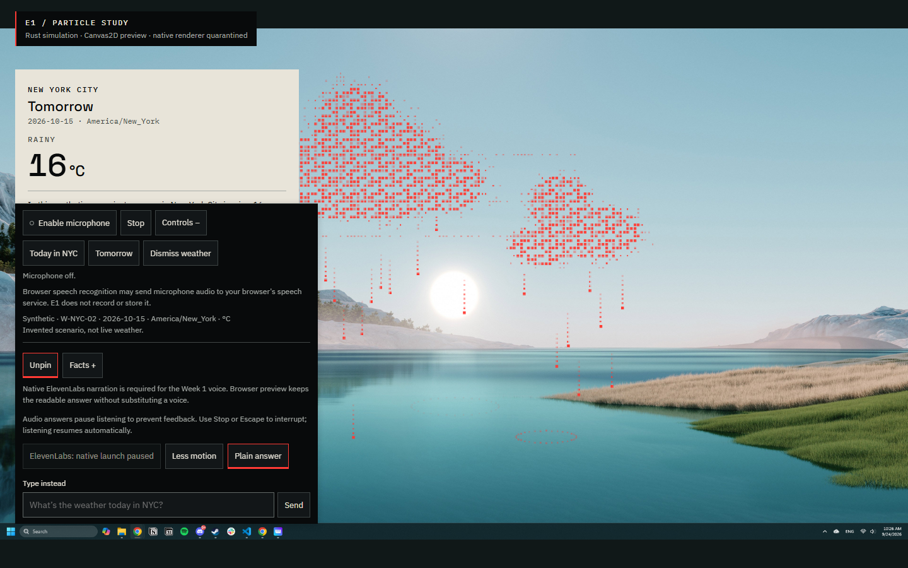 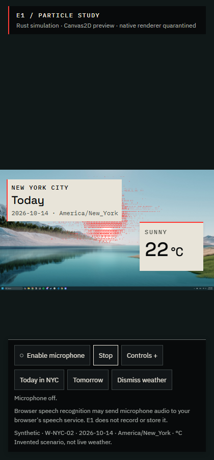

- **Plain answer** and **Less motion** give you the same facts without the show. The layout also holds up in a narrow 420-pixel window.

[Build notes and safety review](docs/design/revisions/e1-20260924-procedural/README.md) · other stills: [reveal](docs/design/revisions/e1-20260924-procedural/software-checks/reveal.png), [returned eye](docs/design/revisions/e1-20260924-procedural/software-checks/returned-eye.png)

## What we used, in normal words

| Tool | What it did this week |
| --- | --- |
| **Higgsfield** | Generated the first still concepts of weather as particle fields. |
| **Figma Weave** | Turned the eye-on-desktop reference into keyframes and short motion clips that we used as the visual target. |
| **Rust → WebAssembly** | The particle simulation in [particles/](particles/). It compiles to a 66 KB `particles.wasm` that runs in the browser without asking for anything from outside. |
| **Canvas2D** | Draws the dots. It's capped at 1280×720 pixels and 30 frames per second, slows or stops if frames lag, and pauses in a hidden tab. No WebGL or GPU context is requested. |
| **React 19 + TypeScript + Vite** | The controls, cards, day switching and the dev server on port 1431. |
| **JSON Schema + Ajv** | Checks that the weather data and each change have the expected shape before we use them. |
| **Tauri 2 + Rust** | The transparent Windows overlay from steps 3 and 6. It's kept for its tests, but **launching it is blocked**. |
| **Vitest, Cargo tests, Playwright, FFmpeg** | Tests, browser checks with the GPU off, and the recordings and stills on this page. |

The Week 1 ElevenLabs voice setup is still wired in, but native voice only works in the blocked desktop app. **So the current preview has no voice.** Browser microphone input exists but is off by default. It warns you before your browser's speech service is used.

## What we checked

We reran the code checks on 2026-09-27 after moving everything into `week2/`. The browser checks are the saved results from the [build notes](docs/design/revisions/e1-20260924-procedural/README.md).

| Check | Result |
| --- | --- |
| TypeScript typecheck and production build | Passed (rerun) |
| JavaScript tests | 139 passed (rerun) |
| Particle simulation (Rust) | 15 passed (rerun). The saved notes also cover 300 back-to-back revisions with stable memory, about 4.4 MB |
| Native Rust policy/maths | 21 passed; 1 GPU test deliberately skipped (rerun) |
| Browser checks with the GPU off | 22 passed at 1440×900 and 420×900 (saved, [results](docs/design/revisions/e1-20260924-procedural/software-checks/checks.json)) |

These don't prove the native app is fixed, that the visuals match the Weave exactly, or anything about how people react to it. We never ran a live microphone, Whisper or ElevenLabs call this week.

To rerun them:

```powershell
npm.cmd --prefix week2 run typecheck
npm.cmd --prefix week2 test
npm.cmd --prefix week2 run build
cargo test --manifest-path week2/particles/Cargo.toml --offline --locked
npm.cmd --prefix week2 run rust:test
```

Don't enable the ignored GPU test. `node week2/scripts/verify-procedural.mjs <new-folder>` repeats the browser checks with the GPU off. It needs Playwright installed; set `E1_PLAYWRIGHT_MODULE` if it lives elsewhere.

## Find the bits

| Folder | What's inside |
| --- | --- |
| [particles/](particles/) | The Rust particle simulation. |
| [src/ui/](src/ui/) | The React preview, particle renderer, cards and controls. |
| [src/core/](src/core/) | Weather data rules, revisions and validators. |
| [src-tauri/](src-tauri/) | The native Windows overlay. Launch is blocked. |
| [fixtures/](fixtures/) | The invented NYC weather (W-NYC-01 and W-NYC-02). |
| [weave/](weave/README.md) | The original Figma Weave inputs, keyframes and clips. |
| [docs/design/INDEX.md](docs/design/INDEX.md) | Every revision in order, with its screenshots and notes. |
| [docs/design/experiments/E1_REVISABLE_WEATHER.md](docs/design/experiments/E1_REVISABLE_WEATHER.md) | What E1 set out to test. |

We removed superseded screenshots, raw test recordings, duplicate copies and the 108 MB set of extracted frames. Anything removed can be recovered from git commit `56f056d`.
