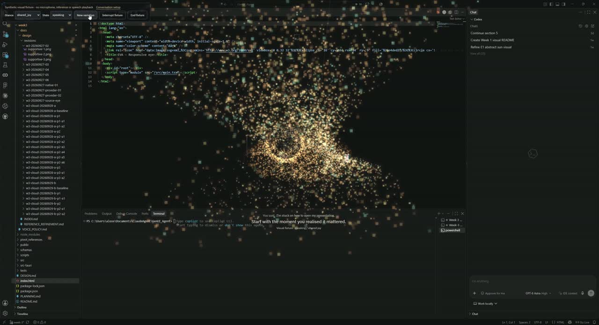
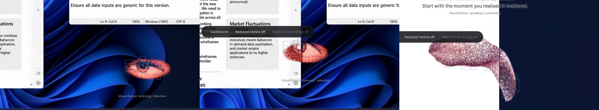
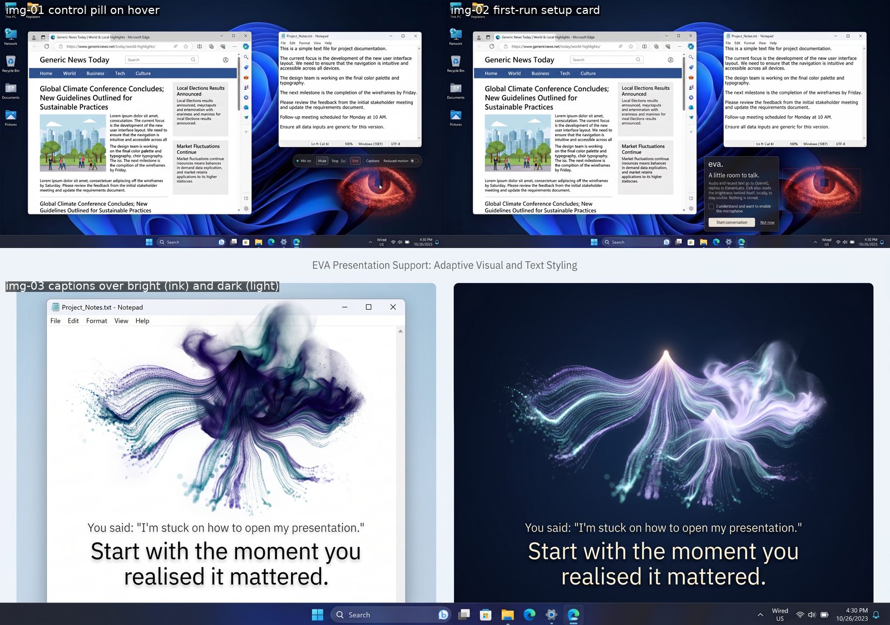

# Week 3 · EVA

A floating desktop eye that transforms into expressive particle forms.

## Final walkthrough

[](Recording%202026-10-01%20153041.mp4)

**[▶ Watch the final recording · 42 seconds](Recording%202026-10-01%20153041.mp4)**

- Preserved the original red eye, square pupil, dithering and cursor-following gaze.
- Added five states: attentive, comforting, shared joy, congratulatory and supportive.
- Built continuous transformations, fresh variations and interruption/reset controls.
- Added a draggable Windows overlay, hover controls, captions and reduced motion.
- **Visual appearance approved October 1.** This walkthrough uses synthetic controls; live microphone/speaker validation remains separate.

### Visual details



- Small resting eye → larger response → return to rest.
- Transparent desktop presence; clicks outside controls pass through.
- **Visible to recordings** lets screenshots and screen recording include EVA.

## Tech stack

- **React + TypeScript + Vite:** interface, controls and state.
- **Canvas 2D:** procedural particles, eye geometry and animation—not video playback.
- **Tauri 2 + Rust + Windows APIs:** desktop overlay, click-through and local brightness sampling.
- **Voice path:** microphone/AudioWorklet → OpenAI transcription and reply → ElevenLabs speech; cancellation and turn limits.
- **Vitest + Playwright + Cargo:** frontend, browser and Rust checks.

## Weave workflow, simply

1. **Describe:** ask Figma Weave for image references and short motion studies.
2. **Choose:** inspect the results; select useful shapes, controls and movement.
3. **Build:** recreate the selected ideas in React/Canvas—not as generated runtime code.
4. **Compare:** capture the implementation and check it against the references.



*Weave references, not app screenshots. [Reference review and run details](docs/design/revisions/w3-cloud-20260929-b-p2/REVIEW.md).*

## Run the visual demo

Windows prerequisites: Node 24+, Rust/MSVC Build Tools and WebView2. From the repository root:

```powershell
npm.cmd --prefix week3 ci
$env:EVA_W3_MAX_TURNS = '0'
npm.cmd --prefix week3 run desktop
```

- Select **Visual rehearsal · no microphone**. No API keys or paid calls needed.
- If the Week 3 preview already runs on port 1430, append `-- --reuse-preview` to the desktop command.
- Hover over the eye for controls; enable **Visible to recordings** before using Snipping Tool.

[Design](DESIGN.md) · [Plan](PLANNING.md) · [Voice policy](docs/VOICE_POLICY.md) · [Acceptance](docs/design/acceptance/w3-conversational-eye.md) · [Development evidence](docs/design/INDEX.md)
