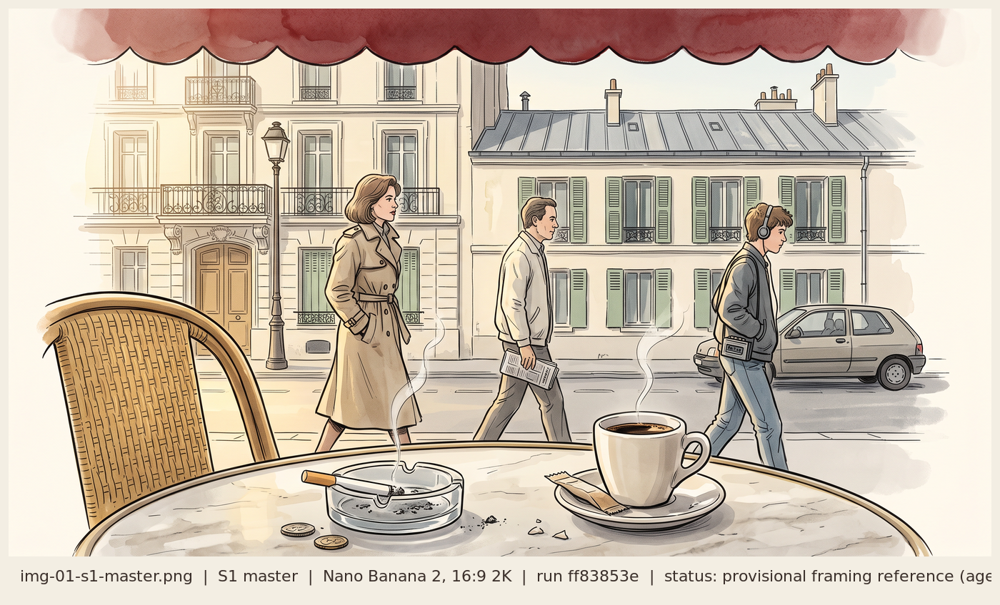

# w4-20261003-paris-p1-s1: S1 master scene

**Status:** S1 generated and inspected. It is a **provisional framing reference** selected by the coordinating agent. Owner review is pending. **The P1 packet is incomplete.** Construction keyframes and video studies have not run, so no UI or renderer work is cleared by this folder.

| Candidate | Job | Selection | Owner |
| --- | --- | --- | --- |
| [img-01-s1-master.png](references/images/img-01-s1-master.png) (2752×1536) | S1 | Provisional framing reference | Pending |

There are no videos yet. `references/videos/` and `implementation/` will be created when real outputs or captures exist.

## Scope and source

- **Pass:** Week 4 P1 arrival packet, first job only (S1), which is used to choose framing before quoting the rest of P1 ([WEAVE_JOBS.md](../../WEAVE_JOBS.md)).
- **Source revision:** `2e640b5` on `week4`, the final W4-1 foundations commit. Accepted Week 4 visual baseline: none.
- **Route:** direct model. `weave_list_tools` returned no workflows. Nano Banana 2, `fal-ai/nano-banana-2/edit` (Weave id `bebebed5-…`), was used text-only with no upload.
- **Inputs:** the [DESIGN_PROMPT.md §11](../../../../DESIGN_PROMPT.md#11-master-prompt) master prompt verbatim; 16:9; 2K; 1 output; random seed; web search off. The 16:9 ratio is an assumption, because the demo monitor's aspect is not recorded in the plan.
- **Run:** prediction `ff83853e-952e-428f-a283-edc58ff2ee90`. Quoted 9 credits, approved by the owner for this exact run, submitted once, reported cost 9. Details are in [provenance.json](provenance.json).

## Inspection

The full frame was viewed, plus full-resolution crops of the table objects, the newspaper, the cassette player and the car. Positions below are approximate fractions of width (x) and height (y), read by eye.

**Matches the brief**
- **Anchors are all present and legible.**
  - The faded red scalloped awning valance runs along the top (y 0–10%). It is the only red in the frame, so the environment is not red-washed.
  - The round worn marble table fills the bottom ~21% (from y 79%).
  - A thick white cup on its saucer, with steam, sits at x ≈ 65%, y ≈ 85%. A torn sugar stick lies on the saucer.
  - A heavy glass ashtray with ash and a half-smoked unbranded cigarette sits at x ≈ 39%, y ≈ 88%, with a smoke thread. Two coins lie beside it.
  - An empty honey rattan chair is cut by the left edge (x 4–27%).
- **Passers-by.** Three walkers, all in profile and none looking at the viewer: a woman in a belted, broad-shouldered trench coat; a man in a pale jacket with a folded newspaper; a teenager with foam headphones and a belt cassette player.
- **Street.** Cream limestone façades, iron balconies, muted green shutters, a zinc roof with chimney pots, a lamp post and a small hatchback with no visible badge.
- **Clean, separable planes.** The near table and objects, the chair, the walkers, the car, the façade, and the roof and sky barely interpenetrate. This suits native reconstruction from layered plates.
- **Mood.** Quiet and unhurried. There are no landmarks, berets, screens or modern intrusions.

**Departs from the brief or is risky for implementation**
1. **Little perspective recession.** The façade is a nearly frontal elevation and the street runs parallel to the picture plane. Off-axis parallax would therefore read as a few stacked flats unless intermediate depth planes are reconstructed, such as the curb, the street surface and the car. The seated horizon (~40–45% in the brief) is only weakly implied.
2. **Walkers are lined up at one depth** and evenly spaced like a parade, rather than overlapping at different depths. The lamp post sits at x ≈ 27%, behind the woman, so it does not occlude walkers in turn (the brief has it at x ≈ 78%).
3. **The style is tidier than the brief.** It reads as clean editorial illustration with flat wash, not loose ink over transparent watercolour. The far façade is not clearly lighter or more linear than the near objects, so selective colour is weak. The low warm sun from the left and its long shadows are barely present.
4. **The far-field boundary is hard.** The right roofline and chimneys are crisp against a small sky, and only the upper corners fade to paper. The plan says no hard roofline should straddle the wallpaper/foreground boundary, so the wallpaper split cannot be cut from this frame as-is.
5. **Text-like marks.** The cassette player has pseudo-glyphs; the newspaper and coins have illegible scribble and embossing; there is a small scribble on the wall at about x 60%, y 63%. None is legible, but the "no text" rule is not fully met.
6. **The near table edge is sharp, not softly out of focus.** The cup is clean rather than chipped, and there is no ring stain.
7. **Era plausibility is unverified.** The hatchback silhouette could read as late-1980s or early-1990s. The wardrobe is a hypothesis (DESIGN_PROMPT §9).

## Implementation guidance (provisional)

This is for planning only. It must not be implemented until the rest of P1 exists and has been inspected.
- Keep the **anchor positions** above as candidate scene-fixture coordinates: valance, table, cup, ashtray and chair. The cup is the zero-parallax anchor.
- **Depth bands** inferred from this frame:
  - near: table, cup, ashtray, chair, valance;
  - pavement: walkers;
  - street: car and curb;
  - façade;
  - roof and sky (far field).
  Add intermediate planes deliberately (curb, street surface, lamp post moved forward) to avoid a stacked-card look.
- The **far field needs a softer paper fade** above the roofline before the wallpaper split can be tested.
- Remove or repaint the pseudo-text in any adopted plate. Generated images remain references, not runtime textures, until rights and adoption are recorded.

## Proposed next jobs (not run, need per-run quotes and approval)

The next jobs are S2 alternatives as **edits of this S1** (S1 as the image input, which keeps registration). They would target issues 1–4: deeper street recession and a lower horizon; walkers overlapping at two or three depths with the lamp post forward; looser watercolour with a stronger paper fade above the roofline. After that come C2–C4 and the V1/V2 studies. See [VISUAL_CLOUD_REPORT.md](../../../../VISUAL_CLOUD_REPORT.md).

## Owner acceptance

Pending. The agent's framing selection is not acceptance.
