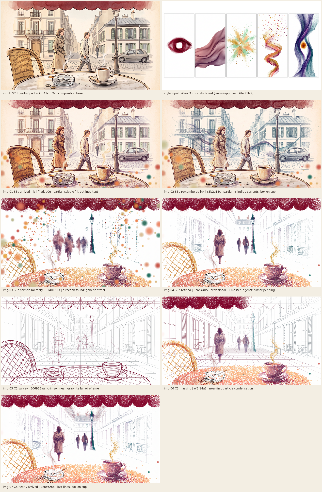
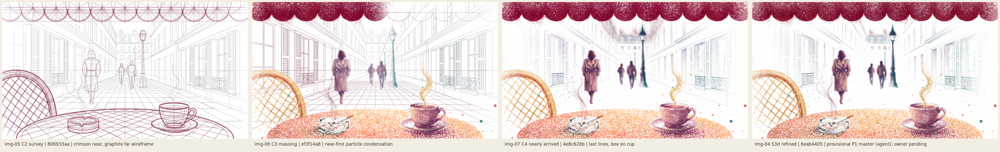

# w4-20261003-paris-p1-s3-week3-ink: the café in Week 3's emotional material

**Status:** four candidates generated and inspected. **S3d is the provisional P1 master and registration base**, refining the S3c direction; selected by the coordinating agent; owner review is pending. P1 is incomplete (no construction keyframes or video studies yet), so UI and renderer work stay blocked.

| Candidate | Job | Selection | Owner |
| --- | --- | --- | --- |
| [img-01-s3a-arrived-ink.png](references/images/img-01-s3a-arrived-ink.png) | S3a, edit of S2d | Not selected: stipple fill, but S2d's outlines survive | Pending |
| [img-02-s3b-remembered-ink.png](references/images/img-02-s3b-remembered-ink.png) | S3b, edit of S2d | Not selected: as S3a, plus indigo/teal currents and a hairline box on the cup | Pending |
| [img-03-s3c-particle-memory.png](references/images/img-03-s3c-particle-memory.png) | S3c, new image from the Week 3 references | Aesthetic direction; material and near-bokeh reference | Pending |
| [img-04-s3d-refined-particle.png](references/images/img-04-s3d-refined-particle.png) | S3d, edit of S3c | **Provisional P1 master** | Pending |
| [img-05-c2-survey-wireframe.png](references/images/img-05-c2-survey-wireframe.png) | C2 survey, edit of S3d | **Provisional construction keyframe** | Pending |
| [img-06-c3-massing-condense.png](references/images/img-06-c3-massing-condense.png) | C3 massing, edit of S3d | **Provisional construction keyframe** | Pending |
| [img-07-c4-nearly-arrived.png](references/images/img-07-c4-nearly-arrived.png) | C4 nearly arrived, edit of S3d | **Provisional construction keyframe** | Pending |

Construction sequence, C2 → C3 → C4 → S3d: 

No video exists yet. Motion is **not** reviewed; these stills do not clear any motion or UI pass.

All images are 2752×1536. Run IDs, approvals and costs are in [provenance.json](provenance.json).

## Why this revision exists

Owner feedback on [S2d](../w4-20261003-paris-p1-s1/REVIEW.md) (2026-10-03): the composition was liked, but the images "don't feel like a specific aesthetic" and read as generic AI illustration. The owner asked to incorporate Week 3's emotional states and their aesthetics.

This changes the art direction in [DESIGN_PROMPT.md](../../../../DESIGN_PROMPT.md) (ink line over watercolour) at the owner's request. The brief's composition, depth, anchors, restraint rules and arc still apply. Only the material changes.

**Week 3 sources (owner-approved, inspected):**
- [ink state board](../../../../../week3/docs/design/revisions/w3-cloud-20260929-b-p1/references/images/img-05-ink-state-board.png);
- [joy ink](../../../../../week3/docs/design/revisions/w3-cloud-20260929-b-p1/references/images/img-07-joy-ink-shimmer.png);
- the approved comfort implementation capture ([p3-a2](../../../../../week3/docs/design/revisions/w3-cloud-20260928-a-p3-a2/comforting-2.png));
- [week3/DESIGN.md](../../../../../week3/DESIGN.md) §4–6.

Both reference images were passed as their existing Weave outputs. Nothing was uploaded.

## Inspection

**S3a and S3b.** These are edits of S2d. Close up, fills, steam and the awning became stipple, and near bokeh appeared. S3b also added indigo/teal particle currents and a faint hairline box on the cup. But every S2d outline survived, so both read as a conventional illustration with effects layered on top. The newspaper pseudo-text also persists. Editing preserves structure, which is the wrong tool for a material change.

**S3c** is a new image with the Week 3 references as the primary inputs.
- **Material:** particles only. There are no outlines; every form frays into loose specks. This matches the Week 3 board.
- **Emotional palette:**
  - the awning is dense crimson, the rest-eye colour;
  - the table is apricot/gold/coral (joy);
  - the cup and walkers are plum/rose (comfort);
  - the lamp post and far specks are teal/indigo (supportive);
  - steam is a gold speck thread; smoke is a pale plum thread.
- **Depth reads from the material itself:** dense large specks near, sparse fine specks far, large soft bokeh closest. The street fades out with no hard roofline. That is exactly what the wallpaper far field needs.
- **Fit with the renderer:** a particle scene with a depth value per particle is the natural input for real off-axis parallax, and Week 3's renderer is already particle-based.

**S3c weaknesses** (targets for the proposed S3d):
- **Too many large bokeh discs.** They cover the sky and right edge and start to read as polka dots; Week 3 flagged the same risk.
- **Paris and the 1980s have nearly vanished.** No balconies, shutters, zinc roof or car remain. The four walkers are generic, clustered at similar depths and walking away.
- **The ashtray is a thin black dotted ring** and the cigarette is barely visible.
- **The rattan weave is a regular diamond grid**, which looks like a pattern rather than woven cane.
- **The cup moved** to x ≈ 71%, y ≈ 83% and the ashtray to x ≈ 33%, y ≈ 87%, so registration with S2d is loose.

**S3d** (an edit of S3c; full frame plus a full-resolution crop of the walkers and the street end):
- **Kept:** S3c's particle-only material and stance palette: the crimson awning, the apricot table, the plum cup with its gold steam, the teal lamp post.
- **Fixed:**
  - Bokeh is down to a few small specks.
  - The street now reads as Paris: grey stippled shutters, wrought-iron balcony rails and cornices on both sides, and a zinc mansard with chimney pots closing the street. Everything stays airy and fades to paper.
  - The ashtray reads as heavy glass, with an unbranded cigarette on its lip, an ember and a smoke thread.
  - The woman wears a belted, broad-shouldered trench coat and is the nearest walker. A teen in headphones and a man with a plain newspaper are further away.
- **Remaining issues:**
  1. The teen and the man are at the **same** depth, and the man is beside the lamp post rather than behind it. Native placement still owns walker depth.
  2. The woman walks **toward** the viewer. Her face is an unreadable speck mass, so she doesn't look at the camera, but the brief prefers people turned away.
  3. The mansard at the street end is the one denser, harder-edged far element. It sits centrally below the awning, so it is foreground, not far-field wallpaper.
  4. With the large near bokeh gone, the near-defocus depth cue is weaker. The renderer can restore a few defocused near particles.
  5. The rattan weave is still a regular diamond grid.

## Construction keyframes (C2–C4)

The owner supplied two construction references in chat (2026-10-04):
- **A:** a dense one-point-perspective street drawn as a transparent wireframe. Full-frame scaffold lines run past the forms, there is a paving grid, and a figure stands inside the grid.
- **B:** a loose low-angle architectural sketch with overshooting lines, braced volumes and uneven finish.

Their creators and rights are unknown. By owner choice they were not committed or uploaded; their style was described in text. Hashes are in provenance.

**C2 survey.** The scene is a pure wireframe: near construction in crimson (EVA), far construction in graphite.
- The awning scallops are built with radial construction arcs.
- The table is an ellipse with a perspective grid; the cup and ashtray are see-through stacked ellipses; the chair is a lattice.
- The paving grid runs to the vanishing point. The façades are see-through, with shutters and balcony rails; the mansard closes the street.
- The walkers are wireframe figures. The woman is now seen **from behind**, which fixes the facing issue.
- Steam and smoke are thin curves.
- **Gap against the references:** the lines are cleaner and more ruled, with fewer full-frame overshooting guide lines than reference A. It reads closer to tidy CAD than to a quick confident sketch.

**C3 massing.** Particles condense near-first: the table, chair, cup and ashtray are dense, and the walkers are speck clouds. Notably, the awning fills from the left while its right half is still outline scallops, a construction sweep worth keeping. The façades and paving are still lines; the lamp post is partly teal specks.

**C4 nearly arrived.** Close to S3d. The façades are stippled with faint guide lines remaining, and a thin hairline box sits on the cup (the Week 3 tracking-box language).

**Registration.** S3d, C2, C3 and C4 keep the same viewpoint and anchors closely, so they can serve as native timeline keyframes:

| Keyframe | Planning phase | Window |
| --- | --- | --- |
| C2 | C, survey | 12–22 s |
| C3 | D/E, massing and wash | 22–44 s |
| C4 | F, inhabiting | 44–54 s |
| S3d | G, arrival | 54 s onward |

## Proposed rule: scene states borrow Week 3 stances

This is a proposal for the owner, not adopted:

| Scene state | Week 3 stance and material |
| --- | --- |
| EVA, construction and leaving | Rest eye, crimson; tracking and glitch boxes |
| Arrival, late afternoon | Joy warmth (apricot/gold) with comfort shade (plum/rose) |
| Rain | Comfort: plum/rose drape, softened, slower particles |
| Evening | Supportive: indigo/teal currents around an amber core, which becomes the lamp |
| Rain and evening together | Comfort drape over supportive currents |

## Implementation guidance (provisional)

- Build the scene as particles with a depth value per particle, not as textured planes. Near objects get dense large particles; far objects get sparse fine ones; a few large defocused particles sit closest to the viewer.
- Keep the far field as sparse specks fading into paper, so the wallpaper split falls in empty paper rather than across a roofline.
- Reuse Week 3's palettes and its hairline tracking-box language for the construction phases.
- Walkers are separate particle clouds at distinct depths (native placement, as recommended in the S2 round).

## Owner acceptance

Pending. The agent's selection is not acceptance.
