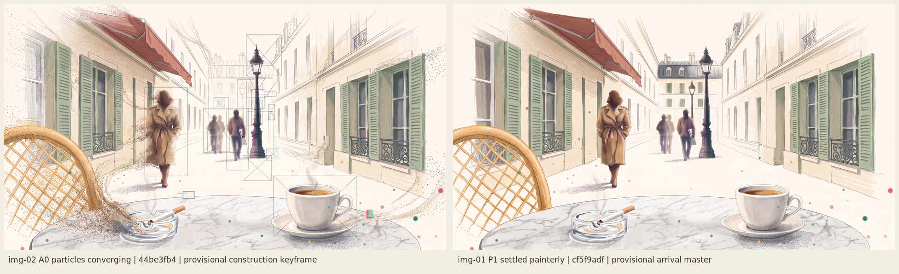

# w4-20261005-paris-p1-converge: particles converging, overlays as accents

**Status:** two images generated and inspected. **P1 is the provisional arrival master** and **A0 the provisional convergence keyframe**, both selected by the agent; owner review is pending. The 10 s convergence video (A0 → P1, 109 credits) and an earlier start frame (E0, 9) are quoted, not run. UI stays blocked.

| Candidate | Job | Selection | Owner |
| --- | --- | --- | --- |
| [img-02-a0-particles-converging.png](references/images/img-02-a0-particles-converging.png) | A0, edit of K2 | **Provisional convergence keyframe** | Pending |
| [img-01-p1-settled-painterly.png](references/images/img-01-p1-settled-painterly.png) | P1, edit of K2 | **Provisional arrival master** | Pending |

Both are 2752×1536 Nano Banana 2 edits of [K2](../w4-20261005-paris-p1-glitch-paris/references/images/img-03-k2-two-thirds-glitch.png) (the owner-chosen painterly look with the shop awning), 9 credits each, approved by the owner beyond the ~500 allowance. Details are in [provenance.json](provenance.json). Previous packet: [p1-glitch-paris](../w4-20261005-paris-p1-glitch-paris/REVIEW.md).

## Owner direction (2026-10-05)

> I dont like how there are strips floating across the generation, it should feel like particles converging with the rectangle overlays and glitch overlays as accents.

**This supersedes the torn-strip grammar of K1, K2 and V4.**
- The primary motion is particles converging into form.
- Hairline rectangles (some X-crossed and linked) and small glitch boxes are sparse accents.
- No horizontal strips or smear bands cross the picture.

## Inspection

**P1, settled.**
- **Achieved:**
  - It is the calm, complete painterly street: cream limestone with sage shutters and iron balconies, the shop awning on the left façade, and the zinc mansard closing the street.
  - The woman wears a camel trench; there is a marble table, a white cup of espresso, a clear glass ashtray with its cigarette and smoke, and the rattan chair.
  - No strips, boxes or wireframe remain.
- **Remaining issues:**
  - The walker beside the man is still a **ghosted double figure**, although the prompt asked for one walker each.
  - A scatter of small teal and coral dots, left over from the Week 3 palette, remains across the frame.
  - Both should be cleaned in native assets or a later edit.

**A0, converging.**
- **Achieved:**
  - Sand-like specks in the scene's own colours stream in curving trails, around the woman, the chair and the ashtray, and along the cornices on both sides. The woman's coat is dissolving into specks at its edges.
  - There are no horizontal strips.
  - Accents are sparse: about ten hairline rectangles, several X-crossed, frame the woman, the walkers, the lamp and the cup. Two small glitch boxes with red and cyan edges sit near the table and the right façade.
  - The far mansard is still pencil wireframe.
- **Deviation:** most of the scene is already fully painted, so this is later in the process than intended. Used as the first frame, a video would show mainly the near objects and the overlays settling. E0, a much earlier frame that is mostly paper and wireframe with particles just starting to arrive, is quoted to give the video a full build.

## Implementation guidance (provisional)

- **Primary motion: particle convergence.**
  - Specks in the scene's palette travel along curved paths from the frame edges and empty paper to target positions on each object.
  - Nearest objects resolve first: cup and table, then ashtray and chair, then the woman and walkers, then the lamp, the façades and the awning, then the far street.
  - Pencil wireframe fades as each region fills.
- **Accents:**
  - At most ~10 hairline rectangles at once, some X-crossed and linked by lines, framing the objects that are currently converging. Each lives about 0.3–1 s and may jump once or twice.
  - At most 1–2 small scanline glitch boxes at forming edges, each lasting about 0.2–0.5 s.
  - The accents taper to none at arrival.
- **Never:**
  - full-width strips, smear bands, numbers or labels;
  - full-frame flashes.
- **Reduced motion:** crossfade E0/A0 → P1 with no particles in flight and no overlays.

## Owner acceptance

Pending. The agent's selection is not acceptance.
