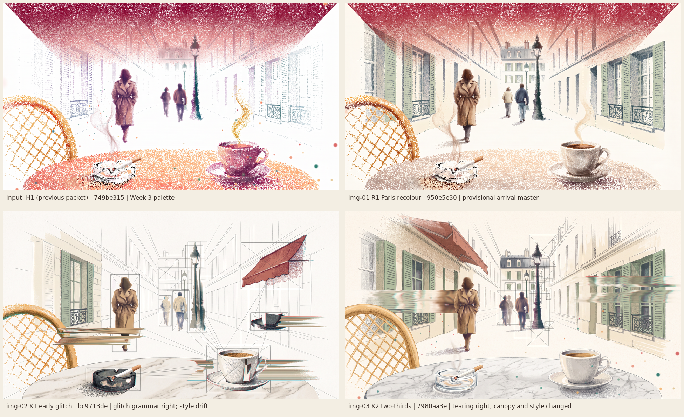

# w4-20261005-paris-p1-glitch-paris: Paris palette and glitch-in construction

**Status:** three images generated and inspected. **R1 is the provisional arrival master** (Paris palette). K1 and K2 set the glitch grammar but drift in style. A closing video is quoted, not run. Owner review is pending; UI stays blocked.

| Candidate | Job | Selection | Owner |
| --- | --- | --- | --- |
| [img-01-r1-paris-recolour.png](references/images/img-01-r1-paris-recolour.png) | R1, H1 recoloured | **Provisional arrival master** | Pending |
| [img-02-k1-early-glitch.png](references/images/img-02-k1-early-glitch.png) | K1, early glitch-in | Glitch-grammar reference; style drift | Pending |
| [img-03-k2-two-thirds-glitch.png](references/images/img-03-k2-two-thirds-glitch.png) | K2, two-thirds in | Glitch-grammar reference; canopy and style changed | Pending |

All are 2752×1536 Nano Banana 2 edits of [H1](../w4-20261003-paris-p1-s3-week3-ink/references/images/img-09-h1-no-hem.png), 9 credits each, approved by the owner. Run IDs are in [provenance.json](provenance.json). Source revision `f3f48ba`; previous packet: [p1-s3-week3-ink](../w4-20261003-paris-p1-s3-week3-ink/REVIEW.md).

## Owner direction (2026-10-05)

> The glitch strips should be glitching not neatly falling into places, refer to the animal gif with overlay boxes, thats how I want the scenes to slowly appear. Also change the color, the colors of these particles kind of ruin the vibes of the request, change the colors into what fits best with the paris environment.

**References re-inspected.** Both are owner-selected Week 3 pivot references. They are described to the model in text only, not uploaded, because their rights are unverified.
- **Klickpin animal video** (45 s, 30 fps, sampled at 8 fps):
  - Every ~0.125–0.25 s the overlay reconfigures: 5–30 hairline grey rectangles, many crossed corner to corner with an X, appear, jump, resize and regroup over detail regions, linked by thin straight lines.
  - Subjects flicker between an outline sketch and a filled image.
  - Its tiny numeric labels are excluded here (brief: no numbers or HUD).
- **Glitch GIF** (`0268915e…`, 1.14 s, 19 frames): a walking figure torn every frame by horizontal smeared colour bands and pixel fragments.

**Palette.** This returns to the Opus brief's Paris palette ([DESIGN_PROMPT §5](../../../../DESIGN_PROMPT.md#5-materials-colour-type-sound)): paper, limestone, sage shutters, zinc, iron, a faded red awning, marble, porcelain and espresso, honey rattan, and muted period clothing. It replaces the Week 3 emotion palette at the owner's request. The Week 3 *material* (stipple particles) and *construction grammar* (wireframe and boxes) remain.

## Inspection

**R1, the Paris recolour.**
- **Achieved:**
  - The particle material and composition are unchanged.
  - Cream limestone with sage shutters and dark iron balconies; a zinc mansard with chimneys; a dark iron lamp post.
  - The woman wears a camel trench; the walkers wear navy and oatmeal.
  - A white porcelain cup of espresso; a pale marble table; a honey rattan chair.
- **Remaining issue:** the canopy is still a strong raspberry-to-pink gradient over the top third, redder than "faded brick". It is the one element that still pulls the mood away from Paris.

**K1, early glitch-in.**
- **The glitch grammar the owner described is present:**
  - Horizontal strips of the woman, the cup and a duplicate cup are torn and smeared sideways with red and cyan fringes.
  - Hairline boxes, many X-crossed, sit around the cup, ashtray, walkers, lamp and an awning fragment, linked by straight lines into a constellation.
  - Most of the frame is still graphite wireframe on paper.
- **Deviations:**
  - The resolved patches are rendered as painterly illustration (realistic veined marble, flat-painted shutters), not stipple particles.
  - The overhead canopy is reinterpreted as a separate shop awning at the upper right.
  - The ashtray is now black glass.
  - There are about 15 boxes, not 30–40.

**K2, two-thirds in.**
- **Present:**
  - Two wide horizontal bands are torn and smeared across the left and right façades, cutting through the woman.
  - The walker is duplicated (ghosted), and about 15 X-crossed boxes linked by lines frame the walkers and lamp.
  - The Paris palette reads well.
- **Deviations:**
  - The style has become a polished painterly illustration, with little stipple left.
  - The overhead canopy is gone: the top is open sky, and a shop awning hangs on the left façade. That changes the seated "under the awning" framing.

## Implementation guidance (provisional)

**The glitch-in is driven natively by the construction timeline:**
- **Regions:** they stutter between wireframe and resolved several times before holding, nearest first.
- **Tears:** horizontal tear bands of 1–4 at a time, each a 2–12% height slice, displaced sideways 3–25% of the width and smeared, with a red/cyan fringe. They re-randomise every 2–6 frames.
- **Box constellation:** 10–40 hairline graphite rectangles, about half X-crossed, linked by straight lines. It reconfigures every ~0.125–0.25 s, clusters on the region being resolved, and thins to zero at arrival.
- **Limits:** no numbers or labels, and no full-frame flash.
- **Reduced motion:** no tearing or box jumps; keyframe crossfades only.

**Owner choices still open:**
- the canopy colour and treatment;
- whether the resolved look stays stippled (R1) or goes painterly (K2).

## Owner acceptance

Pending. The agent's selection is not acceptance.
