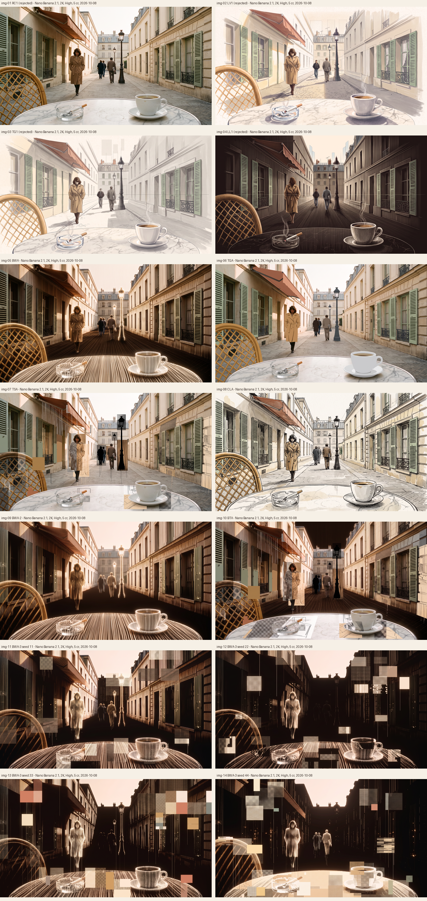

# w4-20261008-paris-c-hybrid: coloured wireframe builds, realistic plates fill in

**Status:** **RC1 rejected at checkpoint 1; batch 1 (LV1, TG1, LL1) rejected by the owner on 2026-10-08.** Owner, verbatim: *"Okay reconstruct the images from the ground up using the references images I provided the last message + the mp4 video from the file upload. Especially refer to Cyberpunk 2077's blackwall aesthetic and shaders. The newly generated images dont resemble anything from the reference images I uploaded."* The reconstruction batch and round 2 ([RECONSTRUCTION.md](RECONSTRUCTION.md)) have run and are inspected below. The owner's direction after the reconstruction set: "Combine BWA and TSA but make it more abstract. Less details on the blackwall, and more transparent/opaque lines" and "The BWA-2 should be again a bit more abstract." Round 2 reviewed ("Even more abstract, the tiles should be glitchy/matrix/dither like in week 3. The outlines/threads should not resemble the structure too much, it should be more spaced out… 1 picture generation, but 4 different variance of it… BWA-2 but with more tiles"); round 3 ran as four seed variants of one prompt and is inspected below. **The owner selected seed 33 (img-13) and then set it as the sole aesthetic: "it should just be seed 33 as the video, disregard BWA-2 now. The aesthetic and style should follow seed 33 solely."** Two 5 s motion studies ran: VB1 (seed 33 to BWA-2, submitted seconds before the redirect and uncancellable; superseded) and **VB2 (seed 33 only), which the owner approved in advance as the motion reference and authorized implementation against overnight with approvals off** (recorded verbatim in the [decision record](../../acceptance/w4-visual-steps.md)). 180 credits used in this packet.

## Motion references

| Video | Job | Selection |
| --- | --- | --- |
| [vid-02-vb2-seed33-only.mp4](references/videos/vid-02-vb2-seed33-only.mp4), [3 fps sheet](references/videos/vid-02-sheet-3fps.png), [12 fps first 2 s](references/videos/vid-02-sheet-12fps-first2s.png), key frames `vid-02-key-01…05.png` | VB2, Kling First & Last Frame O1 Pro, first frame seed 33, no end frame, 5.04 s, 24 fps, 1928×1072, run `70511c4c-0035-42cd-8a87-e7b7cae37b3b`, 55 credits | **Owner-approved motion reference (approval registered before inspection)** |
| [vid-01-vb1-seed33-to-bwa2-superseded.mp4](references/videos/vid-01-vb1-seed33-to-bwa2-superseded.mp4), [3 fps sheet](references/videos/vid-01-sheet-3fps.png) | VB1, same model, seed 33 to BWA-2, 5.08 s, run `de65f1e0-5ebf-439e-9596-be0f9c4ddce6`, 55 credits | Superseded by the owner's redirect; kept |

**VB2 inspection (main session, 2026-10-08).** Per-frame luma difference mean 3.18, p95 4.77, max 6.2 (0–255): calm and continuous, far below the owner's clip (mean 19.4) and in line with the toned-down intensity the owner chose. Mean luma 86, stable. The seed-33 look holds from first to last frame: dark warm ground; pale pink-cream sky; building masses suggested by sparse vertical beaded light-threads; the chair hoop in honey light; the table as a radial burst of beaded threads; cup, saucer and ashtray as beaded light objects; the woman a dot-dithered light figure walking toward the viewer and growing about 1.6× over the 5 s, face unreadable; two far walkers walking away by the lamp; flat-colour and dither tiles over the façades and the table that shift and swap slowly, with thin hairlines dropping from them; beads shimmering along the threads. No whole-frame flash. Not watched in real time.

**VB1 (superseded).** Starts in the seed-33 look and fills the façades into BWA-2's beaded curtain by the end (luma difference mean 0.77); a plausible settle, no longer wanted. The art direction is integrated as [DESIGN_PROMPT_C.md](../../../../DESIGN_PROMPT_C.md), the job list as [JOBS.md](JOBS.md) and the implementation contract as [RENDERER_CONTRACT_C.md](../../../../RENDERER_CONTRACT_C.md) (authored read-only through the `opus` route; see [AUTHORSHIP.md](../../../../AUTHORSHIP.md)). The first RC1 quote attempt was blocked by the Cloud session's permission check; the owner asked for a retry, both quotes (Minimal and High thinking) came back at 5 credits, and the owner approved the High variant in a structured prompt. Each run is quoted first and executed only after the owner's structured approval. UI edits stay blocked until this packet's outputs are inspected and handed to the writers.

## Why this packet exists

The owner rejected the direction of the step-1 candidate ([w4-impl-s1-arrival-frame-20261007](../w4-impl-s1-arrival-frame-20261007/REVIEW.md)) on 2026-10-07/08: *"I feel as if the results do not resemble anything like P1. I want realism and aesthetics at its peak, so form is too hard, maybe just use colored wireframes, or something that feels technological and realistic but also aesthetic at the same time."* The owner then chose, in structured answers recorded in [the decision record](../../acceptance/w4-visual-steps.md):

- **"C — Hybrid: coloured wireframe builds, realistic plates fill in (Recommended)"**;
- **"Yes — new generated images may be runtime plates"** (P1/E0/A0 stay references; a provider-terms note and an inventory record precede any runtime use);
- art direction by **"Claude Opus 5.5 via the `opus` route (as before; self-report caveat recorded)"**;
- Weave runs **"Here in this Cloud session (Figma MCP is authenticated)"**.

Scope: a fresh reference packet for a new step-1 pass (and the material steps 2–5 will reuse where the art direction says so). Source revision: `e7d1424` plus the uncommitted step-1 work.

## Route discovery (read-only, 2026-10-08, no spend)

`weave_find_model` in this session:

| Role | Weave label | Weave model id | `modelId` | Estimate shown by discovery |
| --- | --- | --- | --- | --- |
| Image edit / generation | Nano Banana 2.1 | `bebebed5-50c1-4701-98b3-86929db21585` | `fal-ai/nano-banana-2/edit` | ~3.5 credits at the 1K default; earlier 2K 16:9 runs were quoted at 9 |
| Video, first and last frame | Kling First & Last Frame | `85caf705-a459-48dd-96cd-953a04b4c08e` | `kling` (O1 Pro / O1 Standard / 2.5 Turbo Pro) | ~55 credits (5 s); 10 s was quoted at 109 before |

Discovery estimates are not quotes. The per-run quote comes from `weave_run_model` without cost acknowledgement, and is shown to the owner before anything runs.

## Job plan

See [JOBS.md](JOBS.md): checkpoint 1 is RC1 alone (the realistic look is agreed before anything else is spent); checkpoint 2a is WC1 on both grounds for the ground decision; 2b the near-fill state, the three runtime plate candidates (PL1 street, PL2 tabletop, PL3 figures), RC2 and two 5 s video studies; 2c (WC3, VC1b) can wait for the construction step. Estimated, not quoted: about 182 credits for the step-1 set, about 300 for the whole packet.

## Candidates

| Candidate | Job | Selection | Owner |
| --- | --- | --- | --- |
| [img-01-rc1-realistic-master.png](references/images/img-01-rc1-realistic-master.png) | RC1, Nano Banana 2.1 (`fal-ai/nano-banana-2/edit`), 2K 16:9, thinking High, P1 as layout input, run `005d85e5-692d-4cf6-8ab7-8d98c4085c3c`, 5 credits | Agent candidate for the realistic master | **Rejected: "Reject the realistic look" (2026-10-08)** |
| [img-02-lv1-lavis-arrival.png](references/images/img-02-lv1-lavis-arrival.png) | LV1 (ALTERNATIVES §4.5), same model and settings, P1 input, run `c8cf0e8a-3134-48a9-8fa6-e8b4dab95ba0`, 5 credits | Candidate: city direction 1, Lavis | **Rejected 2026-10-08** (batch 1 does not resemble the owner references) |
| [img-03-tg1-tagged-arrival.png](references/images/img-03-tg1-tagged-arrival.png) | TG1 (ALTERNATIVES §5.5), same, run `cf43dc8b-cc73-4cec-8fc4-f5feea217eed`, 5 credits | Candidate: city direction 2, Tagged (author's recommendation) | **Rejected 2026-10-08** |
| [img-04-ll1-line-light-arrival.png](references/images/img-04-ll1-line-light-arrival.png) | LL1 (ALTERNATIVES §6.5), same, run `fd291284-313d-4391-9398-f3f05e48db8b`, 5 credits | Candidate: city direction 3, Line-light | **Rejected 2026-10-08** |

| [img-05-bwa-blackwall-city.png](references/images/img-05-bwa-blackwall-city.png) | BWA (RECONSTRUCTION.md), RC1 geometry input, run `8c5c805c-12ab-452b-b2d0-d6e04d6a595a`, 5 credits | Reconstruction candidate: the city as Blackwall-style line-light (refs 4–5) | Pending |
| [img-06-tga-colour-tagged-city.png](references/images/img-06-tga-colour-tagged-city.png) | TGA, run `0dcb1fad-0f33-453a-b78e-b7bc464ff446`, 5 credits | Reconstruction candidate: colour-tagged realistic city (ref 1) | Pending |
| [img-07-tsa-tile-swap-construction.png](references/images/img-07-tsa-tile-swap-construction.png) | TSA, run `9b1a16f9-de48-4a32-97ec-403f9ad7d047`, 5 credits | Reconstruction candidate: tile-swap construction frame (owner clip, ref 2) | Pending |
| [img-08-cla-ink-construction-sketch.png](references/images/img-08-cla-ink-construction-sketch.png) | CLA, run `77b1c1d5-c4cc-4175-a9fe-6df4f9bc0cf0`, 5 credits | Reconstruction candidate: ink construction sketch (ref 3) | Pending |

| [img-09-bwa2-abstract-blackwall-city.png](references/images/img-09-bwa2-abstract-blackwall-city.png) | BWA-2 (RECONSTRUCTION.md round 2), edit of BWA, run `37e715fd-60da-47f6-a2b1-aec74eafb400`, 5 credits | Round-2 candidate: the Blackwall city, more abstract | Superseded by seed 33 (owner, 2026-10-08: "disregard BWA-2 now") |
| [img-10-bta-abstract-combined.png](references/images/img-10-bta-abstract-combined.png) | BTA (round 2), edit of BWA + TSA, run `ede199f3-e921-4a39-9a08-e93a60e61376`, 5 credits | Round-2 candidate: BWA and TSA combined, more abstract | Pending |

| [img-11-bwa3a-seed11.png](references/images/img-11-bwa3a-seed11.png) | BWA-3 seed 11 (RECONSTRUCTION.md round 3), edit of BWA-2, run `6ad6952c-3681-4d95-a76c-78ee32196378`, 5 credits | Round-3 variant a | Pending |
| [img-12-bwa3b-seed22.png](references/images/img-12-bwa3b-seed22.png) | BWA-3 seed 22, run `db82e6e7-d096-40d4-bf38-488bb373edb1`, 5 credits | Round-3 variant b | Pending |
| [img-13-bwa3c-seed33.png](references/images/img-13-bwa3c-seed33.png) | BWA-3 seed 33, run `9472c515-4ab8-4dbd-bc65-3d52e970e167`, 5 credits | Round-3 variant c | **Owner selected 2026-10-08 ("Seed 33: select"; "The aesthetic and style should follow seed 33 solely.")** |
| [img-14-bwa3d-seed44.png](references/images/img-14-bwa3d-seed44.png) | BWA-3 seed 44, run `f473e0c0-0755-4f08-b63e-47cfb3b8dc24`, 5 credits | Round-3 variant d | Pending |

Reconstruction comparison: [4-up with RC1](references/compare/compare-recon-4up.png); round 2: [grid with RC1](references/compare/compare-bwa2-grid.png); round 3: [grid with BWA-2](references/compare/compare-bwa3a-grid.png). The sheet placing each output beside the owner's own references exists only in the session scratchpad (the references are third-party and are not committed).

### Reconstruction inspection (main session, 2026-10-08)

| Candidate | Outside Paris hue | Mean luminance |
| --- | --- | --- |
| BWA | 0.00 % | 0.41 |
| TGA | 0.04 % | 0.59 |
| TSA | 0.13 % | 0.57 |
| CLA | 0.01 % | 0.69 |

**Shared.** All four inherit RC1's geometry and therefore RC1's defects: three far walkers (a pair plus the man with the newspaper), the carved house number above the right door (visible in TGA and TSA), and the woman's readable face where the medium keeps it (TGA, TSA, CLA; BWA hides it). No teal, coral or foil colours in any.

**BWA, Blackwall city.** The whole street is a curtain of fine vertical light-threads on a warm dark ground: façades, shutters, awning, chair, cup, ashtray and people all exist as relief in the threads; the lamps and the cup glow; the sky is a pale warm glow; the woman is a camel line-light figure with no readable face. It carries references 4 and 5 as structure (vertical line-light wall, relief, glow) in Paris colours, with no red and no bands. Beads and ghost copies are not evident at 1600 px. This is the closest of the session to "technological and realistic but aesthetic".

**TGA, colour-tagged city.** RC1 kept photographic with flat matte tags: chair honey, coat camel, shutters sage, awning terracotta, lamps and rails zinc-grey, cup and saucer white, far jackets brown. The tags are flat with crisp edges and read exactly like reference 1's logic (a photograph with colour-coded objects); the cup lost most of its shading (the prompt asked to keep it). The surroundings are untouched, including RC1's house number and the woman's face.

**TSA, tile-swap construction frame.** The photographic street with hard-edged rectangular tiles re-assembling the near objects: the woman split between photographic, halftone and vertical-light-thread tiles; the far walkers as black-silhouette and halftone tiles; the lamp post as silhouette, halftone and light-thread tiles; the chair, shutters and façade carrying halftone, flat-colour and ink-line tiles; thin vertical hairlines dropping from tiles. It reads as a single frame of the owner's clip applied to the café scene, with reference 2's drop lines. Tiles are fewer and calmer than the clip (consistent with the toned-down choice).

**CLA, ink construction sketch.** A clean ink-and-watercolour illustration with a faint horizon rule; it is tidier than reference 3 (which is fast, loose and criss-crossed with ruled lines) and the construction lines are barely present. Weakest match.

**Agent view (not a decision):** BWA and TSA answer the owner's brief; TGA answers reference 1 literally; CLA does not yet answer reference 3. If RC1 stays the geometry base, one targeted fix of RC1 (far walkers to two, face into shade, house number removed) would clean every derived image at once.

### Round-2 inspection (main session, 2026-10-08)

| Candidate | Outside Paris hue | Mean luminance |
| --- | --- | --- |
| BWA-2 | 0.02 % | 0.39 |
| BTA | 0.26 % | 0.41 |

**BWA-2, abstract Blackwall city.** The threads now read as a curtain of beaded light-strings: the dot-matrix beading is visible along every thread, forms are softer and simplified, the people are featureless figures of light with faint doubled edges, the table, cup and ashtray are luminous thread drawings, the sky a pale glow. Thread brightness and opacity vary from almost invisible to bright. Shutter and window detail survives on both façades but softened; ripple is subtle. Warm palette only; no bands or fringes. Compared with BWA it is clearly more abstract and closer to the beaded, striated surface of the owner's close-up still.

**BTA, abstract combined.** BWA's simplified thread scene under TSA's tile reconstruction: the woman split between photographic, halftone and thread tiles, the far walkers as silhouette and halftone tiles, the lamp as a silhouette tile over threads, the cup and ashtray with halftone and ink-line tiles on white paper tiles, transparent tiles showing only threads, and thin hairlines dropping from the tiles. The sky has gone dark (the pale glow of BWA is lost), which makes the frame heavier. The woman's face is readable inside her photographic tile (inherited from RC1), and the far walker's blue jeans tile is the one off-palette patch (0.26 %).

**Agent view (not a decision):** BWA-2 is the strongest arrived-city candidate so far for "technological and realistic but aesthetic"; BTA is a convincing mid-construction frame in the owner's clip language. If both are kept, the remaining asks are the inherited RC1 defects and a motion study between them.

### Round-3 inspection (main session, 2026-10-08): one prompt, four seeds

| Variant | Outside Paris hue | Mean luminance | Read |
| --- | --- | --- | --- |
| a, seed 11 | 0.05 % | 0.32 | Closest to BWA-2: façades still fully threaded and structural; dither, halftone and scanline tiles added over façades and table; least abstract of the four |
| b, seed 22 | 0.00 % | 0.22 | Darkest and most reduced: buildings as dark masses against the pale sky, threads sparse and dripping, the woman a dithered light figure, cup, ashtray and table in dot-light; dither squares, scanline blocks and pixel-sorted blocks in cream tones; the strongest answer to "threads should not resemble the structure" |
| c, seed 33 | 0.00 % | 0.29 | Buildings mostly dark with sparse threads; tiles mix dither grids with flat colour swatches (terracotta, cream, honey, sage, zinc) that read like palette chips; woman dithered; cup in dot-light |
| d, seed 44 | 0.01 % | 0.30 | Most abstract: the architecture almost gone, vertical hairlines like a rain of light, people as dot-light figures, the table carrying pale flat and dither tiles; the cup dithered |

**Shared.** Pale sky glow kept in all four; Paris tones only; no readable text; the woman's face unreadable in all (dithered); the far pair plus the man remain (three far figures, inherited from RC1's geometry chain). Tiles are dither cells, dot-matrix grids, scanline rasters and sliced blocks as asked; no iridescent or neon colour. Threads vary from faint to bright in all; b and d space them out most.

**Agent view (not a decision):** b and d answer the owner's round-3 words most directly (sparser, less structural threads; glitch/matrix/dither tiles); c adds the colour-tag chips from reference 1; a is a lighter step from BWA-2. The owner picks.

Batch-1 comparison: [4-up with P1](references/compare/compare-batch1-4up.png), [400 px thumbnails](references/compare/compare-batch1-thumbs.png), and per candidate an overlay/difference sheet and anchor crops: [LV1](references/compare/compare-lv1-overlay.png) / [crops](references/compare/compare-lv1-details.png), [TG1](references/compare/compare-tg1-overlay.png) / [crops](references/compare/compare-tg1-details.png), [LL1](references/compare/compare-ll1-overlay.png) / [crops](references/compare/compare-ll1-details.png).

### Batch-1 inspection (main session, 2026-10-08)

Measured on each 2K output: fraction of sampled pixels outside the Paris-hue guard, and mean luminance (0–1).

| Candidate | Outside Paris hue | Mean luminance |
| --- | --- | --- |
| LV1 Lavis | 0.08 % | 0.78 |
| TG1 Tagged | 0.00 % | 0.79 |
| LL1 Line-light | 0.02 % | 0.29 |

**Shared.** All three keep P1's composition on the overlay (chair, table, ashtray, cup, woman, lamps, awning, façades, mansard on their P1 positions, judged visually). P1's stray dots are gone in all three. No readable text seen (awning, doors, windows, newspaper, chimneys checked at crop scale). Chimney pots appear in all three and television aerials in LV1 and LL1. Steam and smoke threads are drawn in all three. **Shared defect:** the far young man in the blouson walks *toward* the viewer with a visible face in all three, although every prompt asked for him to walk away; the man with the newspaper walks away as asked. The woman's face: LV1 mostly hidden under her hair with downcast eyes; **TG1 readable** (closed eyes, nose and mouth drawn, soft); LL1 hidden, as asked.

**LV1 Lavis.** P1's own family, more finished: sun across the left façade and awning, cast shadows across the cobbled roadway, lace half-curtains on the right ground floor, faint ruled lines crossing the sky. Shadows are soft wash, not the hatching asked for, and stipple texture appears on the ashtray's shadow and the saucer (stippling was excluded). The residue panes are faint to absent. Edges fade a little into paper. Thumbnail test: reads as P1's afternoon, clearly more than P1, not stock. Technological read: low (guides only).

**TG1 Tagged.** A warm-grey ink-and-wash drawing true in light, with flat material tags: sage shutters, terracotta awning, honey chair, camel coat, white cup with espresso, iron lamps and rails; limestone, pavement, marble, glass and sky stay grey (the left façade carries a faint cream wash). Three translucent grey residue panes sit above the far roofs; the horizon construction line crosses the whole frame at eye height. The tags keep the light beneath them and follow the objects exactly. It reads as a finished tinted drawing rather than a colouring book, and not as a black-and-white photograph. Thumbnail test: P1's place, calmer and cooler. Technological read: medium (tags, residue, horizon rule). Defects: the woman's face is readable; the young walker faces us.

**LL1 Line-light.** The street as dense fine vertical lines of warm light on umber-dark, in the manner of a scratchboard engraving: forms in relief, sage shutters, terracotta awning, camel coat, honey chair, white cup; a smooth pale sky with no lines; the horizon rule across the frame; the woman a line figure with her face hidden. The ground is warm, not black or blue. No beads are visible. **Defect:** the residue panes above the roofs are tall pale rectangles that read as distant glass towers behind the mansard, which cuts against 1980s Paris; they would need to be smaller and fewer. The cigarette ember is a tiny red point (an allowed ember tone). It reads as a dark engraving first and as a display second; no cyberpunk or hologram read at this scale. Mean luminance 0.29: the darkest by far, which matters for the wallpaper seam and for an indefinite arrival.

**Agent view (not a decision):** TG1 best answers the three complaints together and stays closest to the owner's colour-tagged reference; its face and far-walker defects are fixable in one targeted edit. LV1 is the safest continuation of P1. LL1 is striking as a construction material, which it will be in all three directions, but as the arrived city it is dark and engraving-like rather than an afternoon. The owner decides.

Comparison against P1: [full sheet](references/compare/compare-rc1-full.png) (P1, RC1, 50 % overlay, absolute difference) and [anchor crops](references/compare/compare-rc1-details.png) (cup, ashtray, woman, chair and table edge, awning and left façade, lamp/mansard/walkers, right façade).

### RC1 inspection (main session, 2026-10-08)

**Achieved.**
- It is a photograph of P1's place: real limestone, porcelain, pressed glass, marble and rattan; soft low sun warm on the left façade and the awning; the right building in luminous open shade; long soft shadows; a pale warm sky; deep focus with slight atmospheric softening at the far end; very fine grain. High-key, airy and low in contrast.
- Composition holds P1's layout. On the 50 % overlay the chair hoop, table rim, ashtray, cup, the woman, the near lamp, the awning, both façades and the mansard sit on their P1 positions to within a few percent of frame size (judged visually, not measured).
- The woman walks toward us, head tilted down, hands in pockets, long belted camel trench with broad shoulders, dark boots, dark brown chin-length hair. The man carries a folded newspaper under his arm and walks away.
- Shop awning on the left façade: plain terracotta canvas on retractable arms, no scallops, fringe or lettering. Sage louvred shutters, scrolled iron balcony rails, a plain zinc mansard with dormers and chimneys, a crowned cast-iron lamp post and a smaller one farther back.
- Palette: 0.26 % of sampled pixels fall outside the step-1 Paris-hue guard (the far walker's dark coat and the blue-grey zinc). No teal or coral dots, no stray specks, no paper texture, no outlines.
- No cars, bicycles, signage, posters or modern fittings seen. Windows show dim interiors and curtains, no people.

**Defects against the job checklist.**
1. **A readable house number** (two digits) is carved above the right-hand door, with a small unreadable plaque beside it. The rule is no readable text or numbers.
2. **Three far walkers instead of two.** P1's ghosted pair became two distinct people (a dark coat with a bag, a lighter jacket with jeans) ahead of the man with the newspaper. The brief asked for the man plus one other.
3. **The woman's face is readable at 2K**: downcast eyes, nose and mouth are distinct. The brief asks for a face in soft shade and not distinct. At 1080p her head is about 40 px tall and the features soften but remain a specific face.
4. The cigarette is whole and unlit with no ash trail; there is no smoke and no visible steam. Steam and smoke are native effects at runtime, so this matters only for the reference and for the RC2/VC2 idle study.
5. The cup is a larger white cup rather than a small thick espresso cup; P1's cup is similar, so this is noted, not counted against it.

**Thumbnail test:** at 400 px beside P1 it reads as the same place, light and calm.

**Agent view:** the realistic look is what direction C needs, and defects 1–3 are the kind a single targeted edit (RC1-fix, estimated 5 credits: remove the number, keep the man and one other walker, turn the woman's face further into shade) usually corrects while keeping the rest of the frame. The decision is the owner's.

## Owner acceptance

Checkpoint 1, 2026-10-08: **"Reject the realistic look"**. Reasons, verbatim options: "Looks like a stock photo; the aesthetic is gone", "Not 1980s Paris enough", "Realistic plates are the wrong idea". Next run: **"No run yet: write me the alternatives first"**. The owner will upload one reference image as a style input (kept out of the repository). Consequence: the realistic-plate half of direction C (DESIGN_PROMPT_C §2.3, §4; jobs PL1–PL3, RC2, VC2) is superseded. The owner then supplied five reference images (Blackwall emphasis; "aesthetics, not colors"; the loading animation should feel like their video). The alternatives are written: [ALTERNATIVES.md](ALTERNATIVES.md) (opus route, read-only) proposes a shared Blackwall-structured construction in Paris colours and three arrived-city directions, Lavis, Tagged (author's recommendation) and Line-light, each with one first image run, plus construction stills BW1/BW2 and a 5 s video study VB1. Nothing in it has run. RC1 stays in the packet as a reviewable, rejected rendition. Nothing here is acceptance.

## Implementation (overnight pass, 2026-10-08; approvals off per the owner)

Guide: [IMPLEMENTATION_BRIEF.md](IMPLEMENTATION_BRIEF.md). Procedural recreation of the seed-33 look and the VB2 motion in the Week 4 browser host: beads of light (point sprites) for threads, table burst, objects and dot-grid people; hard-edged patterned tiles with hairlines; nearest-first build-in; shimmer; tile swap life; reduced motion. No generated pixel is loaded at runtime. Workers and routes are in [the progress file](../../../VISUAL_IMPLEMENTATION_PROGRESS.md).

### Run 1 (`implementation/run-1/`)

First integrated capture (browser-only evidence: headless Chromium, software WebGL2, 1920×1080, dpr 1; not a Windows, WebView2 or GPU measurement). Full check green before capture (core 103, app 85 tests, build). Stills at build 0/25/50/100 % and complete + 5 s, Canvas2D at 50 % and complete + 5 s, a reduced-motion still, the focus screenshot, a real-time recording and a stepped 30 fps clip of the full build plus idle, with 4 fps frame sheets; comparison sheets and the per-frame luma difference in `run-1/compare/`.

Measured calm (frame-to-frame luma difference, 0–255): stepped clip whole 0.35 mean / 2.0 max; idle 0.30 / 1.6; real-time recording idle 0.38 / 4.9. VB2: 3.2 / 6.2. The implementation is calmer than the reference clip (the build is the toned-down version the owner chose; the idle could carry more life).

Inspection against seed 33 (main session, stills viewed at 1600 px): the architecture works (dark ground, pink-cream sky, radial beaded table, beaded cup, saucer and ashtray, honey chair lattice, dot-grid people, lamp silhouettes, patterned tiles with hairlines, nearest-first build). Misses, now specified as round 2 in the brief §8: the sky runs the full frame width instead of the wedge between the rooflines; the façade threads read as faint uniform pinstripes rather than sparse luminous threads at architectural edges with beaded courses; the table burst is too thin; the cup, saucer and ashtray are wire-like instead of luminous beaded solids; the woman reads as a dot rectangle and approaches more slowly than the clip; the tiles are slightly too many and swap too often (cap binding at about 1.7 per second); the lanterns do not glow.

### Run 2 (`implementation/run-2/`)

After round 2 (sky wedge clipping; luminous thread classes with beaded courses; 0.55° table burst; dot-filled cup, saucer and ashtray; silhouette woman at the clip's pace; 18 tiles at 2/s then 1/s; lantern glow). Full check green (core 103, app 89, build, smoke 9/9; Rust 69/69). Same capture set as run 1; comparison in `run-2/compare/`.

Measured calm: stepped idle 0.46 mean / 1.8 max; real-time idle 0.57 / 6.3 (VB2 3.2 / 6.2). The implementation remains far calmer than the reference clip in the idle: a fidelity gap as much as a comfort result.

Inspection against seed 33: the sky now sits in the roofline wedge with dark building masses; façade threads read as threads with courses; lanterns glow; the tile cadence is calm. Still missing: the whole picture is dim and grey where the reference is warm and luminous; the table became a continuous grey disc instead of radial light lines; the cup, saucer and ashtray are too transparent; the woman is dim and rectangular, and absent from the complete + 5 s still because her walk cycle has faded her out (review finding A). Round 3 (brief §9 review fixes and §10 visual tuning) addresses these.

### Independent review (eva-reviewer, alias `opus`; self-report Opus 5.5; read-only, 2026-10-08)

No blocking invariant breach: no generated pixel read at runtime, no text drawn, stable IDs and far→near order, slot identity preserved, no `Math.random` in visuals, time only from the host or life clock, swap caps enforced, pause freezes both clocks, controls outside the canvas, capture labels honest. Should-fix findings, all taken into round 3: (A) the woman's walk cycle cuts off her first build and empties the comparison still; (B) the reduced-motion toggle rebuilt the scene and replayed life (jump and stall); (C) a backend switch split the host and life clocks; (D) unbounded tile drift; (E) tests used seed 33 while the host and capture defaulted to seed 7; (F) the comparison framed less motion than VB2 as a pass; (G) a zero-length build showed an empty frame at t = 0 because births at 0 ramp from 0. Notes carried: palette guard is test-time only (sufficient while all colours are authored tokens; boundary validation required before model-supplied data); the arrival scene is no longer byte-identical to the step-1 manifest because `emit` now draws a phase; small per-frame allocations in the draw path; hairlines unclipped to the frame rect; one tautological host test.

### Run 3 (`implementation/run-3/`)

After round 3 (review fixes A–G; halos and warm tones; 0.9° radial table; dense cup and saucer; glass ashtray; new walker silhouettes; fewer courses; renderer caching and hairline clipping; host clock and toggle fixes; seed default 33). Full check green (core 103, app 116, build, smoke 11/11). Capture at seed 33, build 12 s: stills at 0/25/50/100 % and complete + 5 s, Canvas2D at 50 % and complete, reduced-motion still, focus screenshot, real-time and stepped clips with sheets; comparison and luma difference in `run-3/compare/`.

Measured: stepped idle luma difference 0.28 mean / 1.34 max at 24 fps (VB2 3.18 / 6.2), ratio 0.088 of VB2's mean: calm, and a **fidelity gap** (less life than the reference) as the compare script now reports. WebGL2 frame interval median 66.6 ms during the build on software GL (not a performance claim); draw submit median 1.7 ms.

Inspection against seed 33: the sky wedge, warm beaded cup, saucer and glass ashtray, glowing lanterns, honey chair hoop, radial table, two far walkers and the woman present at every still, calm patterned tiles with hairlines. Remaining gaps: the woman reads as a blocky figure (rectangular coat blocks, square head on a stalk) rather than the reference's organic dot-light figure; the beads are still dimmer than the reference's glow; the table burst is thinner at the rim; the façade threads still carry horizontal courses the reference does not have; the idle has less life than VB2. Round 4 (brief §11) addresses the figure, the glow, the table rim and the courses.

### Run 4 (`implementation/run-4/`, the last overnight round)

After round 4 (continuous organic walker silhouettes with a full dot grid and body light; halos ×4 at 0.16–0.22 on near objects and ×3 on bright threads; outer ray set and 4.2 px rim; porcelain pitch 2.6 px at alpha 1; lintel courses removed). Full check green (core 103, app 119, build, smoke). Same capture set; comparison and luma difference in `run-4/compare/`.

Measured: stepped idle 0.28 mean / 1.34 max at 24 fps (VB2 3.18 / 6.2; ratio 0.088): calm, fidelity gap. Real-time idle 0.44 / 5.40.

Inspection against seed 33: the woman is now a continuous luminous figure with sloped shoulders, a flared coat, a rounded head and hair, standing where the reference has her; the cup and saucer read as glowing porcelain with a dark coffee ellipse; the glass ashtray, the honey chair hoop and the lanterns glow; the radial table burst thickens toward a bright rim; the sky sits in the roofline wedge; patterned tiles with hairlines are calm. Still short of the reference: the figure is softer and flatter than the reference's crisp dot-matrix figure (the halos blur the grid at this bead size); the façade threads are sparser and more regular than the reference's dense flickering strands; the table rays are thinner near the frame bottom; the whole frame is less luminous than the reference; the idle has far less life than VB2 (no bead travel along threads, slow tile cadence by the owner's toned-down choice). These are tuning items for the next owner-directed round, not structural gaps.

**Status at the end of the overnight pass:** implementation candidate complete and verified in the browser host (software GL); records bound by `checks.json` (run-4 manifest). Owner decision pending.
